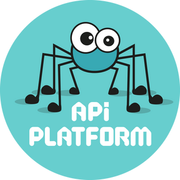
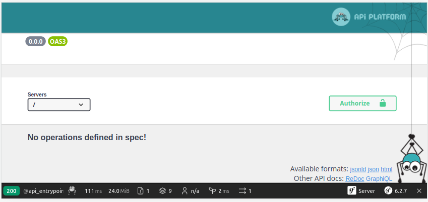
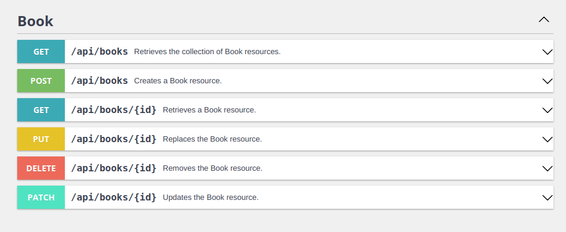
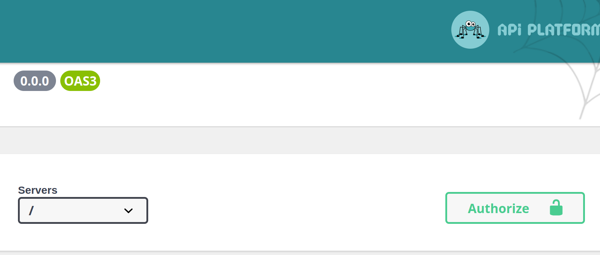

name: inverse
class: center, middle, inverse



<div class="logo"><svg class="logo-1" fill="white" width="196" height="64" viewBox="0 0 196 64" style="fill-rule: evenodd; clip-rule: evenodd; stroke-linejoin: round; stroke-miterlimit: 2;"><g transform="matrix(0.101031,0,0,0.101031,2.39526,-0.329946)"><g transform="matrix(1.27705,0,0,1.27705,1143.65,155.404)"><path d="M320.958,94.576C320.958,107.301 317.357,117.884 310.155,126.323C302.952,134.763 293.386,140.971 281.456,144.947L331.695,223.685L290.072,223.685L246.727,150.647L230.025,150.647L230.025,223.685L193.837,223.685L193.837,40.361L247.787,40.361C296.568,40.361 320.958,58.433 320.958,94.576ZM283.312,94.576C283.312,84.855 280.462,77.764 274.762,73.301C269.062,68.838 260.38,66.607 248.715,66.607L230.025,66.607L230.025,124.931L249.908,124.931C260.954,124.931 269.283,122.501 274.895,117.641C280.506,112.78 283.312,105.092 283.312,94.576Z" style="fill-rule: nonzero;"></path></g><g transform="matrix(1.27705,0,0,1.27705,1486.87,208.548)"><path d="M313.005,64.751L241.159,227.264L208.153,217.058L277.612,67.402L195.163,67.402L195.163,40.361L313.005,40.361L313.005,64.751Z" style="fill-rule: nonzero;"></path></g><g transform="matrix(1.27705,0,0,1.27705,1335.53,155.404)"><path d="M253.752,12.524C257.994,12.524 261.75,13.43 265.019,15.241C268.289,17.053 270.852,19.55 272.708,22.731C274.563,25.912 275.491,29.447 275.491,33.335C275.491,37.224 274.563,40.758 272.708,43.94C270.852,47.121 268.289,49.64 265.019,51.495C261.75,53.351 257.994,54.279 253.752,54.279C249.51,54.279 245.733,53.351 242.419,51.495C239.105,49.64 236.52,47.121 234.664,43.94C232.808,40.758 231.88,37.224 231.88,33.335C231.88,29.447 232.808,25.912 234.664,22.731C236.52,19.55 239.105,17.053 242.419,15.241C245.733,13.43 249.51,12.524 253.752,12.524ZM201.658,83.309L276.419,83.309L276.419,198.897L313.402,198.897L313.402,223.685L200.332,223.685L200.332,198.897L241.424,198.897L241.424,108.097L201.658,108.097L201.658,83.309Z" style="fill-rule: nonzero;"></path></g><g transform="matrix(2.01117,0,0,2.01117,165.834,-128.735)"><path d="M261.043,177.319L211.622,177.319L211.622,218.681L254.382,218.681L254.382,228.302L211.622,228.302L211.622,271.803L264.332,271.803L264.332,280.93L201.096,280.93L201.096,167.944L262.441,167.944L261.043,177.319ZM213.76,150.758L245.501,134.23L250.682,143.851L216.72,156.432L213.76,150.758Z" style="fill-rule: nonzero;"></path></g><g transform="matrix(2.01117,0,0,2.01117,165.834,-128.735)"><path d="M312.861,273.201C321.248,273.201 329.06,270.651 336.297,265.553L341.642,272.46C337.969,275.53 333.501,277.984 328.238,279.82C322.975,281.657 317.987,282.575 313.272,282.575C304.994,282.575 297.922,280.766 292.056,277.148C286.191,273.529 281.723,268.376 278.653,261.688C275.583,255 274.048,247.133 274.048,238.088C274.048,229.426 275.583,221.696 278.653,214.898C281.723,208.101 286.218,202.756 292.139,198.863C298.059,194.971 305.131,193.025 313.354,193.025C323.935,193.025 333.282,196.287 341.395,202.81L335.968,210.129C328.128,204.757 320.426,202.07 312.861,202.07C307.488,202.07 302.733,203.441 298.594,206.182C294.455,208.923 291.22,212.993 288.89,218.393C286.561,223.793 285.396,230.358 285.396,238.088C285.396,245.927 286.547,252.465 288.849,257.7C291.152,262.935 294.373,266.828 298.512,269.377C302.65,271.926 307.434,273.201 312.861,273.201Z" style="fill-rule: nonzero;"></path></g><g transform="matrix(2.01117,0,0,2.01117,165.834,-128.735)"><path d="M386.388,193.025C394.118,193.025 400.641,194.834 405.959,198.452C411.277,202.07 415.251,207.224 417.883,213.912C420.514,220.6 421.83,228.549 421.83,237.759C421.83,246.421 420.473,254.137 417.759,260.907C415.046,267.677 411.003,272.981 405.63,276.819C400.258,280.656 393.761,282.575 386.141,282.575C378.412,282.575 371.874,280.725 366.529,277.024C361.184,273.324 357.168,268.13 354.482,261.441C351.796,254.753 350.453,246.914 350.453,237.923C350.453,228.987 351.81,221.148 354.523,214.405C357.237,207.662 361.294,202.413 366.694,198.658C372.093,194.903 378.658,193.025 386.388,193.025ZM386.388,201.988C369.887,201.988 361.636,213.967 361.636,237.923C361.636,261.661 369.805,273.529 386.141,273.529C402.478,273.529 410.646,261.606 410.646,237.759C410.646,213.912 402.56,201.988 386.388,201.988Z" style="fill-rule: nonzero;"></path></g><g transform="matrix(2.01117,0,0,2.01117,165.834,-128.735)"><path d="M463.945,261.359C463.945,265.635 465.301,268.76 468.015,270.734C470.729,272.707 474.443,273.694 479.157,273.694C483.982,273.694 489.053,272.652 494.37,270.569L497.33,278.463C494.973,279.669 492.136,280.656 488.82,281.424C485.503,282.191 481.953,282.575 478.171,282.575C473.566,282.575 469.413,281.739 465.713,280.067C462.012,278.395 459.093,275.955 456.955,272.748C454.817,269.541 453.748,265.745 453.748,261.359L453.748,168.52L426.94,168.52L426.94,159.639L463.945,159.639L463.945,261.359Z" style="fill-rule: nonzero;"></path></g><g transform="matrix(2.01117,0,0,2.01117,165.834,-128.735)"><path d="M520.121,241.87C520.231,248.833 521.491,254.657 523.904,259.345C526.316,264.032 529.509,267.513 533.483,269.788C537.458,272.063 541.885,273.201 546.764,273.201C551.15,273.201 555.11,272.57 558.646,271.309C562.182,270.048 565.979,268.02 570.035,265.224L575.38,272.872C571.433,275.942 566.952,278.326 561.936,280.026C556.919,281.725 551.999,282.575 547.175,282.575C539.336,282.575 532.552,280.725 526.823,277.024C521.094,273.324 516.722,268.102 513.707,261.359C510.692,254.616 509.184,246.777 509.184,237.841C509.184,229.125 510.705,221.381 513.748,214.611C516.791,207.84 521.08,202.55 526.617,198.74C532.154,194.93 538.486,193.025 545.613,193.025C552.52,193.025 558.496,194.711 563.539,198.082C568.583,201.454 572.434,206.278 575.093,212.555C577.751,218.832 579.081,226.246 579.081,234.798C579.081,236.059 578.999,238.417 578.834,241.87L520.121,241.87ZM545.859,202.564C541.09,202.564 536.855,203.674 533.155,205.894C529.454,208.114 526.48,211.472 524.232,215.967C521.985,220.463 520.669,226.027 520.285,232.66L569.377,232.66C569.158,222.793 566.938,215.31 562.717,210.211C558.496,205.113 552.876,202.564 545.859,202.564Z" style="fill-rule: nonzero;"></path></g><path d="M250.428,75.558C385.339,75.558 494.87,185.089 494.87,320C494.87,454.911 385.339,564.442 250.428,564.442C115.517,564.442 5.986,454.911 5.986,320C5.986,185.089 115.517,75.558 250.428,75.558ZM131.233,450.023L131.233,203.31L220.202,205.493C297.709,207.676 311.355,209.314 331.55,219.685C400.87,255.709 417.79,343.587 365.937,402.536L344.65,426.552L356.658,438.014L368.12,450.023L256.772,450.023L256.772,339.22L269.872,351.228L282.972,363.782L294.434,352.32C308.08,338.674 309.171,325.575 297.163,309.2C294.835,305.797 292.624,303.334 289.625,301.561C283.483,297.931 274.034,297.192 253.497,297.192L218.564,297.192L218.564,450.023L131.233,450.023Z"></path></g></svg></div>

---

class: middle
.left-column[

### Programme

]
.right-column[

1. **Introduction à API Platform :**
   <br />présentation de l'outil, de ses fonctionnalités et de son écosystème.

2. **Installation et configuration de l'environnement de développement :**
   <br />installation de Symfony, configuration de l'environnement de développement, installation de API Platform via Composer.

3. **Création d'une première API :**
   <br />création d'une entité, définition de la ressource API, gestion des opérations CRUD.

4. **Pagination, filtrage et tri :**
   <br />mise en place de la pagination, du filtrage et du tri des résultats.

5. **Sérialisation et désérialisation des données :**
   <br />définition des groupes de sérialisation, gestion des relations entre les entités, utilisation de formats de données alternatifs (XML, CSV, etc.).

6. **Authentification et autorisation :**
   <br />configuration de l'authentification et de l'autorisation, utilisation de JWT et de OAuth2.

7. **Validation des données :**
   <br />validation des données entrantes, gestion des erreurs et des messages d'erreur.

8. **Relations entre les entités :**
   <br />définition des relations entre les entités, gestion de la navigation entre les ressources liées.

9. **Utilisation de GraphQL :**
   <br />configuration de GraphQL dans API Platform, définition des types de ressources, utilisation de l'API GraphQL.
   ]

---

class: middle, inverse, center

# 1. L'introduction à API Platform

---

class: middle

.center[

### **Qu'est-ce qu'une API ?**

]

Une API (Application Programming Interface) est un ensemble de règles et de protocoles qui permettent à différentes applications de communiquer entre elles. C'est une interface qui définit comment les composants logiciels doivent interagir.

#### **Types d'APIs courants**

- **REST**: APIs basées sur HTTP utilisant ses méthodes standards (`GET`, `POST`, `PUT`, `DELETE`)

- **GraphQL**: Permet aux clients de demander exactement les données dont ils ont besoin

- **SOAP**: Protocole plus ancien utilisé principalement dans les systèmes d'entreprise

- **WebSocket**: Pour les communications bidirectionnelles en temps réel

---

class: middle

.center[

### **L'utilité d'API Platform**

]

API Platform est un framework PHP open source basé sur Symfony qui offre de nombreux avantages pour le développement d'API modernes:

#### **Fonctionnalités principales**

- **Création rapide d'API REST et GraphQ**L: Permet de développer des API web professionnelles avec un minimum d'effort de codage.

- **Approche "API-first"**: Facilite la création d'applications web modernes en suivant les meilleures pratiques de conception d'API.

- **Documentation automatique**: Génère automatiquement une documentation interactive (Swagger/OpenAPI et ReDoc) qui se met à jour en temps réel.

- **Opérations CRUD générées automatiquement**: Crée automatiquement les endpoints pour les opérations Create, Read, Update et Delete à partir de vos entités.

---

class: middle
.center[

### **Avantages techniques**

]

- **Performance et évolutivité**: Optimisé pour des performances élevées grâce à des techniques comme le cache HTTP et le lazy loading.

- **Sécurité robuste**: Facilite l'implémentation de l'authentification (JWT, OAuth) et la gestion des autorisations.

- **Formats multiples**: Prend en charge de nombreux formats de données (JSON-LD, HAL, Hydra, etc.) pour une meilleure interopérabilité.

- **Validation des données intégrée**: Utilise le système de validation de Symfony pour garantir l'intégrité des données.

---

class: middle
.center[

### **Intégration et écosystème**

]

- **Compatible avec l'écosystème Symfony**: S'intègre parfaitement avec tous les composants Symfony.

- **Compatible avec l'écosystème Laravel**: Peut être intégré avec Laravel pour bénéficier de ses fonctionnalités

- **Prêt pour les frameworks frontend**: Fonctionne harmonieusement avec React, Angular, Vue.js et d'autres frameworks frontend.

- **Support pour Docker**: Facilement déployable dans des environnements conteneurisés.

API Platform permet aux développeurs de se concentrer sur la logique métier plutôt que sur l'infrastructure, accélérant ainsi considérablement le développement d'applications web modernes tout en maintenant une haute qualité technique.

---

class: middle, inverse, center

# 2. Installation et configuration de l'environnement de développement

---

class: middle
.center[

### **Installation de Symfony**

]

Pour commencer avec API Platform, il est nécessaire d'installer Symfony. Symfony est un framework PHP qui fournit un ensemble de composants pour construire des applications web modernes.

- Créer un nouveau projet Symfony avec le template `symfony-template` :

  ```bash
  symfony new --dir=api-platform --webapp --version=7.2
  cd api-platform

  # Lancer le serveur Symfony
  docker compose up -d
  symfony server:start -d
  ```

Une fois Symfony installé, il est recommandé de configurer l'environnement de développement. Il est possible de créer un fichier `.env.local` à la racine du projet pour stocker les variables d'environnement spécifiques au développement.

Dans ce fichier, vous pouvez définir des paramètres tels que la configuration de la base de données, les informations d'identification de l'API, etc.

---

class: middle
.center[

### **Installation de API Platform via Composer**

]

Vous pouvez installer API Platform en utilisant **Composer**. API Platform est disponible sous forme de paquet Composer, qui peut être installé en utilisant la commande suivante :

```bash
symfony composer require api
```

.info[
L'installation de API Platform, s'est réalisée automatiquement lors de la création du projet Symfony avec le template `symfony-template`.
]

Cette commande a installé tous les composants nécessaires pour utiliser API Platform dans votre projet Symfony, y compris la **documentation Swagger**, la prise en charge de **JSON-LD** et de **HAL**, et les composants pour la **validation**, la **pagination**, le **tri** et le **filtrage**.

🪄 Api Platform est installé vous pouvez vous rendre sur `https://localhost:8000/api/docs`. Vous êtes prêt à commencer à développer des API REST modernes avec API Platform.

.center[

]

---

class: middle
.center[

### **Configuration d'API Platform**

]

- Ajouter la configuration d'API Platform dans le fichier `config/packages/api_platform.yaml` les formats `['application/json']` et `['application/ld+json']` :

```yaml
api_platform:
  formats:
    jsonld: ["application/ld+json"]
    json: ["application/json"]
```

.info[
Cette configuration permet de définir les formats de données pris en charge par API Platform. Par défaut, API Platform prend en charge les formats JSON-LD et HAL. En ajoutant le format JSON, vous pouvez également prendre en charge les données JSON.
]

---

class: middle
.center[

### **Installation d’un Outil pour API (Postman, Insomnia, Bruno)**

]

Pour tester et interagir avec vos API, l’utilisation d’outils dédiés comme Postman, Insomnia ou Bruno est recommandée. Ces outils permettent d’envoyer des requêtes HTTP, de visualiser les réponses, et d’automatiser les tests.

- Vous pouvez installer Postman en téléchargeant l'application depuis le site officiel : [https://www.postman.com/downloads/](https://www.postman.com/downloads/)

- Pour Insomnia, vous pouvez télécharger l'application depuis le site officiel : [https://insomnia.rest/download](https://insomnia.rest/download)

- Pour Bruno, vous pouvez télécharger l'application depuis le site officiel : [https://brunolabs.com/](https://brunolabs.com/)

- Pour les plus téméraires, vous pouvez utiliser curl depuis le terminal.

Ces outils sont essentiels pour le développement et le débogage des API, facilitant les interactions et les tests.

---

class: middle, inverse, center

# 3. Création d'une première API

---

class: middle
.center[

### **Création d'une entité**

]

Pour créer une API avec API Platform, vous devez d'abord créer une entité. Les entités sont des objets qui représentent des données que vous souhaitez stocker dans votre base de données.

Par exemple, si vous créez une application de gestion de bibliothèque, vous pourriez créer une entité "`Book`" pour stocker les informations sur les livres.

- Pour créer une entité avec Symfony, vous pouvez utiliser la commande `make:entity`. Par exemple, pour créer une entité "`Book`", vous pouvez exécuter la commande suivante :
  ```bash
  symfony console make:entity Book --api-resource
  ```
  .info[
  L'option `--api-resource` permet de créer une ressource API pour l'entité.
  ]

Cette commande va créer une classe `Book` dans le dossier `src/Entity`. Définissez les propriétes suivantes:

- `title`, `string`, `255`, `no`
- `author`, `string`, `255`, `no`
- `year`, `string`, `4`, `yes`

* Génerer le fichier de migration, puis l'appliquer

  ```bash
  symfony console make:migration
  symfony console doctrine:migrations:migrate -n
  ```

---

class: middle

.center[

### **Définition de la ressource API**

]

Une fois que l'entité est créée, vous obtenez une classe `Book` avec l'attribute `#[ApiResource]` déjà ajouté.

```diff
  <?php

  namespace App\Entity;

+ use ApiPlatform\Metadata\ApiResource;
  use App\Repository\BookRepository;
  use Doctrine\ORM\Mapping as ORM;

+ #[ApiResource]
  #[ORM\Entity(repositoryClass: BookRepository::class)]
  class Book
    ...
```

API Platform utilisera cette attribute pour générer automatiquement une API CRUD complète pour votre entité.

Cela signifie que les opérations **CRUD** (Create, Read, Update, Delete) seront disponibles pour la ressource API `Book`.

Vous pouvez vous rendre sur `https://localhost:8000/api/docs` pour voir la documentation de la ressource API `Book` se met à jour automatiquement.

.center[]

---

class: middle
.center[

### **Ajouter des données - Super simple!s**

]

Pas besoin de créer un formulaire ou une interface d'administration. Vous pouvez immédiatement utiliser votre API.

Choisissez votre outil préféré pour envoyer une requête `POST` pour créer un nouveau livre.

- Vous pouvez envoyer une requête `POST` pour créer un nouveau livre via un curl dans le container ou l'outil de votre choix :

  ```bash
  curl -sX POST "https://localhost:8000/api/books" \
    -H "Content-Type: application/json" \
    -d '{"title": "The Hitchhikers Guide to the Galaxy", "author": "Douglas Adams", "year": "1979"}' | jq
  ```

Vous aurez une réponse similaire à celle-ci :

```json
{
  "title": "The Hitchhikers Guide to the Galaxy",
  "author": "Douglas Adams",
  "year": "1979"
}
```

Et voilà! Votre livre est sauvegardé dans la base de données.

---

class: middle
.center[

### **Récupérer vos données**

]

C'est tout aussi simple que l'ajout de données.

- Vous pouvez envoyer une requête `GET` pour récupérer une liste de livres :

  ```bash
  curl -sX GET "https://localhost:8000/api/books" \
    -H "Content-Type: application/json" | jq
  ```

  API Platform retournera une liste de tous les livres disponibles dans la base de données.

  ```json
  {
    "@context": "/api/contexts/Book",
    "@id": "/api/books",
    "@type": "hydra:Collection",
    "hydra:totalItems": 1,
    "hydra:member": [
      {
        "@id": "/api/books/1",
        "@type": "Book",
        "id": 1,
        "title": "The Hitchhikers Guide to the Galaxy",
        "author": "Douglas Adams",
        "year": "1979"
      }
    ]
  }
  ```

API Platform gère automatiquement les opérations de lecture pour les ressources API.

---

class: middle
.center[

### **Mise à jour et suppression des données**

]

- Vous pouvez envoyer une requête `PUT` pour mettre à jour un livre existant :

  ```bash
  curl -sX PUT "https://localhost:8000/api/books/1" \
    -H "Content-Type: application/json" \
    -d '{"title": "The Hitchhikers Guide to the Galaxy", "author": "Douglas Adams", "year": "1980"}' | jq
  ```

- Vous pouvez envoyer une requête `DELETE` pour supprimer un livre existant :

  ```bash
  curl -sX DELETE "https://localhost:8000/api/books/1" \
    -H "Content-Type: application/json" | jq
  ```

API Platform gère automatiquement les opérations de mise à jour et de suppression pour les ressources API.

---

class: middle, inverse, center

# 4. Pagination, filtrage et tri

---

class: middle

#### Pagination

La pagination est une technique permettant de limiter le nombre de résultats renvoyés par une requête et de fournir des liens pour accéder aux pages suivantes ou précédentes.

API Platform prend en charge les collections paginées en mode natif. La pagination est activée par défaut pour toutes les collections. Chaque collection contient 30 éléments par page. L'activation de la pagination et le nombre d'éléments par page peuvent être configurés.

- **Elle peut être désactivée via l'option** `#[ApiResource(paginationEnabled: false)]`

- **Le nombre de résulat par page peut-être modifié via l'option** `#[ApiResource(paginationItemsPerPage: 10)]`
- **Le nombre maximul de résulat peut-être modifié via l'option** `#[ApiResource(paginationMaximumItemsPerPage: 100)]`

Dans ces exemples nous avons comment gérer la configuration depuis notre projet symfony. Vous pouvez aussi activer la récupération des résultats paginés en envoyant une requête `GET` avec le paramètres `itemsPerPage`:

```php
#[ApiResource(paginationClientItemsPerPage: true)]
```

```sh
curl -sX GET "https://localhost:8000/api/books?itemsPerPage=10" -H "Content-Type: application/json" | jq
```

---

class: middle

#### Filtrage

Le filtrage permet de limiter les résultats renvoyés par une requête en fonction de critères spécifiques. Pour activer le filtrage dans API Platform, vous pouvez utiliser l'annotation `#[ApiFilter]`.

Par exemple, si vous souhaitez filtrer les livres en fonction de leur titre, vous pouvez ajouter l'attribute suivante à la classe Livre :

```diff
  <?php

  namespace App\Entity;

+ use ApiPlatform\Doctrine\Orm\Filter\SearchFilter;
+ use ApiPlatform\Metadata\ApiFilter;
  use ApiPlatform\Metadata\ApiResource;
  use App\Repository\BookRepository;
  use Doctrine\ORM\Mapping as ORM;

  #[ApiResource]
+ #[ApiFilter(SearchFilter::class, properties: ['title' => 'partial'])]
  #[ORM\Entity(repositoryClass: BookRepository::class)]
  class Book
  {
    ...
  }
```

Dans cet exemple, nous avons utilisé le filtre `SearchFilter` pour permettre le filtrage sur le champ `title` des livres. Le paramètre partial indique que la recherche sera partielle, c'est-à-dire que les résultats incluront tous les livres dont le titre contient la valeur de recherche. Vous pouvez maintenant envoyer une requête `GET` avec le paramètre `title` pour filtrer les résultats en fonction du titre :

```bash
curl -X GET "https://localhost:8000/api/books?title=Hitchhikers" \
  -H "Content-Type: application/json" | jq
```

---

class: middle

#### Tri

Le tri permet de trier les résultats renvoyés par une requête en fonction d'un ou plusieurs critères. Pour activer le tri dans API Platform, vous pouvez utiliser l'attribute `#[ApiFilter]`. Par exemple, si vous souhaitez trier les livres en fonction de leur titre, vous pouvez ajouter l'attribute suivante à la classe `Book` :

```diff
  ...

+ use ApiPlatform\Doctrine\Orm\Filter\OrderFilter;
  use App\Repository\BookRepository;
  use Doctrine\ORM\Mapping as ORM;

  #[ApiResource]
  #[ApiFilter(SearchFilter::class, properties: ['title' => 'partial'])]
+ #[ApiFilter(OrderFilter::class, properties: ['title'])]
  #[ORM\Entity(repositoryClass: BookRepository::class)]
  class Book
  {
    ...
  }
```

Dans cet exemple, nous avons utilisé le filtre `OrderFilter` pour permettre le tri sur le champ `title` des livres. Vous pouvez maintenant envoyer une requête GET avec le paramètre order pour trier les résultats en fonction du titre :

```bash
curl -X GET "https://localhost:8000/api/books?order%5Btitle%5D=asc" \
  -H "Content-Type: application/json" | jq
```

Dans cet exemple, nous avons trié les résultats par ordre croissant (`asc`) du champ `title`. Vous pouvez également trier par ordre décroissant en utilisant la valeur `desc`.

---

class: middle, inverse, center

# 5. Sérialisation et désérialisation des données

---

class: middle

- **La sérialisation** consiste à transformer des objets PHP en données `JSON` ou `XML` qui peuvent être envoyées sur le réseau.

- **La désérialisation** consiste à transformer des données `JSON` ou `XML` en objets PHP.

.center[<object data="img/api-plateform-serializer-workflow.svg" type="image/svg+xml"></object>]

---

class: middle

#### Sérialisation

Dans API Platform, la sérialisation est gérée automatiquement grâce à la bibliothèque de sérialisation **[Symfony Serializer](https://github.com/symfony/serializer)**.

Par défaut, toutes les propriétés de l'entité sont sérialisées, mais vous pouvez personnaliser ce comportement en utilisant l'attribute `#[ApiProperty]` et ses options `readable` et `writable`.

Par exemple, si vous souhaitez exclure la propriété `id` de la sérialisation, vous pouvez ajouter l'annotation suivante à la classe `Book` :

```diff
+ use ApiPlatform\Metadata\ApiProperty;

...

class Book
{
    #[ORM\Id]
    #[ORM\GeneratedValue]
    #[ORM\Column]
+   #[ApiProperty(readable: false)]
    private ?int $id = null;
```

Dans cet exemple, nous avons utilisé l'option `readable: false` de l'attribute `#[ApiProperty]` pour exclure la propriété `id` de la sérialisation.

Vous pouvez maintenant récupérer les résultats de votre API de livres sous forme de données JSON ou XML en envoyant une requête GET sur l'URL de votre API.

---

class: middle

#### Désérialisation

Dans API Platform, la désérialisation est également gérée automatiquement grâce à la bibliothèque Symfony Serializer.

Si vous souhaitez autoriser la création ou la modification d'objets via votre API, vous devez spécifier les champs qui peuvent être modifiés en utilisant l'option `writable` de l'annotation `#[ApiProperty]`.

Par exemple, si vous souhaitez autoriser la modification de la propriété `title` d'un livre, vous pouvez ajouter l'attribute suivante à la classe `Book` :

```diff
    #[ORM\Id]
    #[ORM\GeneratedValue]
    #[ORM\Column]
    #[ApiProperty(readable: false)]
    private ?int $id = null;

    #[ORM\Column(length: 255)]
+   #[ApiProperty(writable: false)]
    private ?string $title = null;
```

Dans cet exemple, nous avons utilisé l'option `writable: false` de l'attribute `#[ApiProperty]` pour exclure la propriété `title` de la désérialisation.

Vous pouvez maintenant envoyer une requête `POST` ou `PUT` sur l'URL de votre API pour créer ou modifier des livres.

---

class: middle, inverse, center

# 6. Authentification et autorisation

---

class: middle

Dans cette partie, nous allons aborder l'authentification et l'autorisation dans API Platform. L'authentification consiste à vérifier l'identité de l'utilisateur, tandis que l'autorisation consiste à vérifier si l'utilisateur a le droit d'accéder à une ressource ou d'effectuer une action sur cette ressource.

## Authentification

API Platform prend en charge différents types d'authentification, notamment :

- **L'authentification basique :** dans ce cas, l'utilisateur doit fournir un nom d'utilisateur et un mot de passe pour accéder à l'API. C'est le type d'authentification le plus simple, mais il n'est pas très sécurisé car les informations d'identification sont envoyées en clair sur le réseau.

- **L'authentification avec token :** dans ce cas, l'utilisateur doit obtenir un token d'authentification valide auprès de l'API avant de pouvoir accéder aux ressources protégées. Le token est généralement envoyé dans l'en-tête de la requête.

- **L'authentification OAuth2** : dans ce cas, l'utilisateur doit autoriser l'API à accéder à certaines ressources en utilisant un fournisseur d'identité tiers, tel que Google ou Facebook.

---

class: middle

### Génerer l'entité User

Pour implémenter l'authentification dans API Platform, vous devez d'abord créer une entité `User` qui représente un utilisateur de l'API. Pour ce faire, vous pouvez utiliser la commande suivante :

```bash
symfony console make:user
```

Cette commande va créer une entité `User` avec les champs `id`, `email`, `roles` et `password`.

Exécutez la commande suivante pour generer la migrations et migrer les changements de la base de donnée :

```bash
symfony console make:migration
symfony console doctrine:migrations:migrate -n
```

### Installer JWT bundle

Pour utiliser l'authentification avec token, vous devez installer le bundle **LexikJWTAuthenticationBundle**

```bash
symfony composer require lexik/jwt-authentication-bundle
```

---

class: middle

#### Generate the SSL keys

Pour utiliser l'authentification avec token, vous devez générer une paire de clés SSL. Pour ce faire, vous pouvez utiliser la commande suivante :

```bash
symfony console lexik:jwt:generate-keypair
```

#### Configurer JWT bundle

La configuration des SSL Keys est au niveau du fichier `.env`

```bash
###> lexik/jwt-authentication-bundle ###
JWT_SECRET_KEY=%kernel.project_dir%/config/jwt/private.pem
JWT_PUBLIC_KEY=%kernel.project_dir%/config/jwt/public.pem
JWT_PASSPHRASE=2994f59d9cb8549e32ed840f1c491fd5
###< lexik/jwt-authentication-bundle ###
```

Pour configurer le bundle, vous devez ajouter le code suivant dans le fichier `config/packages/lexik_jwt_authentication.yaml` :

```yaml
lexik_jwt_authentication:
  secret_key: "%env(resolve:JWT_SECRET_KEY)%"
  public_key: "%env(resolve:JWT_PUBLIC_KEY)%"
  pass_phrase: "%env(JWT_PASSPHRASE)%"
  token_ttl: 86400
  api_platform:
    check_path: /api/login_check
    username_path: email
    password_path: security.credentials.password
```

Dans cet exemple, nous avons configuré le bundle pour utiliser l'authentification avec token. Nous avons également spécifié que l'URL de vérification des identifiants est `/api/login_check`.

---

class: middle

#### Configurer la route d'authentification

Pour configurer la route d'authentification, vous devez ajouter le code suivant dans le fichier `config/routes.yaml` :

```yaml
api_login_check:
  path: /api/login_check
```

#### Documenter le mécanisme d'authentification

Pour documenter le mécanisme d'authentification avec Swagger/Open API, vous devez ajouter le code suivant dans le fichier `config/packages/api_platform.yaml` :

```yaml
api_platform:
  swagger:
    api_keys:
      JWT:
        name: Authorization
        type: header
```

N'hésitez à supprimer votre cache avec la commande `symfony console c:c`

.center[
.pull-left[

]
.pull-right[

]
]

---

class: middle

### Configurer l'authentification avec token

Pour configurer l'authentification avec token, vous devez ajouter le code suivant dans le fichier `config/packages/security.yaml` :

```yaml
security:
    firewalls:
        login:
            pattern: ^/api/login
            stateless: true
            json_login:
                username_path: email
                check_path: /api/login_check
                success_handler: lexik_jwt_authentication.handler.authentication_success
                failure_handler: lexik_jwt_authentication.handler.authentication_failure

        api:
            pattern:   ^/api
            stateless: true
            jwt: ~

        ...

    access_control:
        - { path: ^/api/login, roles: PUBLIC_ACCESS }
        - { path: ^/api/docs, roles: PUBLIC_ACCESS }
        - { path: ^/api,       roles: IS_AUTHENTICATED_FULLY }
```

---

class: middle

### Obtenir un token

Ajoutons à notre application un utilsateur via la commande suivante :

```bash
# genere le hash du mot de passe
symfony console security:hash-password -n myPassword

# ajoute l'utilisateur
symfony console doctrine:query:sql "insert into public.user (id, email, password, roles) values (1, 'john@doe.com', '\$2y\$13\$PbnSuELtRM4rqLdgpjz6U.iAN6CWo5cG/AJsh/DtIH4Cs5HEjISsG', '[\"ROLE_ADMIN\"]');"
```

Pour obtenir un token, vous devez envoyer une requête `POST` à l'URL `/api/login_check` avec les informations d'identification de l'utilisateur. Par exemple, si vous avez créé un utilisateur avec l'adresse e-mail

```bash
curl -sX POST -H "Content-Type: application/json" https://localhost:8000/api/login_check \
 -d '{"email":"john@doe.com","password":"myPassword"}' | jq
```

Faites à nouveau une requête HTTP pour récupérer les livres, on aura une erreur `{"code":401,"message":"JWT Token not found"}`.

En `effet` il faudra à présent vous authentifier pour avoir accès au données de l'api. stockez le token obtenu dans une variable d'environnement `TOKEN`, puis lancer la requête suivante.

```bash
curl -sX GET  https://localhost:8000/api/books \
  -H "Content-Type: application/json" \
  -H "Authorization: Bearer ${TOKEN}" | jq
```

---

class: inverse, center, middle

# 7. Validation des données

---

class: middle
La validation des données consiste à s'assurer que les données envoyées à l'API sont correctes et conformes aux règles de l'application. Dans API Platform, vous pouvez utiliser la bibliothèque de validation **Symfony Validator** pour valider les données des entités.

#### Validation des données avec des Asserts

Pour valider les données de l'entité Book en utilisant des annotations, vous pouvez ajouter des annotations de validation aux propriétés de la classe Book. Par exemple, si vous voulez vous assurer que le titre d'un livre a une longueur minimale de 3 caractères et que la date de publication est obligatoire, vous pouvez ajouter les annotations suivantes à la classe `Book` :

```diff

class Book
{
  ...
+ #[Assert\NotBlank]
  #[ORM\Column(length: 255)]
  #[ApiProperty(writable: false)]
  private ?string $title = null;

+ #[Assert\NotBlank]
+ #[Assert\Length(min: 3)]
  #[ORM\Column(length: 255)]
  private ?string $author = null;

+ #[Assert\Length(exactly: 4)]
  #[ORM\Column(length: 4, nullable: true)]
  private ?string $year = null;

}
```

Dans cet exemple, nous avons ajouté les contraintes `NotBlank` et `Length` de la bibliothèque Symfony Validator à la propriété `$author` de l'entité `Book`. Cela signifie que le nom de l'auteur ne peut pas être vide et doit avoir une longueur minimale de 3 caractères. Nous avons également ajouté la contrainte `Length` à la propriété `$year`, ce qui signifie que l'année n'est pas obligatoire, mais si elle est défini elle devra avoir une longueur de 4 caractères.

---

class: middle

Voici un exemple de commande curl pour tester la validation des données de l'entité `Book` :

```sh
curl -X 'POST' https://localhost:8000/api/books \
  -H "Content-Type: application/json" \
  -H "Authorization: Bearer ${TOKEN}" \
  -d '{ "title" : "Symfony fast track", "author": "Fa", "year": "22" }' | jq
```

Dans cet exemple, nous envoyons une requête POST à l'API pour créer un nouveau livre avec un auteur ayant moins de **3 caractères** et une année de publication n'ayant pas **exactement 4 caractères**.

Comme nous avons ajouté des contraintes de validation à ces deux propriétés, la requête devrait renvoyer une erreur de validation avec des messages d'erreur décrivant les problèmes.

Vous pouvez également tester la validation en envoyant une requête `PUT` ou `PATCH` pour mettre à jour un livre existant avec des données non valides. Par exemple :

```sh
curl -X 'PUT' https://localhost:8000/api/books/1 \
  -H "Content-Type: application/json" \
  -H "Authorization: Bearer ${TOKEN}" \
  -d '{ "title" : "a", "year": "" }' | jq
```

Dans cet exemple, nous envoyons une requête `PUT` à l'API pour mettre à jour le livre avec **l'ID 1** avec un titre de 1 caractère et une date de publication vide.

Comme nous avons ajouté des contraintes de validation à ces deux propriétés, la requête devrait renvoyer une erreur de validation avec des messages d'erreur décrivant les problèmes.

---

class: middle
.center[

### **Personnalisation des messages d'erreur**

]

Vous pouvez personnaliser les messages d'erreur renvoyés par la validation en ajoutant des messages personnalisés à chaque contrainte.
Par exemple, si vous voulez personnaliser le message d'erreur pour la contrainte Length, vous pouvez modifier la validation comme suit :

```diff
+ #[Assert\NotBlank(message: "L'auteur doit être renseigné")]
+ #[Assert\Length(min: 3, minMessage : "Le nom de l'auteur doit contenir au moins 3 caractères")]
  #[ORM\Column(length: 255)]
  private ?string $author = null;
```

#### Validation conditionnelle

Vous pouvez également valider les données de manière conditionnelle en utilisant des groupes de validation.
Les groupes de validation vous permettent de valider uniquement certaines propriétés de l'entité en fonction du contexte.
Par exemple, si vous souhaitez valider la propriété `$year` uniquement lors de la création d'un nouveau livre, vous pouvez ajouter la contrainte NotBlank à cette propriété dans le groupe de validation creation comme suit :

```diff
+ #[Assert\NotBlank(groups: ["creation"])]
  #[Assert\Length(exactly: 4)]
  #[ORM\Column(length: 4, nullable: true)]
  private ?string $year = null;
```

- **Testez ce dernier validateur avec une requête invalide lors de la création.**

---

class: middle
.center[

### **Travaux Pratiques**

]

#### Objectif

Valider les données de l'entité User en utilisant la validation Symfony Validator dans API Platform.

#### Étapes

Ajout des contraintes de validation

- Ajoutez des contraintes de validation aux propriétés de l'entité User en utilisant la validation Symfony Validator. Par exemple, vous pouvez ajouter les contraintes suivantes :
  - **`email` :** non vide et format valide d'adresse e-mail.
  - **`password` :** non vide et longueur minimale de 8 caractères.
  - **`roles` :** non vide et tableau de chaînes de caractères.
- Vous pouvez ajouter ces contraintes en utilisant des attributs, comme décrit dans les sections précédentes.

#### Test de la validation

- Utilisez la commande curl pour tester la validation des données de l'entité `User`.

  - Envoyez une requête `POST` pour créer un nouvel utilisateur avec des données invalides (par exemple, un nom d'utilisateur vide ou une adresse e-mail invalide).
  - Vérifiez que la requête renvoie une erreur de validation avec des messages d'erreur appropriés.

- Ensuite, envoyez une requête `PUT` ou `PATCH` pour mettre à jour un utilisateur existant avec des données invalides (par exemple, un mot de passe trop court).
  - Vérifiez que la requête renvoie une erreur de validation avec des messages d'erreur appropriés.

---

class: middle, center, inverse

# 8. Relations entre les entités

---

class: middle

Dans API Platform, vous pouvez définir des relations entre les différentes entités de votre API. Les relations peuvent être de différents types, tels que :

- `OneToMany`
- `ManyToOne`
- `ManyToMany`

Dans ce chapitre, nous allons voir comment définir des relations entre les entités de votre API.

Nous devrons définir une relation `ManyToOne` entre les entités `Book` et `Category` (`id` et `name`). Chaque livre peut être associé à une seule catégorie (`nullable: true`).

Nous devrons définir une relation `OneToMany` inverse dans l'entité `Category`. Chaque catégorie a un nom et peut avoir plusieurs livres.

```sh
symfony console make:entity Category
```

Appliquer la migration

```bash
symfony console make:migration
symfony console doctrine:migrations:migrate -n
```

---

class: middle

.center[

### **Travaux Pratiques**

]

L'objectif de ce mini TP : est de vous familiariser avec l'utilisation des endpoints REST actuels de l'API (Book et Category) pour alimenter la base de données à partir d'un jeu de données JSON généré.

1. Voici un jeu de données <a href="file/data.json" title="data.json" target="_blank"><i class="fa-solid fa-file"></i> data.json</a> qui contient des informations sur les livres et les catégories.

2. À l'aide de la commande curl, envoyez des requêtes `POST` pour ajouter chaque catégorie à la base de données en utilisant l'endpoint `/api/categories`. Pour chaque requête, utilisez les données JSON correspondantes à la catégorie.

3. Répétez l'étape 2 pour ajouter chaque livre à la base de données en utilisant l'endpoint `/api/books`. Pour chaque requête, utilisez les données JSON correspondantes au livre.

4. Vérifiez que les données ont bien été ajoutées à la base de données en effectuant des requêtes GET pour récupérer les catégories et les livres en utilisant les endpoints `/api/categories` et `/api/books`.

**Conclusion**

Ce mini TP vous a permis de découvrir comment alimenter la base de données de l'API à partir d'un jeu de données JSON généré, en utilisant les endpoints REST actuels pour les entités `Book` et `Category`. Cela vous sera utile pour automatiser l'ajout de données à votre application.

---

class: middle
.center[

### **Groupe de sérialisation**

]

API Platform utilise le composant Serializer de Symfony pour convertir les objets PHP en formats de données tels que JSON ou XML. Les groupes de sérialisation et de désérialisation permettent de contrôler les propriétés qui sont incluses ou exclues de l'objet sérialisé ou désérialisé.

En utilisant les groupes, vous pouvez spécifier les propriétés à inclure ou exclure pour chaque opération d'API (lecture, écriture, etc.) et pour chaque entité.

.pull-left[

```diff
+ use ApiPlatform\Metadata\ApiResource;
+ use Symfony\Component\Validator\Constraints as Assert;
+ use Symfony\Component\Serializer\Annotation\Groups;

+ #[ApiResource(
+     normalizationContext: [ 'groups' => ['category:read']],
+     denormalizationContext: [ 'groups' => ['category:write']],
+ )]
#[ORM\Entity(repositoryClass: CategoryRepository::class)]
class Category
{
+   #[Groups(['category:read'])]
    #[ORM\Id]
    #[ORM\GeneratedValue]
    #[ORM\Column]
    private ?int $id = null;

+   #[Assert\NotBlank()]
+   #[Groups(['category:read', 'book:read', 'category:write'])]
    #[ORM\Column(length: 255)]
    private ?string $name = null;

+   #[Groups(['category:read'])]
    #[ORM\OneToMany(mappedBy: 'category', targetEntity: Book::class, orphanRemoval: true)]
    private Collection $books;
```

]
.pull-right[

Dans cet exemple, nous avons défini deux groupes de sérialisation et de désérialisation différents : `category` et `category:write`. Le groupe `category:write` inclut la propriété `name` tandis que le groupe `category` inclut toutes les propriétés.

Lors de la récupération d'une catégorie à l'aide de l'API, la réponse JSON inclura uniquement les propriétés définies dans le groupe de sérialisation correspondant :

```json
{
  "@context": "/api/contexts/Category",
  "@id": "/api/categories/1",
  "@type": "Category",
  "id": 1,
  "name": "Fiction"
}
```

]

---

class: middle

.pull-left[

```diff
#[ApiResource(
    paginationClientItemsPerPage: true,
+   normalizationContext: ['groups' => ['book:read']],
+   denormalizationContext: ['groups' => ['book:write']],
)]
class Book
{
+   #[ApiProperty(identifier: true)]
+   #[Groups(['book:read'])]
    #[ORM\Id]
    #[ORM\GeneratedValue]
    #[ORM\Column]
    private ?int $id = null;

+   #[Groups(['book:read', 'book:write'])]
    #[Assert\NotBlank]
    #[ORM\Column(length: 255)]
-   #[ApiProperty(writable: false)]
    private ?string $title = null;

+   #[Groups(['book:read', 'book:write'])]
    #[Assert\NotBlank]
    #[Assert\Length(min: 3)]
    #[ORM\Column(length: 255)]
    private ?string $author = null;

+   #[Groups(['book:read', 'book:write'])]
    #[Assert\NotBlank]
    #[Assert\Length(exactly: 4)]
    #[ORM\Column(length: 4, nullable: true)]
    private ?string $year = null;

+   #[Groups(['book:read', 'book:write'])]
    #[Assert\NotNull()]
    #[ORM\ManyToOne(inversedBy: 'books')]
    #[ORM\JoinColumn(nullable: true)]
    private ?Category $category = null;
```

]
.pull-right[
Nous avons utilisé les attributs PHP pour spécifier les contraintes de validation et les groupes de sérialisation et désérialisation. Nous avons également ajouté les annotations `#[ApiProperty]` et `#[Groups]` pour spécifier l'identifiant de la ressource, les groupes de lecture et d'écriture de la sérialisation et la désérialisation.

Lors de la récupération d'un livre à l'aide de l'API, la réponse JSON inclura un lien vers la catégorie associée :

```json
{
  "id": 1,
  "title": "The Great Gatsby",
  "category": {
    "@id": "/api/categories/1",
    "id": 1,
    "name": "Fiction"
  },
  "@context": "/api/contexts/Book",
  "@id": "/api/books/1",
  "@type": "Book"
}
```

Pour créer un nouveau livre associé à une catégorie existante, vous pouvez envoyer une requête POST à l'API avec les données suivantes :

```json
{
  "title": "The Great Gatsby",
  "author": "F. Scott Fitzgerald",
  "year": "1925",
  "category": "/api/categories/1"
}
```

]

---

class: middle, center, inverse

# 9. Utilisation de GraphQL

---

class: middle
.center[

### **Installation de GraphQL**

]

**GraphQL** est un langage de requête pour les APIs créé par Facebook. Contrairement aux APIs REST, qui exposent un ensemble d'URLs pour interagir avec les ressources, GraphQL permet aux clients de définir les données exactes dont ils ont besoin et d'obtenir une réponse qui correspond exactement à cette demande. API Platform prend en charge GraphQL et vous permet de définir des types de ressources personnalisés pour GraphQL.

Pour activer GraphQL et son IDE (GraphiQL et GraphQL Playground) dans votre API, il suffit d'installer le paquet `webonyx/graphql-php` à l'aide de Composer et de vider le cache une fois de plus:

```bash
symfony composer require api-platform/graphql
symfony console cache:clear
```

---

class: middle
.center[

### **Configuration de GraphQL**

]

API Platform detect automatiquement la presence de GraphQL et vous pourrez utiliser le endpoint sur la route `api/graphql`

.pull-left[
**l'IDE GraphiQL** est disponible sur `api/graphql/graphiql`, qui est un IDE web pour GraphQL développé par Facebook.
Il est disponible en tant qu'interface utilisateur intégrée à API Platform.
GraphiQL offre des fonctionnalités telles que l'autocomplétion, la validation de requêtes et l'exploration de schémas GraphQL.
]
.pull-right[
**GraphQL Playground** est disponible sur `api/graphql/graphiql`qui est un IDE web pour GraphQL qui offre une interface utilisateur moderne et intuitive.
Il permet de tester et d'explorer les requêtes GraphQL en temps réel, ainsi que de visualiser les résultats et les erreurs de manière claire.
]

Donnons un accès publique à ses deux IDE, depuis le fichier `config/packages/security.yaml`

```diff
    access_control:
        - { path: ^/api/login, roles: PUBLIC_ACCESS }
        - { path: ^/api/docs, roles: PUBLIC_ACCESS }
+       - { path: ^/api/graphql/(graphiql|graphql_playground), roles: PUBLIC_ACCESS }
        - { path: ^/api,       roles: IS_AUTHENTICATED_FULLY }
```

---

class: middle
.center[

### **Définition des types de ressources pour GraphQL**

]

API Platform vous permet de définir des types de ressources personnalisés pour GraphQL à l'aide de l'attribute `#[ApiResource]`.

Les entités `Book` et `Category` utilise cet attributes, et son directement disponible depuis le endpoint `/api/graphql`.

#### Utilisation de l'API GraphQL

Pour tester l'API GraphQL, vous pouvez utiliser un client GraphQL tel que GraphiQL ou Playground. Ces clients vous permettent de créer et d'envoyer des requêtes GraphQL à votre API.

- **Récupérer la liste des livres :**

```
query {
  books {
    edges {
      node {
        title
        author
      }
    }
  }
}
```

---

class: middle

- **Récupérer un livre par son identifiant :**

```graphql
query {
  book(id: "/api/books/1") {
    id
    title
    author
    category {
      name
    }
  }
}
```

Dans cet exemple, nous demandons à l'API de récupérer un livre avec l'identifiant 1. Nous demandons également les propriétés id, title et author, du livre.

---

class: middle

- **Récupérer la liste des catégories et des livres :**

```graphql
query {
  categories {
    edges {
      node {
        name
      }
    }
  }
  books {
    edges {
      node {
        title
        author
        category {
          name
        }
      }
    }
  }
}
```

class: middle

.center[

### **Recuperer la liste des livres**

]

- **Voici un exemple de requête GraphQL pour récupérer la liste des livres avec la catégorie associée :**

```graphql
query {
  books {
    id
    title
    author
    category {
      name
    }
  }
}
```

---

class: middle
.center[

### **Mutations**

]

Les mutations sont utilisées pour modifier ou créer des données. Elles sont similaires aux requêtes, mais permettent de modifier ou de créer des ressources.

- **Voici un exemple de mutation pour créer un nouveau livre :**

```graphql
mutation {
  createBook(
    input: {
      title: "The Great Gatsby"
      author: "F. Scott Fitzgerald"
      year: "1925"
      category: "/api/categories/1"
    }
  ) {
    id
    title
    author
    category {
      name
    }
  }
}
```

---

class: middle

- **Voici un exemple de mutation pour modifier un livre existant :**

```graphql
mutation {
  updateBook(
    id: "/api/books/1"
    input: {
      title: "The Great Gatsby"
      author: "F. Scott Fitzgerald"
      year: "1925"
      category: "/api/categories/1"
    }
  ) {
    id
    title
    author
    category {
      name
    }
  }
}
```

---

class: middle
.center[

### **Endpoints personnalisés avec GraphQL**

]

API Platform permet de créer des endpoints personnalisés en GraphQL en utilisant des resolvers personnalisés. Voici comment créer un endpoint personnalisé :

1. **Créer un resolver personnalisé :**

````php
class BookResolver extends AbstractItemResolver
{
    public function supports(string $resourceClass, string $operationName = null, array $context = []): bool
    {
        return Book::class === $resourceClass && 'custom_endpoint' === $operationName;
    }

    public function getItem(string $resourceClass, $id, string $operationName = null, array $context = []): object
    {
        return $this->getRepository($resourceClass)->find($id);
    }
}
    ```

2. **Ajouter l'endpoint personnalisé à la configuration API Platform :**

```yaml
api_platform:
  graphql:
    enabled: true
    path: /api/graphql
    playground: /api/graphql/playground
    schema_cache_ttl: 3600
    resolvers:
      - App\GraphQL\Resolver\BookResolver
````

---

class: middle

3. **Créer un endpoint personnalisé :**

```graphql
query {
  custom_endpoint {
    id
    title
    author
    category {
      name
    }
  }
}
```

---

class: middle, center, inverse

# Conclusion

---

class: middle

API Platform est un framework puissant qui simplifie considérablement le développement d'APIs modernes. Ses principaux avantages sont :

- **Développement rapide** : Génération automatique des endpoints CRUD et de la documentation
- **Standards modernes** : Support natif de REST, GraphQL, JSON-LD, OpenAPI
- **Flexibilité** : Personnalisation facile via les attributs et la configuration
- **Performance** : Optimisations intégrées comme le cache HTTP et le lazy loading
- **Sécurité** : Intégration simple de l'authentification et des autorisations
- **Validation robuste** : Validation des données et gestion des erreurs intégrées
- **Extensibilité** : Écosystème riche de composants et d'intégrations

API Platform permet aux développeurs de se concentrer sur la logique métier plutôt que sur l'infrastructure, tout en garantissant des APIs de haute qualité respectant les meilleures pratiques.

Pour aller plus loin :

- Documentation officielle : [https://api-platform.com/docs](https://api-platform.com/docs)
- Tutoriels et exemples : [https://api-platform.com/docs/distribution](https://api-platform.com/docs/distribution)
- Communauté : [https://api-platform.com/community](https://api-platform.com/community)
