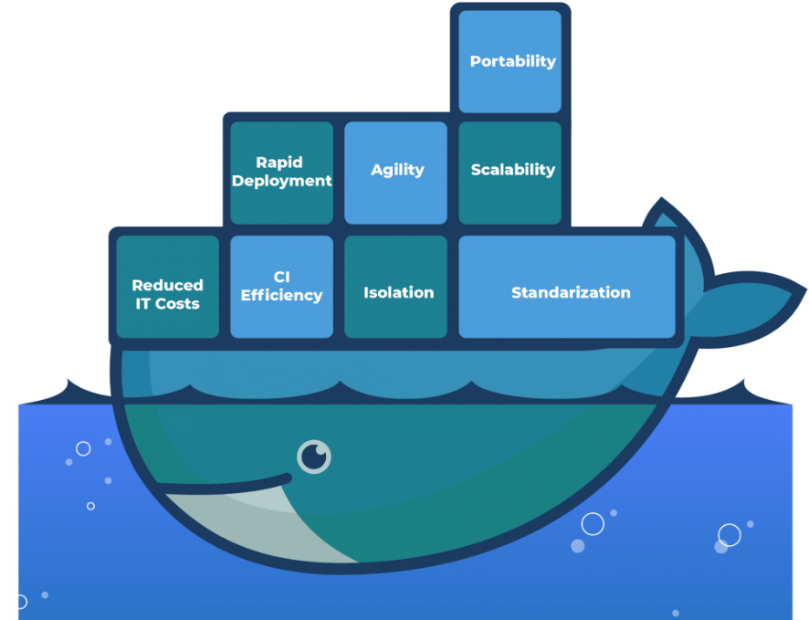
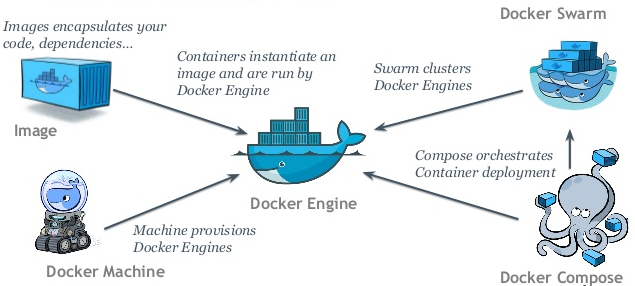
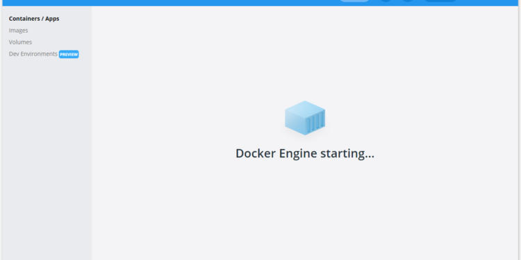
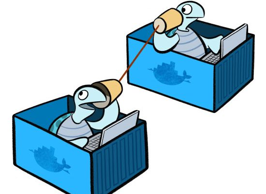
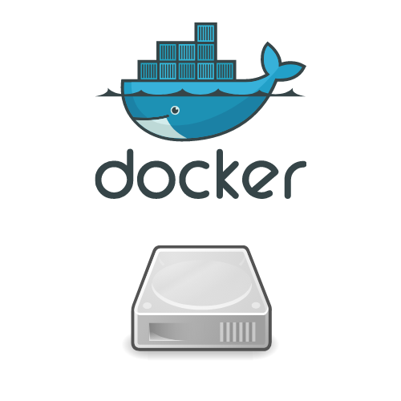

name: inverse
class: center, middle, inverse


# .red[Conteneurisation]

<div class="logo" style="margin-top:80px;"><svg class="logo-1" fill="white" width="196" height="64" viewBox="0 0 196 64" style="fill-rule: evenodd; clip-rule: evenodd; stroke-linejoin: round; stroke-miterlimit: 2;"><g transform="matrix(0.101031,0,0,0.101031,2.39526,-0.329946)"><g transform="matrix(1.27705,0,0,1.27705,1143.65,155.404)"><path d="M320.958,94.576C320.958,107.301 317.357,117.884 310.155,126.323C302.952,134.763 293.386,140.971 281.456,144.947L331.695,223.685L290.072,223.685L246.727,150.647L230.025,150.647L230.025,223.685L193.837,223.685L193.837,40.361L247.787,40.361C296.568,40.361 320.958,58.433 320.958,94.576ZM283.312,94.576C283.312,84.855 280.462,77.764 274.762,73.301C269.062,68.838 260.38,66.607 248.715,66.607L230.025,66.607L230.025,124.931L249.908,124.931C260.954,124.931 269.283,122.501 274.895,117.641C280.506,112.78 283.312,105.092 283.312,94.576Z" style="fill-rule: nonzero;"></path></g><g transform="matrix(1.27705,0,0,1.27705,1486.87,208.548)"><path d="M313.005,64.751L241.159,227.264L208.153,217.058L277.612,67.402L195.163,67.402L195.163,40.361L313.005,40.361L313.005,64.751Z" style="fill-rule: nonzero;"></path></g><g transform="matrix(1.27705,0,0,1.27705,1335.53,155.404)"><path d="M253.752,12.524C257.994,12.524 261.75,13.43 265.019,15.241C268.289,17.053 270.852,19.55 272.708,22.731C274.563,25.912 275.491,29.447 275.491,33.335C275.491,37.224 274.563,40.758 272.708,43.94C270.852,47.121 268.289,49.64 265.019,51.495C261.75,53.351 257.994,54.279 253.752,54.279C249.51,54.279 245.733,53.351 242.419,51.495C239.105,49.64 236.52,47.121 234.664,43.94C232.808,40.758 231.88,37.224 231.88,33.335C231.88,29.447 232.808,25.912 234.664,22.731C236.52,19.55 239.105,17.053 242.419,15.241C245.733,13.43 249.51,12.524 253.752,12.524ZM201.658,83.309L276.419,83.309L276.419,198.897L313.402,198.897L313.402,223.685L200.332,223.685L200.332,198.897L241.424,198.897L241.424,108.097L201.658,108.097L201.658,83.309Z" style="fill-rule: nonzero;"></path></g><g transform="matrix(2.01117,0,0,2.01117,165.834,-128.735)"><path d="M261.043,177.319L211.622,177.319L211.622,218.681L254.382,218.681L254.382,228.302L211.622,228.302L211.622,271.803L264.332,271.803L264.332,280.93L201.096,280.93L201.096,167.944L262.441,167.944L261.043,177.319ZM213.76,150.758L245.501,134.23L250.682,143.851L216.72,156.432L213.76,150.758Z" style="fill-rule: nonzero;"></path></g><g transform="matrix(2.01117,0,0,2.01117,165.834,-128.735)"><path d="M312.861,273.201C321.248,273.201 329.06,270.651 336.297,265.553L341.642,272.46C337.969,275.53 333.501,277.984 328.238,279.82C322.975,281.657 317.987,282.575 313.272,282.575C304.994,282.575 297.922,280.766 292.056,277.148C286.191,273.529 281.723,268.376 278.653,261.688C275.583,255 274.048,247.133 274.048,238.088C274.048,229.426 275.583,221.696 278.653,214.898C281.723,208.101 286.218,202.756 292.139,198.863C298.059,194.971 305.131,193.025 313.354,193.025C323.935,193.025 333.282,196.287 341.395,202.81L335.968,210.129C328.128,204.757 320.426,202.07 312.861,202.07C307.488,202.07 302.733,203.441 298.594,206.182C294.455,208.923 291.22,212.993 288.89,218.393C286.561,223.793 285.396,230.358 285.396,238.088C285.396,245.927 286.547,252.465 288.849,257.7C291.152,262.935 294.373,266.828 298.512,269.377C302.65,271.926 307.434,273.201 312.861,273.201Z" style="fill-rule: nonzero;"></path></g><g transform="matrix(2.01117,0,0,2.01117,165.834,-128.735)"><path d="M386.388,193.025C394.118,193.025 400.641,194.834 405.959,198.452C411.277,202.07 415.251,207.224 417.883,213.912C420.514,220.6 421.83,228.549 421.83,237.759C421.83,246.421 420.473,254.137 417.759,260.907C415.046,267.677 411.003,272.981 405.63,276.819C400.258,280.656 393.761,282.575 386.141,282.575C378.412,282.575 371.874,280.725 366.529,277.024C361.184,273.324 357.168,268.13 354.482,261.441C351.796,254.753 350.453,246.914 350.453,237.923C350.453,228.987 351.81,221.148 354.523,214.405C357.237,207.662 361.294,202.413 366.694,198.658C372.093,194.903 378.658,193.025 386.388,193.025ZM386.388,201.988C369.887,201.988 361.636,213.967 361.636,237.923C361.636,261.661 369.805,273.529 386.141,273.529C402.478,273.529 410.646,261.606 410.646,237.759C410.646,213.912 402.56,201.988 386.388,201.988Z" style="fill-rule: nonzero;"></path></g><g transform="matrix(2.01117,0,0,2.01117,165.834,-128.735)"><path d="M463.945,261.359C463.945,265.635 465.301,268.76 468.015,270.734C470.729,272.707 474.443,273.694 479.157,273.694C483.982,273.694 489.053,272.652 494.37,270.569L497.33,278.463C494.973,279.669 492.136,280.656 488.82,281.424C485.503,282.191 481.953,282.575 478.171,282.575C473.566,282.575 469.413,281.739 465.713,280.067C462.012,278.395 459.093,275.955 456.955,272.748C454.817,269.541 453.748,265.745 453.748,261.359L453.748,168.52L426.94,168.52L426.94,159.639L463.945,159.639L463.945,261.359Z" style="fill-rule: nonzero;"></path></g><g transform="matrix(2.01117,0,0,2.01117,165.834,-128.735)"><path d="M520.121,241.87C520.231,248.833 521.491,254.657 523.904,259.345C526.316,264.032 529.509,267.513 533.483,269.788C537.458,272.063 541.885,273.201 546.764,273.201C551.15,273.201 555.11,272.57 558.646,271.309C562.182,270.048 565.979,268.02 570.035,265.224L575.38,272.872C571.433,275.942 566.952,278.326 561.936,280.026C556.919,281.725 551.999,282.575 547.175,282.575C539.336,282.575 532.552,280.725 526.823,277.024C521.094,273.324 516.722,268.102 513.707,261.359C510.692,254.616 509.184,246.777 509.184,237.841C509.184,229.125 510.705,221.381 513.748,214.611C516.791,207.84 521.08,202.55 526.617,198.74C532.154,194.93 538.486,193.025 545.613,193.025C552.52,193.025 558.496,194.711 563.539,198.082C568.583,201.454 572.434,206.278 575.093,212.555C577.751,218.832 579.081,226.246 579.081,234.798C579.081,236.059 578.999,238.417 578.834,241.87L520.121,241.87ZM545.859,202.564C541.09,202.564 536.855,203.674 533.155,205.894C529.454,208.114 526.48,211.472 524.232,215.967C521.985,220.463 520.669,226.027 520.285,232.66L569.377,232.66C569.158,222.793 566.938,215.31 562.717,210.211C558.496,205.113 552.876,202.564 545.859,202.564Z" style="fill-rule: nonzero;"></path></g><path d="M250.428,75.558C385.339,75.558 494.87,185.089 494.87,320C494.87,454.911 385.339,564.442 250.428,564.442C115.517,564.442 5.986,454.911 5.986,320C5.986,185.089 115.517,75.558 250.428,75.558ZM131.233,450.023L131.233,203.31L220.202,205.493C297.709,207.676 311.355,209.314 331.55,219.685C400.87,255.709 417.79,343.587 365.937,402.536L344.65,426.552L356.658,438.014L368.12,450.023L256.772,450.023L256.772,339.22L269.872,351.228L282.972,363.782L294.434,352.32C308.08,338.674 309.171,325.575 297.163,309.2C294.835,305.797 292.624,303.334 289.625,301.561C283.483,297.931 274.034,297.192 253.497,297.192L218.564,297.192L218.564,450.023L131.233,450.023Z"></path></g></svg></div>

---

class: middle
.left-column[
### Introduction
]
.right-column[
#### Introduction

**Docker** est une technologie de **conteneurisation** qui permet de créer, de distribuer et d'exécuter des applications dans des conteneurs légers et portables. Cette technologie est devenue de plus en plus populaire ces dernières années, en raison de ses nombreux avantages pour les développeurs et les administrateurs système.

L'utilisation de Docker permet de :

* **Faciliter le déploiement d'applications :** les conteneurs Docker permettent de créer des environnements de développement et de production homogènes et portables, facilitant ainsi le déploiement de l'application sur différents serveurs.

* **Réduire les coûts et améliorer l'efficacité :** en utilisant Docker, les développeurs peuvent s'assurer que les applications fonctionnent de manière cohérente et prévisible, réduisant ainsi le temps passé à déboguer des erreurs. De plus, les conteneurs Docker sont plus légers que les machines virtuelles, ce qui permet d'économiser des ressources système.

* **Améliorer la sécurité :** Docker utilise une architecture de sécurité qui permet de sécuriser les applications et les données sensibles en les isolant dans des conteneurs. Cette approche permet de réduire les risques de failles de sécurité et de compromission des données.

Dans ce cours, nous allons nous concentrer sur l'utilisation de Docker pour **le développement et le déploiement d'applications**. Nous allons voir comment Docker permet de simplifier le processus de déploiement en créant des conteneurs légers et portables, et comment Docker Compose permet de gérer facilement les applications multi-conteneurs. Nous allons également explorer les principales commandes et fonctionnalités de Docker, afin que vous puissiez commencer à utiliser cette technologie dès aujourd'hui.
]

---

class: middle
.left-column[
### Introduction
### Au programme
]
.right-column[
.pull-left[
* **Introduction à Docker**
  * Qu'est-ce que Docker?
  * Pourquoi utiliser Docker?
  * Architecture Docker
  * Les composants de Docker
  * Les machines virtuelles vs les conteneurs

* **Installation et configuration de Docker**
  * Les différents systèmes d'exploitation compatibles avec Docker
  * Installer Docker sur Windows, macOS, ou Linux
  * Configurer l'environnement Docker

* **Les bases de Docker**
  * Lancer un premier conteneur
  * Les commandes de base de Docker
  * Créer une image Docker personnalisée
  * Partager une image sur Docker Hub

]
.pull-right[
* **Docker Compose**
  * Présentation de Docker Compose
  * Installation de Docker Compose
  * Configuration de Docker Compose
  * Lancer des conteneurs avec Docker Compose
  * Utilisation des variables d'environnement dans Docker Compose

* **Les réseaux Docker**
  * Les réseaux Docker et leur fonctionnement
  * Création de réseaux Docker personnalisés
  * Connexion de conteneurs à un réseau Docker

* **Les volumes Docker**
  * Comprendre les volumes Docker
  * Création de volumes Docker personnalisés
  * Utilisation des volumes avec Docker Compose
]
]

---
class: center, middle, inverse
# 1. Introduction à Docker
---
class: middle
.left-column[
#### Qu'est-ce que Docker?
]
.right-column[
  **Docker** est une technologie open source qui permet de créer, de déployer et de gérer des applications dans des conteneurs logiciels. 
  
  **Les conteneurs** sont des environnements d'exécution légers et portables qui encapsulent une application et toutes ses dépendances.

  **Docker** repose sur une technologie de virtualisation de type conteneur. Les conteneurs permettent d'isoler l'exécution des applications, en créant un environnement d'exécution **indépendant du système d'exploitation hôte**. Contrairement aux machines virtuelles, qui nécessitent un système d'exploitation complet pour chaque instance, les conteneurs partagent le même noyau du système d'exploitation hôte, ce qui les rend plus légers et plus rapides à démarrer.

  **Les applications peuvent être développées, testées et déployées dans des conteneurs de manière cohérente et reproductible.** Cette approche permet de résoudre les problèmes liés à la configuration et à la compatibilité des environnements d'exécution, tout en offrant une plus grande flexibilité et une meilleure portabilité.

  En outre, Docker est une plateforme très modulaire qui peut être utilisée dans de nombreux contextes, notamment **le développement d'applications, le déploiement d'applications dans le cloud, la mise en place d'environnements de test**, etc.
]

---
class: middle
.left-column[
#### Qu'est-ce que Docker?
#### Pourquoi utiliser Docker?
]
.right-column[
  Docker offre de nombreux avantages par rapport aux méthodes traditionnelles de déploiement d'applications, tels que :

  * **Isolation:** les applications fonctionnent dans un environnement isolé qui empêche les conflits entre les différentes applications et garantit leur stabilité.
  
  * **Portabilité:** les conteneurs Docker sont indépendants du système d'exploitation et de l'infrastructure sous-jacente, ce qui permet de les déployer facilement sur n'importe quel environnement.
  
  * **Rapidité:** les conteneurs Docker sont légers et peuvent être créés rapidement, ce qui permet de réduire considérablement les temps de déploiement.
  
  * **Gestion des ressources:** Docker offre une gestion fine des ressources, ce qui permet d'optimiser l'utilisation des ressources du système et de réduire les coûts d'infrastructure.

.center[
  
]
]

---
class: middle
.left-column[
#### Qu'est-ce que Docker?
#### Pourquoi utiliser Docker?
#### Architecture Docker
]
.right-column[
Docker utilise une architecture client-serveur, composée de plusieurs éléments clés :

* **Le Docker client:** interface en ligne de commande permettant d'interagir avec le daemon Docker.

* **Le Docker daemon:** processus en arrière-plan qui gère les opérations de base, telles que la création, le démarrage et l'arrêt des conteneurs Docker.

* **Les images Docker:** un modèle de base pour la création de conteneurs Docker, qui contient toutes les informations nécessaires à l'exécution d'une application.

* **Les conteneurs Docker:** une instance exécutable d'une image Docker.

* **Les registres Docker:** un service centralisé pour stocker et distribuer des images Docker.
]

---
class: middle
.left-column[
#### Qu'est-ce que Docker?
#### Pourquoi utiliser Docker?
#### Architecture Docker
#### Les composants de Docker
]
.right-column[
Docker se compose de plusieurs composants, notamment :

* **Le Docker Engine:** le moteur principal de Docker qui gère les opérations de conteneurisation.

* **Docker Hub:** un service cloud de registre Docker public où les utilisateurs peuvent stocker et partager leurs images Docker.

* **Docker Compose:** un outil permettant de définir et de gérer des environnements multi-conteneurs avec une seule commande.

* **Docker Swarm:** un outil de clustering Docker qui permet de gérer des clusters de conteneurs sur plusieurs hôtes.

.center[
  
]
]

---
class: middle
.left-column[
#### Qu'est-ce que Docker?
#### Pourquoi utiliser Docker?
#### Architecture Docker
#### Les composants de Docker
#### Machines virtuelles vs les conteneurs
]
.right-column[
.center[
  
]

**Les conteneurs Docker** et **les machines virtuelles (VM)** ont des différences clés. Les machines virtuelles **émulent une pile complète de matériel**, tandis que les conteneurs **partagent les ressources du système hôte**, ce qui les rend plus légers et plus rapides à créer et à déployer.

Les conteneurs sont également **plus portables** et **plus adaptés** aux architectures distribuées que les machines virtuelles.
]

---
class: center, middle, inverse
# 2. Installation et configuration de Docker

---
class: middle
.left-column[
#### Les différents systèmes d'exploitation compatibles avec Docker
]
.right-column[
Docker est compatible avec différents systèmes d'exploitation. Voici une liste des systèmes d'exploitation compatibles avec Docker :

* **Linux :** Docker est natif sur les distributions Linux. Docker utilise le noyau Linux pour exécuter des conteneurs. Les distributions Linux les plus couramment utilisées pour Docker sont Ubuntu, Debian, CentOS, Red Hat Enterprise Linux, Fedora et Arch Linux.

* **macOS :** Docker Desktop est disponible pour les utilisateurs de macOS. Docker Desktop utilise une machine virtuelle pour exécuter des conteneurs. La machine virtuelle utilise le noyau Linux pour exécuter des conteneurs, mais elle est transparente pour l'utilisateur.

* **Windows :** Docker Desktop est également disponible pour les utilisateurs de Windows. Docker Desktop utilise également une machine virtuelle pour exécuter des conteneurs. La machine virtuelle utilise le noyau Linux pour exécuter des conteneurs, mais elle est également transparente pour l'utilisateur.

.center[
  
]

> Il est important de noter que pour exécuter des conteneurs Windows, vous devez utiliser des conteneurs Windows Server Core ou Nano Server, qui nécessitent une licence de Windows Server.
]
---
class: middle
.left-column[
#### Les différents systèmes d'exploitation compatibles avec Docker
#### Installation de Docker
]
.right-column[
Avant de pouvoir utiliser Docker, vous devez installer et configurer Docker sur votre machine. Dans ce chapitre, nous allons couvrir les étapes pour installer et configurer Docker.

#### Installation de Docker
La première étape de l'installation de Docker consiste à télécharger le package d'installation de Docker pour votre système d'exploitation à partir du site Web officiel de Docker. ***https://docs.docker.com/engine/install***

Une fois le package d'installation téléchargé, suivez les instructions d'installation pour installer Docker sur votre système.

Après avoir terminé l'installation, vous pouvez vérifier que Docker est correctement installé en exécutant la commande suivante dans votre terminal :
```sh
docker --version
```

Cette commande affichera la version de Docker que vous avez installée sur votre machine.

]  
---
class: middle
.left-column[
#### Les différents systèmes d'exploitation compatibles avec Docker
#### Installation de Docker
#### Configuration de Docker
]
.right-column[
Après l'installation de Docker, vous pouvez commencer à configurer Docker pour répondre à vos besoins. Les fichiers de configuration Docker se trouvent généralement dans le répertoire `/etc/docker` sur Linux, ou dans le menu Docker Desktop sur macOS ou Windows.

Les fichiers de configuration Docker les plus couramment utilisés sont :

* **daemon.json** : ce fichier de configuration permet de définir les paramètres du démon Docker, tels que la configuration du stockage, les limites de ressources, la sécurité, etc.

* **docker-compose.yml** : ce fichier permet de définir les services, les réseaux et les volumes pour une application multi-conteneurs.

* **Dockerfile** : ce fichier est utilisé pour créer une image personnalisée à partir de laquelle vous pouvez lancer des conteneurs.
]  
---

class: middle
.left-column[
#### Les différents systèmes d'exploitation compatibles avec Docker
#### Installation de Docker
#### Configuration de Docker
]
.right-column[
**💡 Pour ceux ayant un environnement linux**, il est bien sûr est possible de configurer Docker pour que vous n'ayez pas besoin d'utiliser `sudo` à chaque fois que vous souhaitez exécuter une commande Docker.

Pour éviter d'utiliser `sudo`, vous pouvez ajouter votre utilisateur au groupe docker en utilisant la commande suivante :

```sh
sudo usermod -aG docker $USER
```

Après avoir ajouté votre utilisateur au groupe docker, vous devez vous déconnecter et vous reconnecter pour que les modifications prennent effet.

Une fois que vous avez effectué cette étape, vous pouvez exécuter des commandes Docker sans utiliser sudo. Par exemple, pour exécuter un conteneur, vous pouvez utiliser la commande suivante :
```sh
docker run hello-world
```
Il est important de noter que cette configuration est utile pour les utilisateurs qui travaillent seuls sur leur machine. Si plusieurs utilisateurs travaillent sur la même machine, il est recommandé de configurer l'accès à Docker de manière appropriée pour chaque utilisateur.
]
---

class: center, middle, inverse
# 3. Les bases de Docker

---

class: middle
.left-column[
#### Lancer votre premier conteneur
]
.right-column[
  Maintenant que nous avons installé Docker sur notre machine, nous allons explorer les bases de Docker. Nous allons apprendre à lancer notre premier conteneur, à utiliser les commandes de base de Docker, à créer une image Docker personnalisée et à partager une image sur Docker Hub.

#### Lancer votre premier conteneur
Pour lancer un premier conteneur, nous allons utiliser l'image Docker [`hello-world`](https://hub.docker.com/_/hello-world). Cette image est un exemple simple qui affiche un message dans la sortie standard.

Pour lancer un conteneur à partir de l'image `hello-world`, nous allons utiliser la commande suivante :
```sh
docker run hello-world
```
La commande `docker run` crée un nouveau conteneur à partir de l'image `hello-world` et exécute la commande par défaut de l'image. Dans ce cas, la commande par défaut de l'image `hello-world` affiche un message de bienvenue.

]

---

class: middle
.left-column[
#### Lancer votre premier conteneur
#### Utiliser les commandes de base de Docker
]
.right-column[

Docker dispose de nombreuses commandes pour travailler avec des conteneurs, des images et des volumes. Voici quelques-unes des commandes les plus courantes :

* **`docker run` :** Cette commande crée un nouveau conteneur à partir d'une image Docker.

* **`docker ps`** : Cette commande affiche une liste des conteneurs en cours d'exécution.

* **`docker images` :** Cette commande affiche une liste des images Docker disponibles sur votre machine.

* **`docker stop` :** Cette commande arrête un ou plusieurs conteneurs en cours d'exécution.

* **`docker rm` :** Cette commande supprime un ou plusieurs conteneurs.

* **`docker rmi` :** Cette commande supprime une ou plusieurs images Docker.

* **`docker build` :** Cette commande crée une nouvelle image Docker à partir d'un fichier Dockerfile.

* **`docker exec` :** Cette commande exécute une commande dans un conteneur en cours d'exécution.

* **`docker pull` :** Cette commande télécharge une image Docker depuis un registre Docker.

* **`docker push` :** Cette commande envoie une image Docker vers un registre Docker.

]

---

class: middle
.left-column[
#### Lancer votre premier conteneur
#### Utiliser les commandes de base de Docker
#### Utiliser les commandes de base de Docker
#### Définir une image Docker personnalisée
]
.right-column[
Il est souvent nécessaire de créer une image Docker personnalisée pour vos projets. Pour créer une image Docker personnalisée, vous devez créer un fichier `Dockerfile` qui contient les instructions pour la création de l'image.

Voici un exemple de fichier `Dockerfile` qui crée une image Docker pour une application `PHP` :
```sh
FROM php:8.2-alpine
WORKDIR /app
COPY . .
CMD [ "php", "-S", "0.0.0.0:8080" ]
EXPOSE 8080
```

Ce fichier `Dockerfile` utilise la dernière image de base [`php:8.2-alpine` (8.2)](https://hub.docker.com/layers/library/php/8.2-alpine/images/sha256-55fd6cd3f17e48015df5ff8f2843a9a48fba6c363a90b7f431dc01e6c57b1bc5?context=explore)  pour créer une image qui copie les fichiers de l'application PHP dans le conteneur, expose le port `8080` et définit la commande par défaut pour lancer le serveur web intégré de PHP.

]

---

class: middle
.left-column[
#### Lancer votre premier conteneur
#### Utiliser les commandes de base de Docker
#### Utiliser les commandes de base de Docker
#### Définir une image Docker personnalisée
]
.right-column[
Le `Dockerfile` est un fichier texte qui contient une liste d'instructions permettant de créer une image Docker personnalisée. Voici un survol des différentes options disponibles dans le `Dockerfile` :

* **`FROM` :** spécifie l'image de base à utiliser pour créer la nouvelle image.
* **`RUN` :** exécute une commande lors de la construction de l'image.
* **`COPY` :** copie des fichiers de l'hôte vers l'image.
* **`ADD` :** copie des fichiers de l'hôte vers l'image, avec une prise en charge améliorée des URL, des archives et des extraits.
* **`WORKDIR` :** définit le répertoire de travail pour les instructions suivantes.
* **`EXPOSE` :** indique que le conteneur écoute sur le port spécifié au moment de l'exécution.
* **`CMD` :** définit la commande par défaut à exécuter lorsque le conteneur est démarré.
* **`ENTRYPOINT` :** définit la commande par défaut à exécuter lorsque le conteneur est démarré, mais permet également de passer des arguments à cette commande.

Ces options permettent de créer une image Docker personnalisée selon les besoins spécifiques de l'application que vous souhaitez exécuter dans un conteneur.
]

---

class: middle
.left-column[
#### Lancer votre premier conteneur
#### Utiliser les commandes de base de Docker
#### Utiliser les commandes de base de Docker
#### Définir une image Docker personnalisée
#### Construire une image Docker personnalisée
]
.right-column[
  
Pour créer l'image Docker à partir du fichier Dockerfile, utilisez la commande suivante :

```sh
docker build -t mon-image .
```

La commande `docker build` crée une nouvelle image Docker à partir du fichier `Dockerfile`. L'option `-t` permet de donner un nom à l'image. Dans ce cas, le nom de l'image est `mon-image`.

]

---

.left-column[
<br />
#### Lancer votre premier conteneur
#### Utiliser les commandes de base de Docker
#### Utiliser les commandes de base de Docker
#### Créer une image Docker personnalisée
#### Partager une image sur Docker Hub
]
.right-column[
Docker Hub (https://hub.docker.com) est un registre d'images Docker qui permet de stocker et de partager des images Docker avec d'autres utilisateurs. Pour partager une image sur Docker Hub, vous devez d'abord créer un compte sur Docker Hub.

Une fois que vous avez créé un compte sur Docker Hub, vous pouvez vous connecter à votre compte en utilisant la commande suivante :
```sh
docker login
``` 
La commande docker login vous demande votre nom d'utilisateur et votre mot de passe pour Docker Hub. Si vous avez entré les informations de connexion correctement, vous devriez être connecté à Docker Hub.

Pour partager une image sur Docker Hub, vous devez d'abord taguer l'image avec le nom de votre compte Docker Hub. Pour cela, utilisez la commande suivante :
```sh
docker tag mon-image mon-compte-docker-hub/mon-image
```

Cette commande ajoute un nouveau tag à l'image mon-image avec le nom de votre compte Docker Hub. Par exemple, si votre nom d'utilisateur Docker Hub est `mon-utilisateur`, le nouveau tag sera `mon-utilisateur/mon-image`.

Ensuite, vous pouvez pousser l'image vers Docker Hub en utilisant la commande suivante :
```sh
docker push mon-compte-docker-hub/mon-image
```

La commande docker push pousse l'image taguée vers Docker Hub. Une fois que l'image est poussée sur Docker Hub, vous pouvez la partager avec d'autres utilisateurs.

]

---

.left-column[
<br />
#### Lancer votre premier conteneur
#### Utiliser les commandes de base de Docker
#### Utiliser les commandes de base de Docker
#### Créer une image Docker personnalisée
#### Partager une image sur Docker Hub
#### .red[🚧 TP]
]
.right-column[
L'objectif de ce TP est de vous familiariser avec Docker en créant et en gérant des conteneurs Docker.

- **Étape 1 : Installation et configuration de Docker**<br />
Assurez-vous que Docker est installé et configuré correctement sur votre machine.
- **Étape 2 : Lancer un premier conteneur**<br />
Lancez un conteneur Docker à partir de l'image hello-world. Vérifiez que le conteneur a été lancé correctement.
- **Étape 3 : Les commandes de base de Docker**<br />
Utilisez les commandes de base de Docker pour lister les images et les conteneurs Docker présents sur votre machine.
- **Étape 4 : Créer une image Docker personnalisée**<br />
Créez une image Docker personnalisée à partir de l'image php:alpine. Cette image doit contenir un script PHP simple qui affiche "Hello World" dans le navigateur.
- **Étape 5 : Lancer un conteneur à partir de l'image personnalisée**<br />
Lancez un conteneur à partir de l'image personnalisée que vous venez de créer. Vérifiez que le conteneur affiche "Hello World" dans votre navigateur.
- **Étape 6 : Partager une image sur Docker Hub**<br />
Créez un compte sur Docker Hub et partagez votre image personnalisée sur Docker Hub.
- **Étape 7 : Utiliser Docker Compose**<br />
Créez un fichier docker-compose.yml pour lancer deux conteneurs Docker : un conteneur pour votre image personnalisée et un conteneur pour la base de données MySQL. Les deux conteneurs doivent être en réseau et communiquer entre eux.
- **Étape 8 : Tester les conteneurs**<br />
Vérifiez que les deux conteneurs Docker sont lancés correctement et communiquent entre eux.


]


---
class: center, middle, inverse
# 4. Docker compose

---
.left-column[
<br />
#### Présentation de Docker Compose
]
.right-column[
**Docker Compose** est un outil open-source de Docker qui permet de décrire et de lancer des applications multi-conteneurs. Il facilite la gestion des différents conteneurs d'une application en les regroupant ensemble et en les lançant de manière cohérente.

Docker Compose est un outil particulièrement utile pour les applications qui ont besoin de plusieurs conteneurs pour fonctionner, par exemple une application web qui nécessite un conteneur pour le serveur web et un autre conteneur pour la base de données.

Avec Docker Compose, vous pouvez définir les différents conteneurs de votre application dans un fichier `docker-compose.yml`, qui décrit les images, les ports exposés, les variables d'environnement, etc. Ensuite, vous pouvez utiliser la commande docker-compose up pour lancer tous les conteneurs décrits dans le fichier `docker-compose.yml`.

Docker Compose permet également de gérer la mise en réseau des différents conteneurs, en créant un réseau virtuel qui permet aux différents conteneurs de communiquer entre eux.

🚀 En résumé, Docker Compose est un outil essentiel pour gérer des applications multi-conteneurs avec Docker. Il facilite la définition des différents conteneurs, leur mise en réseau et leur lancement de manière cohérente.
.center[
  
]
]
---
.left-column[
<br />
#### Présentation de Docker Compose
#### Installation & Configuration
]
.right-column[

#### Installation de Docker Compose
Pour installer Docker Compose, vous pouvez vous rendre sur le site officiel de Docker et télécharger la dernière version de Docker Compose pour votre système d'exploitation. Une fois le téléchargement terminé, vous pouvez installer Docker Compose en suivant les instructions fournies.

#### Configuration de Docker Compose
La configuration de Docker Compose se fait principalement dans un fichier `docker-compose.yml` situé à la racine du projet. Ce fichier est utilisé par Docker Compose pour décrire les différents conteneurs de l'application, ainsi que les options de configuration associées.

Le fichier `docker-compose.yml` est écrit en YAML, un format de données structuré facile à lire et à écrire. Dans ce fichier, vous pouvez définir plusieurs éléments :

* **Les images des conteneurs :** vous pouvez spécifier les images Docker utilisées pour chaque conteneur, en précisant le nom de l'image et éventuellement la version.
* **Les volumes :** vous pouvez configurer les volumes utilisés par les différents conteneurs pour stocker les données persistantes.
* **Les variables d'environnement :** vous pouvez spécifier les variables d'environnement utilisées par les différents conteneurs pour configurer leur comportement.
* **Les ports exposés :** vous pouvez préciser les ports exposés par les différents conteneurs pour permettre l'accès aux services qu'ils fournissent.
* **Les liens entre les conteneurs :** vous pouvez configurer les liens entre les différents conteneurs pour qu'ils puissent communiquer entre eux.
* **Les réseaux :** vous pouvez définir des réseaux virtuels pour vos conteneurs afin de les isoler les uns des autres.
]
---
.left-column[
<br />
#### Présentation de Docker Compose
#### Installation & Configuration
#### Exemple d'utilisation de Docker Compose
]
.right-column[
Voici un exemple d'utilisation de Docker Compose pour lancer une application composée d'un conteneur pour une application web et d'un conteneur pour une base de données MySQL :

```yaml
version: '3'
services:
  web:
    build: .
    ports:
      - "5000:5000"
  db:
    image: mysql:8.0
    environment:
      MYSQL_ROOT_PASSWORD: ${PASSWORD:-password}
    volumes:
      - db_data:/var/lib/mysql
```
Dans cet exemple, le conteneur web est créé à partir du `Dockerfile` du répertoire courant, et expose le port `5000` de la machine hôte vers le port `5000` du conteneur.

Le conteneur `db` est créé à partir de l'image **MySQL 8.0** et définit la variable d'environnement `MYSQL_ROOT_PASSWORD` pour définir le mot de passe de l'utilisateur root de MySQL.

#### Utilisation des variables d'environnement dans Docker Compose
Docker Compose permet également d'utiliser des variables d'environnement pour définir les paramètres des conteneurs de votre application. Pour utiliser des variables d'environnement dans votre fichier `docker-compose.yml`, vous pouvez utiliser la syntaxe `${VAR}` pour référencer les variables d'environnement.
]
---
.left-column[
<br />
#### Présentation de Docker Compose
#### Installation & Configuration
#### Exemple d'utilisation de Docker Compose
#### Details des configurations docker-compose.yaml
]
.right-column[
Voici quelques-unes des configurations les plus courantes que vous pouvez ajouter dans votre fichier `docker-compose.yaml` :

* **`image` :** cette configuration permet de spécifier l'image Docker à utiliser pour un service donné. Si l'image n'est pas disponible localement, Docker Compose la téléchargera automatiquement depuis le Docker Hub.

* **`build` :** cette configuration permet de construire une image personnalisée pour un service donné, à partir d'un Dockerfile. Elle peut inclure des options de construction telles que le contexte de construction et le chemin vers le fichier Dockerfile.

* **`ports` :** cette configuration permet de spécifier les ports à exposer pour un service donné. Elle peut être utilisée pour rediriger les demandes de trafic réseau vers un conteneur Docker.

* **`volumes` :** cette configuration permet de monter des volumes pour un service donné, ce qui permet de stocker des données persistantes en dehors du conteneur Docker.

* **`environment` :** cette configuration permet de spécifier des variables d'environnement pour un service donné, qui peuvent être utilisées pour configurer l'application dans le conteneur Docker.

* **`depends_on` :** cette configuration permet de spécifier les dépendances entre les différents services de votre application. Elle garantit que les services qui dépendent d'autres services sont lancés dans le bon ordre.

Il est important de noter que le fichier docker-compose.yaml peut être versionné avec un système de contrôle de version (Git, SVN, etc.) pour faciliter la collaboration et le partage de code entre les membres de l'équipe de développement.
]
---
.left-column[
<br />
#### Présentation de Docker Compose
#### Installation & Configuration
#### Exemple d'utilisation de Docker Compose
#### Details des configurations docker-compose.yaml
#### Lancer des conteneurs avec Docker Compose
]
.right-column[

Pour lancer des conteneurs avec **Docker Compose**, vous devez d'abord créer un fichier `docker-compose.yaml` qui décrit les différents services de votre application. Une fois le fichier créé, vous pouvez utiliser la commande docker-compose up pour lancer tous les services de votre application en même temps.

Par exemple, si vous avez un fichier `docker-compose.yaml` qui décrit deux services : un service de base de données MySQL et un service d'application PHP, vous pouvez lancer les deux services en même temps en utilisant la commande suivante :
```sh
docker-compose up
```
Cette commande lancera tous les services définis dans le fichier `docker-compose.yaml` et affichera les logs de chaque service dans la console.

Si vous voulez lancer les services en arrière-plan, vous pouvez utiliser l'option `-d` ou `--detach` :
```sh
docker-compose up -d
```
Cette commande lancera tous les services définis dans le fichier `docker-compose.yaml` en arrière-plan, sans afficher les logs de chaque service dans la console.

Vous pouvez également lancer un service spécifique en utilisant la commande docker-compose up avec le nom du service :
```sh
docker-compose up web
```
Cette commande lancera seulement le service spécifié dans le fichier `docker-compose.yaml`.
]
---
.left-column[
<br />
#### Présentation de Docker Compose
#### Installation & Configuration
#### Exemple d'utilisation de Docker Compose
#### Details des configurations docker-compose.yaml
#### Lancer des conteneurs avec Docker Compose
]
.right-column[
  Si vous voulez arrêter et supprimer tous les conteneurs lancés avec docker-compose up, vous pouvez utiliser la commande docker-compose down :
```sh
docker-compose down
```
Cette commande arrêtera et supprimera tous les conteneurs créés avec docker-compose up, ainsi que tous les réseaux et volumes Docker créés pour ces conteneurs.

Enfin, si vous voulez arrêter les conteneurs sans les supprimer, vous pouvez utiliser la commande docker-compose stop :
```sh
docker-compose stop
```
Cette commande arrêtera tous les conteneurs lancés avec docker-compose up, mais les laissera en place pour que vous puissiez les relancer ultérieurement avec la commande docker-compose start.

.center[
  
]
]

---
class: center, middle, inverse
# 5. Les réseaux Docker
---
class: middle
.left-column[
<br />
#### Les réseaux Docker et leur fonctionnement
]
.right-column[
Les réseaux Docker permettent à des conteneurs de communiquer entre eux de manière transparente, même s'ils sont hébergés sur des hôtes différents. Docker fournit plusieurs types de réseaux par défaut, tels que le réseau bridge qui est utilisé par défaut pour les conteneurs lancés avec `docker run`.

Chaque conteneur lancé avec Docker est automatiquement connecté à un réseau, ce qui lui permet de communiquer avec les autres conteneurs sur le même réseau. Les conteneurs peuvent également être connectés à plusieurs réseaux pour permettre une communication entre différents groupes de conteneurs.

.center[
  
]
]
---

class: middle
.left-column[
<br />
#### Les réseaux Docker et leur fonctionnement
#### Création de réseaux Docker personnalisés
]
.right-column[
Vous pouvez également créer des réseaux Docker personnalisés pour vos conteneurs. Pour créer un nouveau réseau Docker, vous pouvez utiliser la commande `docker network create` :
```sh
docker network create my-network
```

Cette commande créera un nouveau réseau Docker avec le nom spécifié. Vous pouvez également spécifier d'autres options lors de la création du réseau, telles que le type de pilote réseau à utiliser.

#### Connexion de conteneurs à un réseau Docker

Une fois que vous avez créé un réseau Docker, vous pouvez connecter vos conteneurs à ce réseau en utilisant la commande `docker run` ou la commande `docker network connect`.

Par exemple, pour connecter un conteneur existant à un réseau Docker, vous pouvez utiliser la commande `docker network connect` :
```sh
docker network connect my-network my-container
```

Cette commande connectera le conteneur spécifié au réseau Docker spécifié.

]
---

class: middle
.left-column[
<br />
#### Les réseaux Docker et leur fonctionnement
#### Création de réseaux Docker personnalisés
]
.right-column[
Vous pouvez également spécifier le réseau Docker au moment de la création du conteneur en utilisant l'option `--network` de la commande `docker run` :
```sh
docker run --network my-network -d nginx
```
Cette commande lancera un nouveau conteneur et le connectera automatiquement au réseau Docker spécifié.

En utilisant les réseaux Docker, vous pouvez facilement créer des architectures d'applications complexes composées de plusieurs conteneurs qui communiquent entre eux de manière transparente.

]
---

class: middle
.left-column[
<br />
#### Les réseaux Docker et leur fonctionnement
#### Création de réseaux Docker personnalisés
#### Les réseaux Docker avec Docker Compose
]
.right-column[
Docker Compose permet également de gérer les réseaux Docker. Les réseaux Docker permettent aux conteneurs de communiquer entre eux, qu'ils soient sur la même machine hôte ou sur différentes machines. Les réseaux Docker peuvent être créés à partir de Docker Compose, et les conteneurs peuvent être ajoutés à ces réseaux lors de leur création.

**Création de réseaux Docker personnalisés avec Docker Compose**

Pour créer un réseau personnalisé dans Docker Compose, il suffit de spécifier le nom du réseau dans le fichier `docker-compose.yaml`. Voici un exemple :

```yaml
version: "3"
services:
  web:
    image: nginx
    networks:
      - mon_reseau

networks:
  mon_reseau:
    driver: bridge
```
Dans cet exemple, le réseau personnalisé est nommé `"mon_reseau"`. Le service `"web"` est connecté à ce réseau via la clé `"networks"`. Le driver du réseau est `"bridge"` par défaut.
]
---

class: middle
.left-column[
<br />
#### Les réseaux Docker et leur fonctionnement
#### Création de réseaux Docker personnalisés
#### Les réseaux Docker avec Docker Compose
#### Connexion de conteneurs à un réseau Docker
]
.right-column[
Pour connecter un conteneur à un réseau Docker, il suffit de spécifier le nom du réseau dans le fichier `docker-compose.yaml`. 

Voici un exemple :
  
```yaml
version: "3"
services:
  web:
    image: nginx
    networks:
      - mon_reseau

  db:
    image: postgres
    networks:
      - mon_reseau

networks:
  mon_reseau:
    driver: bridge
```
Dans cet exemple, les services `"web"` et `"db"` sont connectés au réseau `"mon_reseau"`.
]

---
class: center, middle, inverse
# 5. Les volumes Docker
---

class: middle
.left-column[
#### Comprendre les volumes Docker
]
.right-column[

Les volumes Docker permettent de stocker des données en dehors du conteneur lui-même, ce qui offre plusieurs avantages, notamment en termes de portabilité, de persistance des données et de performances. 

Dans cette section, nous allons voir comment utiliser les volumes Docker pour stocker des données.

Les volumes Docker sont des **entités de stockage de données indépendantes des conteneurs** qui peuvent être montées sur ces derniers. Ils peuvent être utilisés pour **stocker des fichiers, des bases de données ou tout autre type de données** nécessaires à l'exécution de l'application dans un conteneur.

Il existe deux types de volumes Docker : **les volumes nommés et les volumes anonymes**. 

* **Les volumes nommés** sont des volumes qui ont un nom et qui peuvent être réutilisés entre plusieurs conteneurs. 

* **Les volumes anonymes** sont des volumes qui ne sont pas nommés et qui ne peuvent être utilisés que par un seul conteneur.

.center[
  
]
]
---

class: middle
.left-column[
#### Comprendre les volumes Docker
#### Création de volumes Docker personnalisés
]
.right-column[
Pour créer un volume Docker personnalisé, il suffit d'utiliser la commande `docker volume create` suivie du nom du volume. 

Par exemple, pour créer un volume nommé "`myvolume`", vous pouvez exécuter la commande suivante :
```sh
docker volume create myvolume
```
Cela créera un volume Docker nommé `"myvolume"`.
]
---

class: middle
.left-column[
#### Comprendre les volumes Docker
#### Création de volumes Docker personnalisés
#### Utilisation des volumes avec Docker Compose
]
.right-column[

Pour utiliser un volume Docker dans un fichier Docker Compose, vous devez spécifier le nom du volume dans la section "`volumes`" de votre fichier `docker-compose.yaml`. 

Par exemple, pour utiliser le volume `"myvolume"` créé précédemment, vous pouvez ajouter les lignes suivantes à votre fichier `docker-compose.yaml` :
```yaml
volumes:
  myvolume:
```

Ensuite, vous pouvez monter le volume dans votre conteneur en spécifiant le nom du volume dans la section "volumes" de votre fichier `docker-compose.yaml` . Par exemple, pour monter le volume "`myvolume`" dans votre conteneur, vous pouvez ajouter les lignes suivantes à votre fichier `docker-compose.yaml` :
```yaml
services:
  myservice:
    image: myimage
    volumes:
      - myvolume:/path/to/mount
```

> * Nous avons vu comment utiliser les volumes Docker pour stocker des données en dehors des conteneurs. 
> * Nous avons également vu comment créer des volumes personnalisés et les utiliser avec Docker Compose. 

Les volumes Docker offrent une flexibilité et une portabilité accrues pour les applications Docker en permettant la persistance des données et en facilitant le partage de données entre plusieurs conteneurs.
]
---

class: middle
.left-column[
#### Comprendre les volumes Docker
#### Création de volumes Docker personnalisés
#### Utilisation des volumes avec Docker Compose
#### .red[🚧 TP : Conteneuriser une application Symfony avec PostgreSQL
]
]
.right-column[
Dans ce TP, vous allez mettre en pratique les connaissances acquises lors de cette formation. L'objectif est de conteneuriser une application **Symfony** avec une base de données **PostgreSQL** en utilisant Docker et Docker Compose.

**Prérequis**

* Avoir une application Symfony fonctionnelle avec un accès à une base de données PostgreSQL
* Avoir les connaissances de base en Docker et Docker Compose vues lors de cette formation

**Étapes à suivre**

1. Créez un nouveau projet et créez un fichier `docker-compose.yml` dans le répertoire principal du projet.
2. Définissez les services suivants dans votre fichier `docker-compose.yml` :
    * Un service pour votre application Symfony, basé sur **l'image PHP Apache** avec les extensions nécessaires pour faire fonctionner votre application.
    * Un service pour votre base de données PostgreSQL, basé sur l'image PostgreSQL.
3. Configurez les volumes nécessaires pour votre application Symfony et votre base de données PostgreSQL.
4. Configurez les ports et les variables d'environnement nécessaires pour vos services.
5. Configurez un réseau Docker personnalisé pour connecter vos services.
6. Lancez vos services en utilisant la commande `docker-compose up`.
7. Vérifiez que votre application Symfony fonctionne en accédant à http://localhost:8080 dans votre navigateur.
8. Vérifiez que votre base de données PostgreSQL fonctionne en vous connectant à la base de données à l'aide d'un outil de gestion de base de données tel que pgAdmin.
]
---

class: middle
.left-column[
#### Comprendre les volumes Docker
#### Création de volumes Docker personnalisés
#### Utilisation des volumes avec Docker Compose
#### .red[🚧 TP : Conteneuriser une application Symfony avec PostgreSQL]
]
.right-column[

**Bonus**
* Ajoutez un service de migration de base de données pour exécuter automatiquement les migrations de votre application Symfony.

* Utilisez les variables d'environnement pour stocker les informations de connexion à la base de données et pour les transmettre à votre application Symfony.

* Utilisez un volume Docker pour stocker les fichiers de configuration de votre application Symfony.

]