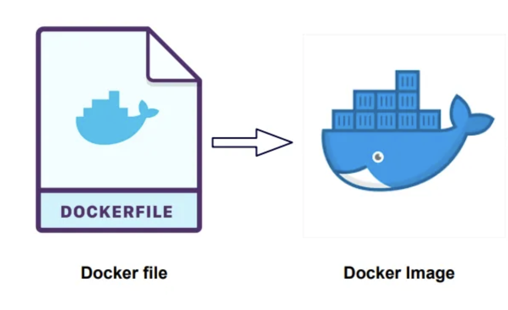
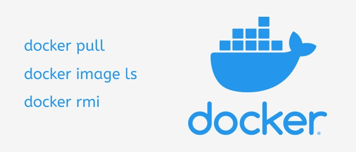
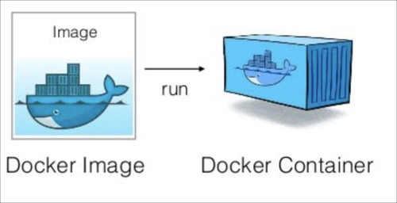
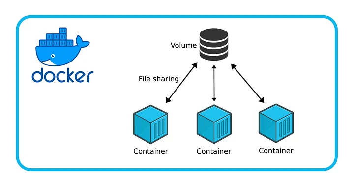
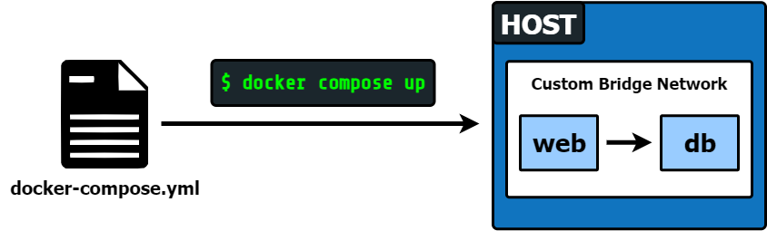

name: inverse
class: center, middle, inverse


# .red[Conteneurisation]

<div class="logo" style="margin-top:80px;"><svg class="logo-1" fill="white" width="196" height="64" viewBox="0 0 196 64" style="fill-rule: evenodd; clip-rule: evenodd; stroke-linejoin: round; stroke-miterlimit: 2;"><g transform="matrix(0.101031,0,0,0.101031,2.39526,-0.329946)"><g transform="matrix(1.27705,0,0,1.27705,1143.65,155.404)"><path d="M320.958,94.576C320.958,107.301 317.357,117.884 310.155,126.323C302.952,134.763 293.386,140.971 281.456,144.947L331.695,223.685L290.072,223.685L246.727,150.647L230.025,150.647L230.025,223.685L193.837,223.685L193.837,40.361L247.787,40.361C296.568,40.361 320.958,58.433 320.958,94.576ZM283.312,94.576C283.312,84.855 280.462,77.764 274.762,73.301C269.062,68.838 260.38,66.607 248.715,66.607L230.025,66.607L230.025,124.931L249.908,124.931C260.954,124.931 269.283,122.501 274.895,117.641C280.506,112.78 283.312,105.092 283.312,94.576Z" style="fill-rule: nonzero;"></path></g><g transform="matrix(1.27705,0,0,1.27705,1486.87,208.548)"><path d="M313.005,64.751L241.159,227.264L208.153,217.058L277.612,67.402L195.163,67.402L195.163,40.361L313.005,40.361L313.005,64.751Z" style="fill-rule: nonzero;"></path></g><g transform="matrix(1.27705,0,0,1.27705,1335.53,155.404)"><path d="M253.752,12.524C257.994,12.524 261.75,13.43 265.019,15.241C268.289,17.053 270.852,19.55 272.708,22.731C274.563,25.912 275.491,29.447 275.491,33.335C275.491,37.224 274.563,40.758 272.708,43.94C270.852,47.121 268.289,49.64 265.019,51.495C261.75,53.351 257.994,54.279 253.752,54.279C249.51,54.279 245.733,53.351 242.419,51.495C239.105,49.64 236.52,47.121 234.664,43.94C232.808,40.758 231.88,37.224 231.88,33.335C231.88,29.447 232.808,25.912 234.664,22.731C236.52,19.55 239.105,17.053 242.419,15.241C245.733,13.43 249.51,12.524 253.752,12.524ZM201.658,83.309L276.419,83.309L276.419,198.897L313.402,198.897L313.402,223.685L200.332,223.685L200.332,198.897L241.424,198.897L241.424,108.097L201.658,108.097L201.658,83.309Z" style="fill-rule: nonzero;"></path></g><g transform="matrix(2.01117,0,0,2.01117,165.834,-128.735)"><path d="M261.043,177.319L211.622,177.319L211.622,218.681L254.382,218.681L254.382,228.302L211.622,228.302L211.622,271.803L264.332,271.803L264.332,280.93L201.096,280.93L201.096,167.944L262.441,167.944L261.043,177.319ZM213.76,150.758L245.501,134.23L250.682,143.851L216.72,156.432L213.76,150.758Z" style="fill-rule: nonzero;"></path></g><g transform="matrix(2.01117,0,0,2.01117,165.834,-128.735)"><path d="M312.861,273.201C321.248,273.201 329.06,270.651 336.297,265.553L341.642,272.46C337.969,275.53 333.501,277.984 328.238,279.82C322.975,281.657 317.987,282.575 313.272,282.575C304.994,282.575 297.922,280.766 292.056,277.148C286.191,273.529 281.723,268.376 278.653,261.688C275.583,255 274.048,247.133 274.048,238.088C274.048,229.426 275.583,221.696 278.653,214.898C281.723,208.101 286.218,202.756 292.139,198.863C298.059,194.971 305.131,193.025 313.354,193.025C323.935,193.025 333.282,196.287 341.395,202.81L335.968,210.129C328.128,204.757 320.426,202.07 312.861,202.07C307.488,202.07 302.733,203.441 298.594,206.182C294.455,208.923 291.22,212.993 288.89,218.393C286.561,223.793 285.396,230.358 285.396,238.088C285.396,245.927 286.547,252.465 288.849,257.7C291.152,262.935 294.373,266.828 298.512,269.377C302.65,271.926 307.434,273.201 312.861,273.201Z" style="fill-rule: nonzero;"></path></g><g transform="matrix(2.01117,0,0,2.01117,165.834,-128.735)"><path d="M386.388,193.025C394.118,193.025 400.641,194.834 405.959,198.452C411.277,202.07 415.251,207.224 417.883,213.912C420.514,220.6 421.83,228.549 421.83,237.759C421.83,246.421 420.473,254.137 417.759,260.907C415.046,267.677 411.003,272.981 405.63,276.819C400.258,280.656 393.761,282.575 386.141,282.575C378.412,282.575 371.874,280.725 366.529,277.024C361.184,273.324 357.168,268.13 354.482,261.441C351.796,254.753 350.453,246.914 350.453,237.923C350.453,228.987 351.81,221.148 354.523,214.405C357.237,207.662 361.294,202.413 366.694,198.658C372.093,194.903 378.658,193.025 386.388,193.025ZM386.388,201.988C369.887,201.988 361.636,213.967 361.636,237.923C361.636,261.661 369.805,273.529 386.141,273.529C402.478,273.529 410.646,261.606 410.646,237.759C410.646,213.912 402.56,201.988 386.388,201.988Z" style="fill-rule: nonzero;"></path></g><g transform="matrix(2.01117,0,0,2.01117,165.834,-128.735)"><path d="M463.945,261.359C463.945,265.635 465.301,268.76 468.015,270.734C470.729,272.707 474.443,273.694 479.157,273.694C483.982,273.694 489.053,272.652 494.37,270.569L497.33,278.463C494.973,279.669 492.136,280.656 488.82,281.424C485.503,282.191 481.953,282.575 478.171,282.575C473.566,282.575 469.413,281.739 465.713,280.067C462.012,278.395 459.093,275.955 456.955,272.748C454.817,269.541 453.748,265.745 453.748,261.359L453.748,168.52L426.94,168.52L426.94,159.639L463.945,159.639L463.945,261.359Z" style="fill-rule: nonzero;"></path></g><g transform="matrix(2.01117,0,0,2.01117,165.834,-128.735)"><path d="M520.121,241.87C520.231,248.833 521.491,254.657 523.904,259.345C526.316,264.032 529.509,267.513 533.483,269.788C537.458,272.063 541.885,273.201 546.764,273.201C551.15,273.201 555.11,272.57 558.646,271.309C562.182,270.048 565.979,268.02 570.035,265.224L575.38,272.872C571.433,275.942 566.952,278.326 561.936,280.026C556.919,281.725 551.999,282.575 547.175,282.575C539.336,282.575 532.552,280.725 526.823,277.024C521.094,273.324 516.722,268.102 513.707,261.359C510.692,254.616 509.184,246.777 509.184,237.841C509.184,229.125 510.705,221.381 513.748,214.611C516.791,207.84 521.08,202.55 526.617,198.74C532.154,194.93 538.486,193.025 545.613,193.025C552.52,193.025 558.496,194.711 563.539,198.082C568.583,201.454 572.434,206.278 575.093,212.555C577.751,218.832 579.081,226.246 579.081,234.798C579.081,236.059 578.999,238.417 578.834,241.87L520.121,241.87ZM545.859,202.564C541.09,202.564 536.855,203.674 533.155,205.894C529.454,208.114 526.48,211.472 524.232,215.967C521.985,220.463 520.669,226.027 520.285,232.66L569.377,232.66C569.158,222.793 566.938,215.31 562.717,210.211C558.496,205.113 552.876,202.564 545.859,202.564Z" style="fill-rule: nonzero;"></path></g><path d="M250.428,75.558C385.339,75.558 494.87,185.089 494.87,320C494.87,454.911 385.339,564.442 250.428,564.442C115.517,564.442 5.986,454.911 5.986,320C5.986,185.089 115.517,75.558 250.428,75.558ZM131.233,450.023L131.233,203.31L220.202,205.493C297.709,207.676 311.355,209.314 331.55,219.685C400.87,255.709 417.79,343.587 365.937,402.536L344.65,426.552L356.658,438.014L368.12,450.023L256.772,450.023L256.772,339.22L269.872,351.228L282.972,363.782L294.434,352.32C308.08,338.674 309.171,325.575 297.163,309.2C294.835,305.797 292.624,303.334 289.625,301.561C283.483,297.931 274.034,297.192 253.497,297.192L218.564,297.192L218.564,450.023L131.233,450.023Z"></path></g></svg></div>

---

class: middle
.center[

### **Exemple de contexte**

]

Imaginez un scénario où un développeur travaille sur une application web en local sur macOS avec PHP 8.3 et PostgreSQL 16. Un autre développeur rejoint le projet, mais utilise Linux avec PHP 8.2 et une version différente de PostgreSQL. Pour harmoniser leur environnement de développement, le premier développeur décide de rétrograder sa version de PHP pour assurer la compatibilité.

Tout semble bien fonctionner jusqu'à ce que l'application soit prête à être déployée en production. À ce moment-là, ils réalisent que certaines extensions PHP nécessaires ne sont pas installées sur le serveur de production, nécessitant une configuration supplémentaire.

Face à cette situation, plusieurs options se présentent :

1. Standardiser l'environnement de développement pour tous les développeurs afin d'éviter de futurs problèmes de compatibilité.
2. Permettre à chaque développeur de choisir sa propre configuration, ce qui pourrait compliquer la maintenance et le déploiement.
3. Abandonner le projet, ce qui n'est clairement pas une option viable.
4. Utiliser un outil comme Docker, qui permettrait à chaque développeur de travailler dans un conteneur isolé reproduisant fidèlement l'environnement de production, indépendamment de leur système d'exploitation ou de leur configuration locale.

La quatrième option, l'utilisation de Docker, semble être la meilleure solution. Elle permettrait non seulement de résoudre les problèmes de compatibilité entre les développeurs, mais aussi de simplifier le déploiement en production en garantissant que l'environnement de développement correspond exactement à l'environnement de production.

---

class: middle
.center[

### **Introduction à Docker**

]

**Objectif :** Comprendre les bases de Docker de manière interactive et pratique.

##### Qu’est-ce que Docker ?

**Docker** est une technologie de **conteneurisation** qui permet de créer, de distribuer et d'exécuter des applications dans des conteneurs légers et portables.

Contrairement aux machines virtuelles, les conteneurs partagent le noyau du système d’exploitation hôte, ce qui les rend plus rapides et moins gourmands en ressources.

Cette technologie est devenue de plus en plus populaire ces dernières années, en raison de ses nombreux avantages pour les développeurs et les administrateurs système.

---

class: middle

.center[

### **Pourquoi Docker ?**

]

L'utilisation de Docker permet de :

- **Faciliter le déploiement d'applications :** les conteneurs Docker permettent de créer des environnements de développement et de production homogènes et portables, facilitant ainsi le déploiement de l'application sur différents serveurs.

- **Réduire les coûts et améliorer l'efficacité :** en utilisant Docker, les développeurs peuvent s'assurer que les applications fonctionnent de manière cohérente et prévisible, réduisant ainsi le temps passé à déboguer des erreurs. De plus, les conteneurs Docker sont plus légers que les machines virtuelles, ce qui permet d'économiser des ressources système.

- **Améliorer la sécurité :** Docker utilise une architecture de sécurité qui permet de sécuriser les applications et les données sensibles en les isolant dans des conteneurs. Cette approche permet de réduire les risques de failles de sécurité et de compromission des données.

---

class: middle
.center[

### **Machines virtuelles vs les conteneurs**

]

.center[

]

**Les conteneurs Docker** et **les machines virtuelles (VM)** ont des différences clés. Les machines virtuelles **émulent une pile complète de matériel**, tandis que les conteneurs **partagent les ressources du système hôte**, ce qui les rend plus légers et plus rapides à créer et à déployer.

Les conteneurs sont également **plus portables** et **plus adaptés** aux architectures distribuées que les machines virtuelles.

---

class: middle
.center[

### **Au programme**

]

Dans ce cours,

- Nous allons nous concentrer sur l'utilisation de Docker pour **le développement et le déploiement d'applications**.

- Nous allons voir comment Docker permet de simplifier le processus de déploiement en créant des conteneurs légers et portables, et comment Docker Compose permet de gérer facilement les applications multi-conteneurs.

- Nous allons également explorer les principales commandes et fonctionnalités de Docker, afin que vous puissiez commencer à utiliser cette technologie dès aujourd'hui.

---

class: center, middle, inverse

# 1. Installation de Docker

---

class: middle
.center[

### **Installation locale**

]

Étapes :

- **Téléchargez Docker** : Rendez-vous sur [le site officiel de Docker](https://docs.docker.com/engine/install) et téléchargez Docker Desktop pour votre système d’exploitation.
  .info[
  Pour les utilisateur de macOs vous avez une alternative a Docker desktop qui est obstark, plus leger.
  ]

- **Installez Docker :** Suivez les instructions d’installation pour votre OS (Windows, macOS ou Linux).

- **Vérifiez l’installation :** Ouvrez un terminal et tapez `docker --version.` Vous devriez voir la version de Docker installée.

.info[

**💡 Pour ceux ayant un environnement linux**, vous aurez besoin d'utiliser `sudo` à chaque fois que vous souhaitez exécuter une commande Docker.

Pour éviter d'utiliser `sudo`, vous pouvez ajouter votre utilisateur au groupe docker en utilisant la commande suivante :

```sh
sudo usermod -aG docker $USER
```

]

---

class: middle
.center[

### **Installation gitpod**

]

Étapes :

- **Creer un projet vide depuis votre Github**

- **Rendez-vous sur le site de gitpod** : [https://gitpod.io](https://gitpod.io)

- **Connectez-vous avec votre compte GitHub**

- **Créez un nouveau projet** : Cliquez sur le bouton "New Workspace" et sélectionnez le projet que vous venez de créer.

- **Vérifiez l’installation :** Ouvrez un terminal et tapez `docker --version.` Vous devriez voir la version de Docker installée.

---

class: center, middle, inverse

# 2. Docker image

---

class: middle

.center[

### **Définition**

]

Une image Docker est un fichier immuable qui encapsule toutes les dépendances (bibliothèques, code source, fichiers de configuration) nécessaires à l'exécution d'une application.

Ces images sont créées à partir d'un `Dockerfile`, un fichier texte contenant les instructions nécessaires pour assembler l'image. Une fois l'image créée, elle peut être utilisée pour lancer des conteneurs Docker, permettant ainsi une isolation parfaite entre les applications et leur environnement

Les images Docker sont généralement légères et peuvent être facilement partagées ou stockées dans des **registres publics ou privés**.

.center[

]

---

class: middle
.center[

### **Registre Docker**

]

Toutes les images sont stockées dans un registre Docker public appelé [Docker Hub](https://hub.docker.com/).

Le Docker Hub est un service en ligne qui permet aux développeurs de partager et de télécharger des images Docker. Il contient des milliers d'images Docker créées par la communauté et les entreprises, qui peuvent être utilisées pour créer des conteneurs Docker.

Les images Docker peuvent également être stockées dans des registres privés, qui permettent aux entreprises de gérer et de partager des images Docker internes en toute sécurité.

Exemple d'images Docker populaires :

- `hello-world` : une image simple qui affiche un message de bienvenue.
- `nginx` : une image qui contient le serveur web Nginx.
- `mysql` : une image qui contient la base de données MySQL.
- `node` : une image qui contient l'environnement d'exécution Node.js.
- `php` : une image qui contient l'environnement d'exécution PHP.

---

class: middle

.center[

### **Obtenir une image Docker**

]

En utilisant la commande `docker pull`, nous pouvons obtenir une image à partir du [hub Docker](https://hub.docker.com/).

- ⏩ **Par exemple, pour obtenir l'image `hello-world`, vous pouvez utiliser la commande suivante :**
  ```sh
  docker pull hello-world
  ```

Cette commande télécharge l'image `hello-world` depuis le hub Docker et la stocke localement sur votre machine.

.info[

Vous pouvez indiquer la version de l'image en ajoutant un tag à la fin de la commande, par exemple `hello-world:latest`.

]

- ⏩ **Vous pouvez lister les images Docker disponibles sur votre machine en utilisant la commande :**
  ```sh
  docker images
  ```

Cette commande affiche une liste des images Docker disponibles sur votre machine, y compris le nom de l'image, la version, le tag et la taille de l'image.

---

class: middle
.center[

### **Supprimer une image Docker**

]

Pour supprimer une image Docker de votre machine, vous pouvez utiliser la commande `docker rmi`.

- ⏩ **Par exemple, pour supprimer l'image `hello-world`, vous pouvez utiliser la commande suivante :**
  ```sh
  docker rmi hello-world
  ```

Cette commande supprime l'image `hello-world` de votre machine. Vous pouvez également spécifier le nom de l'image et le tag pour supprimer une image spécifique.

- ⏩ **Pour supprimer toutes les images Docker non utilisées, vous pouvez utiliser la commande suivante :**
  ```sh
  docker image prune
  ```

Cette commande supprime toutes les images Docker non utilisées de votre machine, ce qui permet de libérer de l'espace disque.

.center[  ]

---

class: center, middle, inverse

# 2. Docker container

---

class: middle
.center[

### **Qu'est-ce qu'un conteneur (container)**

]

Le conteneur Docker n'est rien d'autre **qu'une instance en cours d'exécution d'une image.**

**Les conteneurs** sont donc des environnements d'exécution légers et portables qui encapsulent une application et toutes ses dépendances.

Chaque conteneur s'exécute dans un environnement isolé sans perturber les applications en cours d'exécution d'un système.

.center[  ]

---

class: middle
.center[

### **Lançons notre premier conteneur**

]

Via la commande `docker run`, nous pouvons lancer un conteneur Docker à partir d'une image Docker. Si l'image n'est pas déjà présente sur la machine, Docker la téléchargera automatiquement depuis le hub Docker.

- ⏩ **Utilisez la commande docker run pour convertir l'image Docker en conteneur Docker.**
  ```sh
  docker run hello-world
  ```

.info[
Nous pouvons exécuter plusieurs conteneurs en utilisant une seule image.
]

Cette commande crée un nouveau conteneur à partir de l'image `hello-world` et exécute la commande par défaut de l'image. Dans ce cas, la commande par défaut de l'image `hello-world` affiche un message de bienvenue.

---

class: middle
.center[

### **Lister les conteneurs en cours d'exécution**

]

Pour afficher une liste des conteneurs en cours d'exécution sur votre machine, vous pouvez utiliser la commande `docker ps`.

- ⏩ **Utilisez la commande `docker ps` pour afficher une liste des conteneurs en cours d'exécution :**

  ```sh
  docker ps -a
  ```

  .info[
  L'option `-a` permet d'afficher tous les conteneurs, y compris ceux qui sont arrêtés. Ce qui est le cas pour le conteneur `hello-world` lancé précédemment.
  ]

Cette commande affiche une liste des conteneurs en cours d'exécution sur votre machine, y compris le nom du conteneur, l'ID du conteneur, l'image utilisée, le statut du conteneur, le port exposé et d'autres informations.

---

class: middle
.center[

### **Lancer un conteneur en tant que démon**

]

Contrairement a notre image `hello-world` qui ne peut s'exécuter qu'une seule fois, il existe des images Docker qui sont conçues pour s'exécuter en tant que démon, c'est-à-dire en arrière-plan.

Pour lancer un conteneur en tant que démon, vous pouvez utiliser l'option `-d` avec la commande `docker run`.

L'image `nginx` est un exemple d'une image Docker qui est conçue pour s'exécuter en tant que démon.

- ⏩ **Utilisez la commande `docker run` avec l'option `-d` pour lancer un conteneur en tant que démon :**

  ```sh
  docker run -d --name mon-conteneur-nginx nginx
  ```

  .info[
  L'option `--name` permet de spécifier un nom pour le conteneur. Le nom de l'image doit toujours être après les options.
  ]

Cette commande crée un nouveau conteneur à partir de l'image `nginx` et le lance en tant que démon. Vous pouvez afficher les conteneurs en cours d'exécution en utilisant la commande `docker ps`.

---

class: middle
.center[

### **Exécuter une commande dans un conteneur**

]

Pour exécuter une commande dans un conteneur en cours d'exécution, vous pouvez utiliser la commande `docker exec`.

- ⏩ **Utilisez la commande `docker exec` pour exécuter une commande dans un conteneur en cours d'exécution :**
  ```sh
  docker exec mon-conteneur-nginx ls -al /usr/share/nginx/html
  ```

Par cette commande nous pouvons exécuter les commandes linux installées dans notre image `nginx`. Ce qui nous offre la possibilité de faire des tests ou de débugger notre conteneur.

Toutes modifications apportées au conteneur n'impactent pas l'image Docker. c'est à dire que si nous modifions le conteneur, la prochaine fois que nous lancérons un conteneur à partir de cette image, nous devrions reprendre ces étapes.

- ⏩ **Supprimer le repertoire `/usr/share/nginx/html` du conteneur, supprimer le conteneur et lancer un nouveau conteneur avec la même image.**

  ```sh
  docker exec -it mon-conteneur-nginx rm -rf /usr/share/nginx/html

  docker exec mon-conteneur-nginx ls -al /usr/share/nginx

  docker rm -f mon-conteneur-nginx

  docker run -d --name mon-conteneur-nginx nginx

  docker exec mon-conteneur-nginx ls -al /usr/share/nginx/html
  ```

---

class: middle
.center[

### **Se connecter à un conteneur**

]

Nous avons précedement comment exécuter une commande depuis l'extérieur du conteneur. Il est aussi possible de les éxécuter depuis le conteneur lui même. Pour nous offrir une meilleure expérience, nous pouvons utiliser la commande `docker exec` avec l'option `-it`.

- ⏩ **Utilisez la commande `docker exec` avec l'option `-it` pour se connecter à un conteneur en cours d'exécution :**
  ```sh
  docker exec -it mon-conteneur-nginx /bin/bash
  ```

.info[
L'option `-it` permet de se connecter à un conteneur en cours d'exécution en utilisant le shell interactif.
]

Cette commande se connecte au conteneur spécifié en utilisant son nom et exécute le shell interactif `/bin/bash` dans le conteneur. Vous pouvez exécuter des commandes linux dans le conteneur.

Pour quitter le shell interactif et revenir à votre terminal, vous pouvez utiliser la combinaison de touches `Ctrl + D` ou exécuter la commande `exit`.

---

class: middle
.center[

### **Afficher les journaux d'un conteneur**

]

Il arrivera souvent que notre conteneur ne démarre pas correctement. Pour avoir plus d'informations sur ce blocage docker a mis en place les journaux.

- ⏩ **Pour afficher les journaux d'un conteneur en cours d'exécution, vous pouvez utiliser la commande `docker logs` :**

  ```sh
  docker logs -f mon-conteneur-nginx
  ```

  .info[
  L'option `-f` permet de suivre les journaux en temps réel.
  ]

Cette commande affiche les journaux du conteneur spécifié, y compris les messages de sortie standard et d'erreur. Vous pouvez utiliser cette commande pour diagnostiquer les problèmes de votre conteneur et vérifier son état.

---

class: middle
.center[

### **Afficher les informations d'un conteneur**

]

Pour afficher des informations détaillées sur un conteneur en cours d'exécution, vous pouvez utiliser la commande `docker inspect`.

- ⏩ **Utilisez la commande `docker inspect` pour afficher des informations détaillées sur un conteneur en cours d'exécution :**
  ```sh
  docker inspect mon-conteneur-nginx
  ```

Cette commande affiche des informations détaillées sur le conteneur spécifié, y compris les métadonnées du conteneur, les paramètres de configuration, les variables d'environnement, les montages de volumes et d'autres informations.

---

class: middle
.center[

### **Afficher les statistiques d'un conteneur**

]

Pour afficher les statistiques d'un conteneur en cours d'exécution, vous pouvez utiliser la commande `docker stats`.

- ⏩ **Utilisez la commande `docker stats` pour afficher les statistiques d'un conteneur en cours d'exécution :**
  ```sh
  docker stats mon-conteneur-nginx
  ```

Cette commande affiche les statistiques en temps réel du conteneur spécifié, y compris l'utilisation du processeur, de la mémoire, du réseau et du stockage. Vous pouvez utiliser cette commande pour surveiller les performances de votre conteneur et diagnostiquer les problèmes de performance.

.info[
En utilisant l'option `--format` vous pouvez afficher les statistiques dans un format personnalisé. Par exemple le format json pour en faire une API.
]

---

class: middle
.center[

### **Arrêter un conteneur en cours d'exécution**

]

Pour arrêter un conteneur en cours d'exécution, vous pouvez utiliser la commande `docker stop`.

- ⏩ **Utilisez la commande `docker stop` pour arrêter un conteneur en cours d'exécution :**
  ```sh
  docker stop mon-conteneur-nginx
  ```

Cette commande arrête le conteneur spécifié en utilisant son nom ou son ID. Vous pouvez obtenir l'ID du conteneur en utilisant la commande `docker ps`.

.info[
Pour redémarrer un conteneur, vous pouvez utiliser la commande `docker restart` ou `docker start`.
]

---

class: middle
.center[

### **Nettoyer les conteneurs en cours d'exécution**

]

Vous pouvez supprimer un conteneur en cours d'exécution en utilisant la commande `docker rm`.

- ⏩ **Utilisez la commande `docker rm` ou `docker kill` pour supprimer un conteneur en cours d'exécution :**

  ```sh
  docker rm -f mon-conteneur-nginx
  ```

  .info[
  L'option `-f` permet de forcer la suppression du conteneur, même s'il est en cours d'exécution.
  ]

- ⏩ **Vous pouvez arrêter et supprimer tous les conteneurs en cours d'exécution en utilisant la commande suivante :**
  ```sh
  docker stop $(docker ps -a -q) && docker rm $(docker ps -a -q)
  ```
- ⏩ **Pour supprimer tous les conteneurs en cours d'exécution, vous pouvez aussi utiliser la commande suivante :**
  ```sh
  docker container prune
  ```

Une commande plus radicale si vous souhaitez faire le ménage sur votre machine. Elle supprimera les images non utilisées et les conteneurs stoppés.

- ⏩ **Exécutez la commande suivante:**
  ```sh
  docker system prune -a
  ```

---

class: middle
.center[

### **.red[Travaux pratique]**

]

**1.** Lancez 2 conteneurs Docker à partir de l'image `mysql` et `postgresql` avec un nom.

**2.** Affichez une liste des conteneurs en cours d'exécution sur votre machine.

**3.** Connectez-vous au conteneur `mysql` et exécutez la commande `mysql` pour ouvrir le shell MySQL.

**4.** Affichez les journaux du conteneur `postgresql`.

**5.** Affichez des informations détaillées sur le conteneur `mysql`.

**6.** Affichez les statistiques du conteneur `postgresql`.

**7.** Arrêtez les conteneurs `mysql` et `postgresql` en cours d'exécution.

**8.** Redémarrez le conteneur `mysql` et `postgresql`.

**9.** Supprimez les conteneurs `mysql` et `postgresql` en cours d'exécution.

---

class: center, middle, inverse

# 3. Configurer un conteneur Docker

---

class: middle
.center[

### **Lancer un conteneur avec un port exposé**

]

Pour rendre un port de votre conteneur Docker accessible depuis votre environnement de travail, simulant ainsi une connexion entre deux machines (le port du conteneur et le port de l'hôte), utilisez l'option `-p` ou `-P` lors de l'exécution de la commande `docker run`.

- ⏩ **Utilisez l'option `-p` pour exposer un port spécifique sur le conteneur :**
  ```sh
  docker run -d -p 8080:80 --name mon-conteneur-nginx nginx
  ```

🔹 Cette commande crée un nouveau conteneur à partir de l'image `nginx` et expose le port `80` du conteneur sur le port `8080` de l'hôte.

.info[
Pour connaître les ports exposés par un conteneur, vous pouvez utiliser la commande `docker ps`.
]

🔗 Vous pouvez accéder à l'application Nginx en utilisant l'URL `http://localhost:8080` dans votre navigateur.

---

class: middle
.center[

### **Lancer un conteneur avec des variables d'environnement**

]

Pour définir des variables d'environnement dans un conteneur Docker, vous pouvez utiliser l'option `-e` avec la commande `docker run`.

- ⏩ **Utilisez l'option `-e` pour définir des variables d'environnement dans un conteneur :**
  ```sh
  docker run -d -e MA_VARIABLE=ma_valeur --name mon-conteneur-nginx nginx
  ```

Cette commande crée un nouveau conteneur à partir de l'image `nginx` et définit la variable d'environnement `MA_VARIABLE` avec la valeur `ma_valeur`. Vous pouvez utiliser cette option pour passer des paramètres de configuration à votre conteneur.

Pour afficher la valeur de la variable d'environnement dans le conteneur, vous pouvez utiliser la commande `docker exec`.

- ⏩ **Utilisez la commande `docker exec` pour afficher la valeur de la variable d'environnement :**
  ```sh
  docker exec mon-conteneur-nginx env
  ```

---

class: middle
.center[

### .red[**Travaux pratique**]

]

**1.** Lancez un conteneur Docker à partir de l'image `mysql` avec un nom et un port exposé.

**2.** Définissez une variable d'environnement `MYSQL_ROOT_PASSWORD` avec la valeur `password` dans le conteneur `mysql`.

**3.** Connectez-vous au serveur MySQL dans le conteneur `mysql` via la commande `mysql -u root -p`.

**4.** Affichez la valeur de la variable d'environnement `MYSQL_ROOT_PASSWORD` dans le conteneur `mysql`.

**5.** Arrêtez et supprimez le conteneur `mysql` en cours d'exécution.

---

class: middle, inverse, center

# 4. Volume Docker

---

class: middle
.center[

### **Introduction à Docker Volume**

]

On a vu précedement que lorsque l'on redémarre un conteneur, toutes les données présentes dans le conteneur sont perdues. Pour éviter cela, nous pouvons monter un volume dans le conteneur.

#### Qu’est-ce qu’un volume Docker ?

- Un volume Docker est un répertoire externe au système de fichiers du conteneur.
- Il permet de stocker des données de manière persistante, même après l’arrêt ou la suppression d’un conteneur.
- Les volumes peuvent être partagés entre plusieurs conteneurs.

#### Pourquoi utiliser des volumes Docker ?

- **Persistance des données :** Les données stockées dans un volume ne disparaissent pas lorsque le conteneur est supprimé.
- **Isolation des données :** Les volumes permettent de séparer les données du conteneur pour une meilleure gestion.
- **Partage des données :** Facilite le partage des données entre plusieurs conteneurs.

.center[

]

---

class: middle
.center[

### **Les volumes anonymes**

]

Le volume anonyme est un volume qui n'a pas de nom. Il est créé lors de la création d'un conteneur. On l'utilise pour des données temporaires.

- ⏩ **Créez un volume anonyme dans un conteneur avec l'option `-v` :**

  ```sh
  docker run -d -v /usr/share/nginx/html --name mon-conteneur-nginx nginx
  ```

- ⏩ **Nous pouvons voir les details de ce volume monté en utilisant la commande `docker inspect` pour le conteneur `mon-conteneur-nginx`.**

  ```sh
  docker inspect mon-conteneur-nginx --format json | jq '.[0]["Mounts"]'
  ```

  ```sh
  [{
      "Type": "volume",
      "Name": "c5f57017f27d0a9e58c0d2dba69cbcaf82be749f4d34d69dd71ad92a01c7fdb7",
      "Source": "/var/lib/docker/volumes/c5f57017f27d0a9e58c0d2dba69cbcaf82be749f4d34d69dd71ad92a01c7fdb7/_data",
      "Destination": "/usr/share/nginx/html",
      "Driver": "local",
      "Mode": "",
      "RW": true,
      "Propagation": ""
  }]
  ```

Il y a d'autres commandes permettant de visualiser les volumes montés dans un conteneur, comme `docker volume ls` et `docker volume inspect`

.info[
Si vous supprimez le conteneur `mon-conteneur-nginx`, le volume anonyme sera toujours conservé. Pour le supprimer, vous pouvez utiliser la commande `docker volume rm`.
]

---

class: middle
.center[

### **Les volumes nommés**

]

Comme son nom l'indique, le volume nommé est un volume qui a un nom qui le référence. Il est donc identifiable par le nom et réutilisable pour plusieurs conteneurs.

- ⏩ **Créez un volume nommé :**

  ```sh
  docker volume create mon-volume-nginx
  ```

- ⏩ **Vous pouvez voir les volumes nommés avec la commande `docker volume ls`.**

  ```sh
  docker volume ls
  ```

- ⏩ **Utilisez notre volume nommé dans un conteneur avec l'option `-v` :**

  ```sh
  docker run -d -v mon-volume-nginx:/usr/share/nginx/html -p 8080:80 --name mon-conteneur-nginx nginx
  ```

  On définit le volume nommé `mon-volume-nginx` avec le chemin `/usr/share/nginx/html` dans le conteneur.

---

class: middle

#### **Voyons maintenant comment notre volume nommé va persister nos données.**

Voyons maintenant comment notre volume nommé va persister nos données.

- ⏩ **Modifiez le fichier `index.html` dans le conteneur :**

  ```sh
  docker exec -it mon-conteneur-nginx bash
  echo '<h1>Hello, World!</h1>' > /usr/share/nginx/html/index.html
  exit
  ```

- ⏩ **Supprimez le conteneur `mon-conteneur-nginx` et redémarrez le conteneur avec le volume nommé :**

  ```sh
  docker rm -f mon-conteneur-nginx

  docker run -d -v mon-volume-nginx:/usr/share/nginx/html -p 8080:80 --name mon-conteneur-nginx nginx
  ```

- ⏩ **Affichez le contenu du fichier `index.html` dans le conteneur :**

  ```sh
  docker exec mon-conteneur-nginx cat /usr/share/nginx/html/index.html
  ```

Notre fichier `index.html` a garder le contenu modifié, et n'a pas été réinitialiser entre deux démarrage de conteneur.

---

class: middle
.center[

### **Bind Mount**

]

Les **bind mounts** sont un moyen de partager un répertoire du système hôte avec un conteneur. Contrairement aux volumes, les montages de liaison vous permettent de définir le chemin absolu sur votre système local que vous souhaitez partager.

- ⏩ **Créez un conteneur avec un bind mount depuis votre repertoire de travail :**
  ```sh
  docker run -d -v ./:/usr/share/nginx/html -p 8080:80 --name mon-conteneur-nginx nginx
  ```

Cette commande crée un nouveau conteneur à partir de l'image `nginx` et monte le dossier `./` de l'hôte dans le répertoire `/usr/share/nginx/html` du conteneur. Vous pouvez partager des fichiers entre l'hôte et le conteneur en utilisant cette option. C'est la méthode idéale pour utiliser docker en environnement de dev.

- ⏩ **Ajouter un fichier `index.html` dans le répertoire de travail :**

  ```sh
  echo '<h1>Hello, World!</h1>' > ./index.html
  ```

Renouvellez la page `http://localhost:8080` dans votre navigateur et vous verrez que le fichier `index.html` a été créé dans le conteneur.

Pour aller encore plus loin, supprimez le conteneur et vous verrez que le fichier `index.html` a été conservé dans le répertoire de travail. Vous pouvez ainsi voir que les données sont conservées entre les démarrages de conteneur.

---

class: middle
.center[

### **.red[Travaux pratique]**

]

**1.** Créez un volume nommé `my-database-volume`

**2.** Créez un conteneur avec une image postgresql

**3.** Montez le volume `my-database-volume` dans le conteneur

**4.** Créez une base de données `my-database` dans le conteneur

**5.** Jouez les requetes suivantes pour y injecter les données :

```sql
CREATE TABLE IF NOT EXISTS users (id SERIAL PRIMARY KEY, name VARCHAR(255), email VARCHAR(255));
INSERT INTO users (name, email) VALUES ('John Doe', 'john.doe@example.com');
INSERT INTO users (name, email) VALUES ('Jane Doe', 'jane.doe@example.com');
```

**6.** Créez un nouveau conteneur postgresql avec le volume `my-database-volume`

**7.** Connectez vous au conteneur et affichez les données

---

class: center, middle, inverse

# 5. Reseau Docker

---

class: middle
.center[

### **Les réseaux Docker**

]

**Qu’est-ce qu’un réseau Docker ?**

La mise en réseau des conteneurs fait référence à la capacité des conteneurs à se connecter et à communiquer entre eux, ou avec des charges de travail non Docker.

Par défaut, Docker crée plusieurs réseaux : bridge, host, et none. Vous pouvez aussi créer vos propres réseaux personnalisés.

**Pourquoi utiliser des réseaux Docker ?**

- Isolation : Les réseaux Docker permettent d’isoler les conteneurs les uns des autres pour éviter les interférences et améliorer la sécurité.
- Sécurité : En configurant les réseaux, vous pouvez contrôler qui peut accéder à quoi, limitant ainsi les risques de sécurité.
- Facilité de gestion : Docker simplifie la gestion des réseaux, permettant de créer et de configurer des réseaux avec quelques commandes simples.
- Scalabilité : Les réseaux Docker facilitent l’ajout de nouveaux conteneurs et services, permettant de faire évoluer facilement vos applications.
- Flexibilité : Vous pouvez configurer différents types de réseaux en fonction des besoins spécifiques de votre application, tels que des réseaux bridgés, host, ou overlay.

---

class: middle
.center[

### **Créer un réseau Docker**

]

Nous allons voir l'utilisation du réseau docker a travers un exemple. Nous allons créer deux conteneurs `nginx` et les connecter entre eux.

- ⏩ **Créez un réseau Docker nommé `my-network` :**

  ```sh
  docker network create mon-reseau
  ```

  .info[
  Vous pouvez aussi utiliser la commande `docker network ls` pour voir la liste des réseaux Docker que vous avez créé.
  ]

- ⏩ **Créez un premier conteneur `nginx` avec le réseau `mon-reseau` :**

  ```sh
  docker run -d --network mon-reseau --name conteneur-nginx-1 nginx
  ```

- ⏩ **Personnalisez le conteneur `nginx` en modifiant le fichier `index.html` :**

  ```sh
  docker exec -it conteneur-nginx-1 bash
  echo "<h1>Hello, Nginx 1</h1>" > /usr/share/nginx/html/index.html
  exit
  ```

---

class: middle

- ⏩ **Créez un deuxième conteneur `nginx` avec le réseau `mon-reseau` :**

  ```sh
  docker run -d --network mon-reseau --name conteneur-nginx-2 nginx
  ```

- ⏩ **Vérifiez que les deux conteneurs sont bien connectés, en faisant un curl entre eux :**

  ```sh
  docker exec -it conteneur-nginx-1 bash
  curl conteneur-nginx-2
  ```

  .info[
  On a pu faire un `curl` entre les deux conteneur en utilisant leur nom seulement.
  ]

---

class: center, middle, inverse

# 6. Image Docker personnalisée

---

class: middle
.center[

### **Introduction**

]

`Dockerfile` est le concept de base pour la création d'images Docker. Il est préférable de le comprendre si vous souhaitez approfondir un peu plus les scénarios de création d'images Docker.

`Dockerfile` est un fichier texte qui contient une liste de commandes (instructions), qui décrit comment une image Docker est créée à partir de celles-ci. La commande `docker build` indique à Docker de créer l'image en suivant le contenu (instructions) à l'intérieur du `Dockerfile`.

.center[

]

Les images présente dans le docker hub ne répondent pas à toutes les besoins. Vous devez donc les personnaliser avec vos besoins.

---

class: middle
.center[

### **Structure et format**

]

Le `Dockerfile` commence par une commande `FROM` qui indique l'image de base sur laquelle le build va se faire. Les commandes suivantes dans le fichier `Dockerfile` sont exécutées sur l'image de base qui doit être une image valide.

Le format du `Dockerfile` est le suivant :

```dockerfile
FROM my-image

# Commentaire
COMMAND args
```

.info[
Le fichier `Dockerfile` peut contenir plusieurs commandes, chacune d'entre elle peut être une instruction, un commentaire ou une directive.

`COMMAND` n'est pas obligé d'être en majuscule, c'est une convention qui permet de les distinguer des arguments.
]

---

class: middle
.center[

### **Définir une image Docker personnalisée**

]

Nous allons voir un exemple de fichier `Dockerfile` qui crée une image Docker pour une application `PHP` :

- ⏩ **Créez un fichier `Dockerfile` dans le répertoire de votre application PHP et ajoutez les instructions suivantes :**

  ```sh
  # Definition d'un argument pour la version de PHP
  ARG PHP_VERSION=8.2
  ARG DEVELOPED_BY=username

  # Definition d'une variable d'environnement pour le port
  ENV PORT=8080

  # Utiliser une image de base officielle de PHP avec Alpine Linux
  FROM php:${PHP_VERSION}-alpine

  # Définir le répertoire de travail dans le conteneur
  WORKDIR /app

  # Copier tous les fichiers de l'application dans le répertoire de travail
  COPY . .

  # Exposer le port 8080 pour accéder à l'application
  EXPOSE ${PORT}

  # Définir la commande par défaut pour lancer l'application
  CMD ["php", "-S", "0.0.0.0:${PORT}", "-t", "/app]
  ```

Ce fichier `Dockerfile` utilise la dernière image de base [`php:8.2-alpine` (8.2)](https://hub.docker.com/layers/library/php/8.2-alpine/images/sha256-55fd6cd3f17e48015df5ff8f2843a9a48fba6c363a90b7f431dc01e6c57b1bc5?context=explore) pour créer une image qui copie les fichiers de l'application PHP dans le conteneur, expose le port `8080` et définit la commande par défaut pour lancer le serveur web intégré de PHP.

---

class: middle
.center[

### **Options disponibles dans le Dockerfile**

]

Le `Dockerfile` est un fichier texte qui contient une liste d'instructions permettant de créer une image Docker personnalisée. Voici un survol des différentes options disponibles dans le `Dockerfile` :

- **`FROM` :** spécifie l'image de base à utiliser pour créer la nouvelle image.
- **`RUN` :** exécute une commande lors de la construction de l'image.
- **`ENV` :** définit une variable d'environnement dans l'image.
- **`ARG` :** définit une variable d'argument qui peut être passée à la commande `docker build`.
- **`COPY` :** copie des fichiers de l'hôte vers l'image.
- **`ADD` :** copie des fichiers de l'hôte vers l'image, avec une prise en charge améliorée des URL, des archives et des extraits.
- **`WORKDIR` :** définit le répertoire de travail pour les instructions suivantes.
- **`EXPOSE` :** indique que le conteneur écoute sur le port spécifié au moment de l'exécution.
- **`CMD` :** définit la commande par défaut à exécuter lorsque le conteneur est démarré.
- **`ENTRYPOINT` :** définit la commande par défaut à exécuter lorsque le conteneur est démarré, mais permet également de passer des arguments à cette commande.

Ces options permettent de créer une image Docker personnalisée selon les besoins spécifiques de l'application que vous souhaitez exécuter dans un conteneur.

---

class: middle
.center[

### **Mettons à jour notre code PHP**

]

Pour que notre application PHP fonctionne correctement, nous devons créer un fichier `index.php` dans le répertoire de notre application PHP.

- ⏩ **Ajoutez le contenu suivant :**
  ```php
    <html>
      <head>
        <meta charset="UTF-8">
        <meta name="viewport" content="width=device-width, initial-scale=1.0">
        <title>Application PHP personnalisée</title>
        <link rel="stylesheet" href="https://cdn.jsdelivr.net/npm/@picocss/pico@2/css/pico.min.css" />
      </head>
      <body>
        <header class="container">
            <h1>Bienvenue sur notre application PHP personnalisée</h1>
        </header>
        <main class="container">
          <h2><?php echo "Version de PHP : " . phpversion(); ?></h2>
          <p>Cette application a été créée à partir d'une image Docker personnalisée.</p>
        </main>
        <footer class="container">
          <p>Développé par <?php getenv('DEVELOPED_BY') ?></p>
        </footer>
      </body>
    </html>
  ```

---

class: middle
.center[

### **Construire une image Docker personnalisée**

]

- ⏩ **Créer l'image Docker à partir du fichier `Dockerfile`, utilisez la commande suivante :**
  ```sh
  docker build -t mon-image-php-8.3 --arg PHP_VERSION=8.3 .
  ```

La commande `docker build` crée une nouvelle image Docker à partir du fichier `Dockerfile`. L'option `-t` permet de donner un nom à l'image. Dans ce cas, le nom de l'image est `mon-image`.

- ⏩ **Construisons une autre image avec la version par default qui est la 8.2 :**
  ```sh
  docker build -t mon-image-php-8.2 .
  ```

En utilisant la commande `docker images`, vous y verrez nos images `mon-image-php-8.2 et mon-image-php-8.3` créées.

---

class: middle
.center[

### **Lançons dans un conteneur nos images personnalisées**

]

Exploitons nos images construit avec nos besoins dans des conteneurs.

- ⏩ **Lancer les conteneurs à partir de nos images Docker personnalisée, via la commande suivante :**

```sh
docker run -d -p 8080:80 --name mon-conteneur-php8.3 mon-image-php8.3

docker run -d -p 8081:80 --name mon-conteneur-php8.2 mon-image-php8.@
```

Ces commandes créent deux nouveaux conteneurs à partir des images `mon-image-php-8.3` et `mon-image-php-8.2` et les lancent en tant que démons. Vous pouvez accéder à l'application PHP en utilisant l'URL `http://localhost:8080` et `http://localhost:8081` dans votre navigateur.

Il est possible de passer des arguments à la commande `docker run` pour personnaliser le comportement du conteneur, par exemple pour définir des variables d'environnement ou des options de configuration.

- ⏩ **Lancer un nouveau conteneur en passant des variables d'environnement :**
  ```sh
  docker run -d -p 8082:80 --name mon-conteneur-php8.3 -e DEVELOPED_BY=moi mon-image-php8.3
  ```

Rendez-vous sur l'URL `http://localhost:8082` pour voir le résultat.

Vous avez là un aperçu des multitudes possibilités qu'offre la conteneurisation avec Docker.

---

class: middle
.center[

### .red[**Travaux Pratique**]

]

#### Modifier notre image Docker personnalisée

**1.** Installer le client symfony dans notre image Docker personnalisée.

**2.** Lancer `symfony serve -d --port=8080` lors du lancement du conteneur

---

class: middle
.center[

### **Partager une image sur Docker Hub**

]

Pour partager une image sur Docker Hub, vous devez d'abord créer un compte sur Docker Hub.

Une fois que vous avez créé un compte sur Docker Hub, vous pouvez vous connecter à votre compte en utilisant la commande suivante :

```sh
docker login
```

La commande docker login vous demande votre nom d'utilisateur et votre mot de passe pour Docker Hub. Si vous avez entré les informations de connexion correctement, vous devriez être connecté à Docker Hub.

Pour partager une image sur Docker Hub, vous devez d'abord taguer l'image avec le nom de votre compte Docker Hub. Pour cela, utilisez la commande suivante :

```sh
docker tag mon-image mon-compte-docker-hub/mon-image
```

Cette commande ajoute un nouveau tag à l'image mon-image avec le nom de votre compte Docker Hub. Par exemple, si votre nom d'utilisateur Docker Hub est `mon-utilisateur`, le nouveau tag sera `mon-utilisateur/mon-image`.

Ensuite, vous pouvez pousser l'image vers Docker Hub en utilisant la commande suivante :

```sh
docker push mon-compte-docker-hub/mon-image
```

La commande docker push pousse l'image taguée vers Docker Hub. Une fois que l'image est poussée sur Docker Hub, vous pouvez la partager avec d'autres utilisateurs.

---

class: middle, center
.center[

#### **.red[Travaux Pratique]**

]

L'objectif de ce TP est de vous familiariser avec Docker en créant et en gérant des conteneurs Docker.

Récupérez l'image de votre collègue et lancez un conteneur à partir de cette image depuis votre machine.

---

class: center, middle, inverse

# 7. Docker compose

---

class: middle
.center[

### **Présentation de Docker Compose**

]

**Docker Compose** est un outil open-source de Docker qui permet de décrire et de lancer des applications multi-conteneurs.
Il facilite la gestion des différents conteneurs d'une application en les regroupant ensemble et en les lançant de manière cohérente.

Docker Compose est un outil particulièrement utile pour les applications qui ont besoin de plusieurs conteneurs pour fonctionner,
par exemple une application web qui nécessite un conteneur pour le serveur web et un autre conteneur pour la base de données.

🚀 En résumé, Docker Compose est un outil essentiel pour gérer des applications multi-conteneurs avec Docker. Il facilite la définition des différents conteneurs, leur mise en réseau et leur lancement de manière cohérente.
.center[

]

---

class: middle
.center[

#### **Installation**

]

Par défaut, Docker compose est installé avec Docker Desktop.

Vous pouvez vérifier la version de Docker Compose en utilisant la commande suivante :

```sh
docker compose version
```

Si vous n'avez pas de Docker Desktop, vous pouvez télécharger la dernière version de Docker Desktop sur le site officiel de Docker.

---

class: middle
.center[

### **Configuration de Docker Compose**

]

La configuration de Docker Compose se fait principalement dans un fichier `compose.yaml` situé à la racine du projet. Ce fichier est utilisé par Docker Compose pour décrire les différents conteneurs de l'application, ainsi que les options de configuration associées.

Le fichier `compose.yaml` est écrit en YAML, un format de données structuré facile à lire et à écrire. Dans ce fichier, vous pouvez définir plusieurs éléments :

- **Les images des conteneurs :** vous pouvez spécifier les images Docker utilisées pour chaque conteneur, en précisant le nom de l'image et éventuellement la version.

- **Les volumes :** vous pouvez configurer les volumes utilisés par les différents conteneurs pour stocker les données persistantes.

- **Les variables d'environnement :** vous pouvez spécifier les variables d'environnement utilisées par les différents conteneurs pour configurer leur comportement.

- **Les ports exposés :** vous pouvez préciser les ports exposés par les différents conteneurs pour permettre l'accès aux services qu'ils fournissent.

- **Les liens entre les conteneurs :** vous pouvez configurer les liens entre les différents conteneurs pour qu'ils puissent communiquer entre eux.

- **Les réseaux :** vous pouvez définir des réseaux virtuels pour vos conteneurs afin de les isoler les uns des autres.

---

class: middle
.center[

### **Exemple d'utilisation de Docker Compose**

]

Voici un exemple d'utilisation de Docker Compose pour lancer une application composée d'un conteneur `web` pour une application web et d'un conteneur `database` pour une base de données MySQL :

```yml
services:
  web:
    container_name: app-web
    build: Dockerfile
    ports:
      - 8080:8080
    depends_on: database

  database:
    container_name: app-database
    image: postgres:16
    environment:
      POSTGRES_USER: ${USER:-postgres}
      POSTGRES_PASSWORD: ${PASSWORD:-password}
    volumes:
      - db_data:/var/lib/postgresql/data

volumes:
  # Ce volume est utilisé pour stocker les données de la base de données PostgreSQL
  db_data:
```

---

class: middle
.center[

### **Explication**

]

Dans cet exemple, le conteneur `web` est créé à partir du `Dockerfile` du répertoire courant, et expose le port `8080` de la machine hôte vers le port `8080` du conteneur.

Le conteneur `database` est créé à partir de l'image **Postgresql 16** et définit la variable d'environnement `POSTGRES_USER` et `POSTGRES_PASSWORD` pour définir le mot de passe et l'utilisateur.

**Utilisation des variables d'environnement dans Docker Compose**

Docker Compose permet également d'utiliser des variables d'environnement pour définir les paramètres des conteneurs de votre application.

Pour utiliser des variables d'environnement dans votre fichier `compose.yaml`, vous pouvez utiliser la syntaxe `${VAR:-default_value}` pour référencer les variables d'environnement.

---

class: middle
.center[

### **Details des configurations `compose.yaml`**

]

Voici quelques-unes des configurations les plus courantes :

- **`image` :** cette configuration permet de spécifier l'image Docker à utiliser pour un service donné. Si l'image n'est pas disponible localement, Docker Compose la téléchargera automatiquement depuis le Docker Hub.

- **`build` :** cette configuration permet de construire une image personnalisée pour un service donné, à partir d'un Dockerfile. Elle peut inclure des options de construction telles que le contexte de construction et le chemin vers le fichier Dockerfile.

- **`ports` :** cette configuration permet de spécifier les ports à exposer pour un service donné. Elle peut être utilisée pour rediriger les demandes de trafic réseau vers un conteneur Docker.

- **`volumes` :** cette configuration permet de monter des volumes pour un service donné, ce qui permet de stocker des données persistantes en dehors du conteneur Docker.

- **`environment` :** cette configuration permet de spécifier des variables d'environnement pour un service donné, qui peuvent être utilisées pour configurer l'application dans le conteneur Docker.

- **`depends_on` :** cette configuration permet de spécifier les dépendances entre les différents services de votre application. Elle garantit que les services qui dépendent d'autres services sont lancés dans le bon ordre.

Il est important de noter que le fichier `compose.yaml` peut être versionné avec un système de contrôle de version (Git, SVN, etc.) pour faciliter la collaboration et le partage de code entre les membres de l'équipe de développement.

---

class: middle
.center[

### **Lancer des conteneurs avec Docker Compose**

]

- ⏩ **Pour lancer les conteuneurs inclus dans notre fichier `compose.yaml` que nous avons rédigé auparavant, nous allons utiliser la commande suivante :**

  ```sh
  docker compose up
  ```

  Cette commande lancera tous les services définis et affichera les logs de chaque service dans la console.
  .info[
  Si vous voulez lancer les services en arrière-plan, vous pouvez utiliser l'option `-d` ou `--detach` :
  ]

- ⏩ **Vous pouvez également lancer un service en spécifiant le nom du service :**
  ```sh
  docker compose up web
  ```

Cette commande lancera seulement le service `web` spécifié dans le fichier `compose.yaml`.

---

class: middle
.center[

### **Stopper les conteneurs avec Docker Compose**

]

Si vous voulez arrêter et supprimer tous les conteneurs lancés avec `docker compose up`, vous pouvez utiliser la commande suivante :

```sh
docker compose down
```

Cette commande arrêtera et supprimera tous les conteneurs créés présent dans le fichier de configuration `compose.yaml`, ainsi que tous les réseaux et volumes Docker créés pour ces conteneurs.

.info[
Vous pouvez spécifier un conteneur à arrêter en indiquant le nom du service.
]

Enfin, si vous voulez arrêter les conteneurs sans les supprimer, vous pouvez utiliser la commande docker-compose stop :

```sh
docker compose stop
```

Cette commande arrêtera tous les conteneurs lancés avec docker-compose up, mais les laissera en place pour que vous puissiez les relancer ultérieurement avec la commande docker-compose start.

.center[

]

---

class: middle
.center[

#### **.red[🚧 TP : Conteneuriser une application Symfony avec PostgreSQL]**

]

Dans ce TP, vous allez mettre en pratique les connaissances acquises lors de cette formation. L'objectif est de conteneuriser une application **Symfony existante** avec une base de données **PostgreSQL** en utilisant Docker et Docker Compose.

**Étapes à suivre**

- Rédiger un `Dockerfile` qui se base sur l'image `dunglas/frankenphp:alpine`

  - Installez-y les extensions php `pdo_pgsql intl zip opcache` avec `install-php-extensions` inclus dans l'image `dunglas/frankenphp:alpine`
  - Installez-y le `symfony-cli`
  - Définissez le repertoire de travail qui est `/app`
  - Copiez notre application symfony dans l'image
  - Lancez le `composer install`

- Rédiger un `compose.yaml` qui :
  - Build notre fichier `Dockerfile` pour le service `web`
  - Inclus un service `database` qui est base de données postgresql avec un volume pour persister les données
  - Indiquez au service `web` une config de `prod`
  - Définissez un port qui permettra d'acceder a notre application depuis le navigateur

- Lancez nos conteneur et verifier que celui-ci fonctionnel.