name: inverse
class: center, middle, inverse
# Modele Conceptuel - SQL
# .red[Methode Merise]


---

class: middle
.left-column[
## Objectif
]
.right-column[
  #🎯

- Vous présenter la méthode de conception des systèmes d'information Merise.

- Vous rendre capable de concevoir ou de participer à la conception d'un système d'information. 

- Vous permettre d'apporter des solutions pertinantes aux projets.

- Vous permettre d'analyser et répondre aux besoins de votre entreprise.

- Gagner en confiance et motivation
]

---

class: middle
.left-column[
## Objectif
## Au programme
]
.right-column[
- **Méthode MERISE**
- **Modele Conceptuel de Données**
  - Entité
  - Relations
  - Héritage
- **Modele Logique Relationnel**
- **SQL**
  - Base de données
  - Type de données
  - Contraintes
  - Instructions
  - where
  - functions
]
---
class: center, middle, inverse
# 1. Méthode MERISE
---

class: middle
.left-column[
## Présentation
]
.right-column[
La conception d'un système d'information n'est pas évidente car il faut réfléchir à l'ensemble de l'organisation que l'on doit mettre en place. La phase de conception nécessite des méthodes permettant **de mettre en place un modèle** sur lequel on va s'appuyer. 

**La modélisation** consiste à créer une représentation virtuelle d'une réalité de telle façon à faire ressortir les points auxquels on s'intéresse.

Ce type de méthode est appelé **analyse**. Il existe plusieurs méthodes d'analyse, la méthode la plus utilisée en France est la méthode **MERISE**.

**MERISE** est une méthode de conception, de développement et de réalisation de projets informatiques. Le but de cette méthode est d'arriver à concevoir un système d'information. La méthode MERISE est basée sur **la séparation des données et des traitements à effectuer** en plusieurs modèles conceptuels et physiques.

La séparation des données et des traitements assure une longévité au modèle. En effet, l'agencement des données n'a pas à être souvent remanié, tandis que les traitements le sont plus fréquemment.
]
---

class: middle
.left-column[
## Présentation
## Système d'information
]
.right-column[
### Qu'est-ce qu'un système ?
Un système est **un ensemble d'éléments matériels ou immatériels en interaction** (hommes, machines, règles…) transformant par un processus des éléments en d'autres éléments.
Une entreprise qui fonctionne en vue de réaliser ses objectifs est une forme de système.
Il existe différents types de système :
* **Le système opérant :** comparable à une boîte noire, il s'agit d'un système physique qui transforme un flux physique entrant (matière première, flux financier…) en un flux physique de sortie (produit, service…).

* **Le système de pilotage :** son rôle est de réguler et contrôler le système opérant, et adapte son fonctionnement en fonction des objectifs prédéfinis. 

Afin de faire l'interface entre le système opérant et le système de pilotage, il est nécessaire de mettre en place le système d'information.
]
---

class: middle
.left-column[
## Présentation
## Système d'information
]
.right-column[
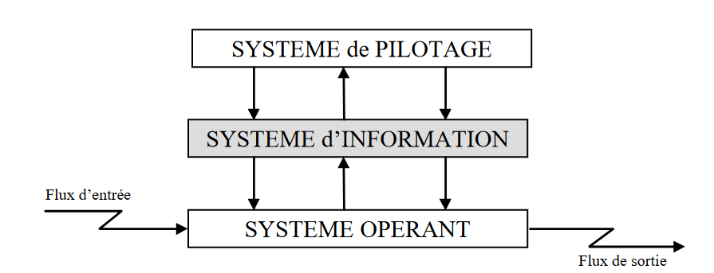

On peut comparer le système d'information à une **« boîte noire »** par laquelle transitent les principaux flux d'information entre le système de pilotage et le système opérant d'une part (règles de fonctionnement, ressources allouées, priorités d'exécution)

Le système d'information assure donc l'interface entre les systèmes opérant et de pilotage, mais il peut aussi assurer l'interface avec le pôle client et/ou le pôle fournisseur. Le système d'information n'est pas fermé sur une organisation interne
]

---

class: middle
.left-column[
## Présentation
## Système d'information
## Cycle de Conception d'un SI
]
.right-column[
.pull-left.center[
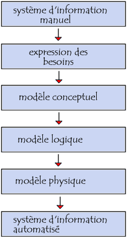
]
.pull-right[
La conception du système d'information se fait par étapes, afin d'aboutir à un système d'information fonctionnel reflétant une réalité physique
* **Système d'information manuel :** Faire l'inventaire des éléments nécessaires au système
* **Expression des besoins :** Délimiter le système en s'informant auprès des futurs utilisateurs
Grâce à ses deux étapes nous avons ce que l'on attend du système d'informtion
* **Modèle conceptuel :** Décrit les règles et les contraintes à prendre en compte.
* **Modele Logique :** Représente le choix logiciel pour le système d'information.
* **Modèle physique :** reflète le choix matériel pour le système d'information.
]
]

---
.left-column[
## Présentation
## Système d'information
## Cycle de Conception d'un SI
## Niveaux de Modelisations
]
.right-column[
Les trois niveaux conceptuel, logique, et physique facilitent l'analyse d'un problème en se focalisant respectivement sur les aspects de gestion, d'organisation, et d'implémentation.

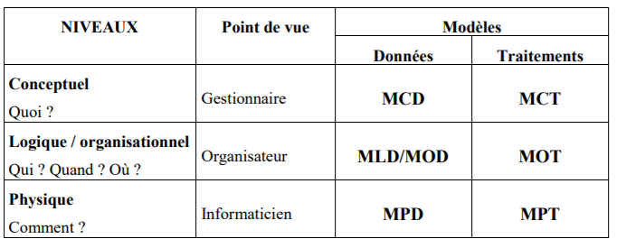


Aborder un problème selon ces trois axes en facilite l'analyse. Ainsi, 
* **Le gestionnaire** définira les traitements relatifs à une commande reçue dans l'entreprise,

* **Les aspects organisationnels** seront étudiés par l'organisateur, 

* **L'informaticien** précisera les moyens techniques à mettre en œuvre pour satisfaire les besoins relatifs aux niveaux précédents.

Ce tableau fait clairement apparaître les modèles que propose la méthode MERISE pour la
formalisation des données et des traitements à chacun des niveaux supportés.

]

---

class: middle
.left-column[
## Présentation
## Système d'information
## Cycle de Conception d'un Système d'information
## Niveaux de Modelisations
]
.right-column[
  Les différents modèles Merise sont donc :
* **MCD :** Modèle Conceptuel de Données

* **MCT :** Modèle Conceptuel de Traitements

* **MLD :** Modèle Logique de Données

* **MOT :** Modèle Organisationnel de Traitements

* **MPD :** Modèle Physique de Données

* **MPT :** Modèle Physique de Traitements.

La séparation des données et des traitements est conforme aux principes des bases de données relationnelles. Elle met en évidence la relative invariance des données par rapport aux traitements. 

**Par exemple**, un processus de facturation peut consister en l'envoi d'une facture et l'attente du paiement ou en prélèvement automatique. Pour autant, les données nécessaires à chacun de ces traitements restent sensiblement les mêmes.
]
---
class: center, middle, inverse
# 2. Modèle Conceptuel de données
.red[MCD]
---

class: middle
.left-column[
## Presentation
]
.right-column[
Le modèle conceptuel des données **(MCD)** a pour but d'écrire de façon formelle les données qui seront utilisées par le système d'information. Il s'agit donc d'une représentation des données, facilement compréhensible, permettant de décrire le système d'information à l'aide d'entités.

Il doit être le plus complet possible. Sa représentation doit se faire en toute indépendance de considérations techniques et/ou organisationnelles. Le MCD est une représentation statique des données et, par conséquent, ne doit comporter aucune référence aux traitements effectués.

Le Modèle Conceptuel de Données (MCD) permet de faire la description des données et des relations entre les données, grâce aux concepts du formalisme **Entité-Association**. 
]

---

.left-column[
## Presentation
## Entité
]
.right-column[
**L'entité** est définie comme un objet de gestion considéré d'intérêt pour représenter l'activité à modéliser (exemple : entité `Pays`, `Eleve`, ...). 

**L'élève** est une entité, l'élève **« Pierre Dupond »** est une occurrence de l'entité élève. 
  .pull-left.center[
    
  ]

  .pull-left.center[
    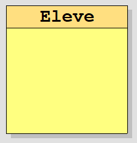
  ]
]
---

.left-column[
## Presentation
## Entité
## Propriété
]
.right-column[
À son tour, chaque entité (ou objet) est porteuse d'une ou **plusieurs propriétés**.

**Une propriété** est une donnée élémentaire susceptible de prendre une valeur. C'est le plus petit élément manipulé du système d'information et qui a un sens en lui-même. 

Une propriété peut-être élémentaire ou calculée, simple ou composée.

* La note d'un élève est une propriété élémentaire, en revanche sa moyenne est une propriété calculée.

* La date de naissance de l'élève est une propriété simple alors que le nom complet de l'élève est une propriété composée.

.center[
  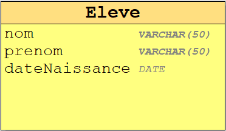
> *Le nom de la propriété est inscrit à l'intérieur de l'entité.*
]
]

---
.left-column[
## Presentation
## Entité
## Propriété
## Identifiant
]
.right-column[
**L'identifiant est une propriété particulière de l'entité** telle qu'à chaque valeur de la propriété corresponde une et une seule occurrence de l'entité. 

La valeur de l'identifiant **rend unique chaque occurrence** de l'entité. Ainsi pour éviter les synonymes, **les numéros ou les codes font les meilleurs identifiants**.

.center[
  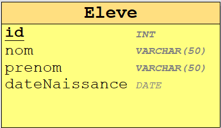
> *Dans le MCD, l'identifiant figure en première position dans la liste des propriétés et est souligné*
]
.small[
* **Le numéro d'un élève** sera l'identifiant pour l'entité élève, son nom ne suffirait pas pour l'identifier de manière unique dans le SI.

* **Le numéro INSEE** pourra être l'identifiant d'une personne.

* **Le numéro d'immatriculation** pourra être l'identifiant de l'entité voiture.
]

]

---
.left-column[
## Presentation
## Entité
## Propriété
## Identifiant
## .red[Travaux Pratique]
]
.right-column[
**La société R** est désireuse de vouloir analyser ses besoins afin de mettre en place une nouvelle version de son logiciel utilisé en interne.

Elle fait appel à vous pour lui réaliser un modèle conceptuel de données dans un premier temps.

* La société R gère des employés qui sont identifié par un numéro d'immatriculation. Elle souhaite ainsi stocker le nom, prénom, date de naissance, date d'entrée dans l'entreprise ainsi que son niveau de compétence parmi celle que la société à établi.

* Egalement elle souhaite pouvoir lister tout les postes de travail qu'elle gère. Chaque poste de travaille est identifié par un code unique et possède donc un intitulé, une description et une catégorie.

* La société souhaiterai en plus gérer la disponibilité du poste.

Représenter toutes les entités nécessaires.

]

---
.left-column[
## Relation / Association
### Définition
]
.right-column[
**Une association** est la représentation **d'une relation entre plusieurs entités**. Elle est dépourvue d'existence propre et est subordonnée à l'existence des entités qui la composent. 

Pour définir la reation on utilise généralement un verbe.

L'entité `Eleve` est en association avec l'entité `Classe`.

.center[
  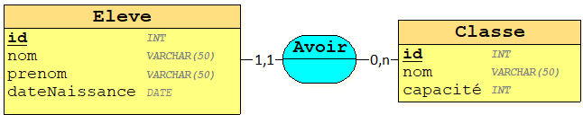
> *La relation peut être binaire*
]

.small[
**On traduit par :**
* L'élève **a une** classe.

* La classe **a un ou plusieurs** élèves.
]
]

---
.left-column[
## Relation / Association
### Définition
### Porteuse de données
]
.right-column[
La relation peut aussi **être porteuse d'une ou plusieurs propriétés** : 

L'entité `Eleve` est en association avec l'entité `Matiere` et porte la propriété `note`.

.center[
  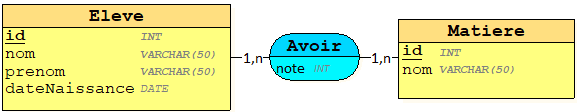
> *La relation peut être porteuse de données*
]
.small[
**On traduit par :**
* L'élève **a une ou plusieurs notes** de matières.

* Une Matière **a une ou plusieurs notes** d'élèves.
]

]

---
.left-column[
## Relation / Association
### Définition
### Porteuse de données
### Relation n-aire
]
.right-column[
La relation peut aussi être lié à plus de deux entités.

L'entité `Eleve` est en association avec les entités `Matiere`, `Examen` et porte la propriété `note`.

.center[
  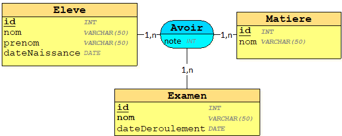
> *Relation ternaire*
]
.small[
**On traduit par :**
* L'élève **a une ou plusieurs notes** de matières pour une ou plusieurs examens.

* Une Matière **a une ou plusieurs notes** d'élèves pour une ou plusieurs examens.

* Un Examen **a une ou plusieurs notes** d'élèves pour une ou plusieurs matières.
]

.red[
  <i class="fas fa-info-circle"></i> Dans une relation ternaire, il n'y a jamais de cardinalités à 1,1 ou 0,1]
]

---
.left-column[
## Relation / Association
### Définition
### Porteuse de données
### Relation n-aire
### Relation réflexive
]
.right-column[
La relation peut être aussi **réflexive** (ou unaire). C'est une relation qui relie une entité à elle-même.
.center[
  
> *Relation reflexive*
]
.small[
**On traduit par :**
* L'élève **a une ou plusieurs** revisions avec d'autres élèves.
]
]

---
.left-column[
## Relation / Association
### Définition
### Porteuse de données
### Relation n-aire
### Relation réflexive
### Relation identifiante
]
.right-column[
**L'association identifiante** traduit la relation de composition entre une entité composante et une entité composée. 

* L'exemple classique est la relation entre une commande et ses lignes de commande. Une ligne de commande n'a pas d'existence propre. Elle est toujours relative à une commande. 
.center[
  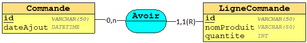
> *Relation identifiante*
]

* Un autre exemple classique est celui de l'hôtel et des ses chambres. Les chambres seules n'ont pas d'existence propre.
.center[
  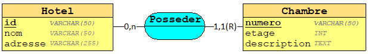
> *Relation identifiante*
]

L'association identifiante (appelée lien identifiant) est notée `1,1(R)` dans le MCD.
]

---
.left-column[
## Relation / Association
### Définition
### Porteuse de données
### Relation n-aire
### Relation réflexive
### Relation identifiante
### .red[Travaux pratique]
]
.right-column[
Ajouter les associations aux projet de la société R.

* La société R gère des employés ayant un seul niveau compétence.

* Un employé peut etre affecté a un poste durant une période

* Un poste appartient à une seule catégorie.

* Un employé est dorénavant  affecté à une équipe de travail, chaque équipe est représenté par un nom et une couleur.

* Un employé peut travailler avec d'autres employés sans forcement faire partie de la même équipe.

]

---
.left-column[
## Cardinalité
### Presentation
]
.right-column[
**La cardinalité** d'une entité par rapport à une relation s'exprime par deux nombres appelés **cardinalité minimale** et **cardinalité maximale**.
.center[
  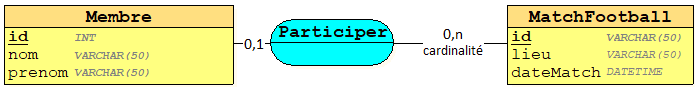
]

**Cardinalité minimale**
* La cardinalité minimale, égale à `0` ou `1`, est le nombre de fois minimum qu'une occurrence d'une entité participe aux occurrences de la relation. 
* Si la cardinalité minimale est égale à `0`, c'est qu'il existe parmi toutes les occurrences de l'entité, au moins une occurrence qui ne participe pas à la relation. 

.small[
  Par exemple, dans une équipe de sport, tous les membres de l'équipe ne participent pas forcément à un match. En revanche, si la cardinalité minimale est égale à 1, cela implique que toutes les occurrences d'une entité participent à toutes les occurrences de la relation. Dans notre exemple, cela se traduit par le fait qu'un joueur joue tous les matchs.
]

**Cardinalité maximale**
* La cardinalité maximale, égale à `1` ou `n`, indique le nombre de fois maximum qu'une occurrence de l'entité participe aux occurrences de la relation (n est équivalent à infini). 
]

---
.left-column[
## Cardinalité
### Presentation
### Cardinalités possibles
]
.right-column[
.pull-left.center[
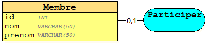
> *Cardinalité 0,1*
  
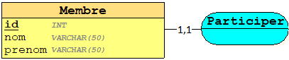
> *Cardinalité 1,1*

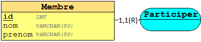
> *Cardinalité 1,1(R)*
]
.pull-right.center[

> *Cardinalité 0,n*

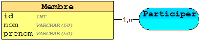
> *Cardinalité 1,n*

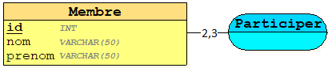
> *Cardinalité x,y*
]
]

---
.left-column[
## Cardinalité
### Presentation
### Cardinalités possibles
### Explication
]
.right-column[
.center[

> *Cardinalité explication*
]

Dans l'exemple ci-dessus
* **la cardinalité minimale** entre l'entité `Client` et la relation `Passer` qui est à **« 0 »** exprime le fait qu'un client peut ne pas passer de commande. C'est un client potentiel.

* **La cardinalité maximale** entre l'entité `Client` et la relation `Passer` qui est à **« n »** exprime le fait qu'un client peut passer au plus « n » commandes.

* **La cardinalité minimale** entre la relation `Passer` et l'entité `Commande` qui est à **« 1 »** exprime le fait qu'à une commande correspond toujours un client.

* **La cardinalité maximale** entre la relation `Passer` et l'entité `Commande` qui est à **« 1 »** exprime le fait qu'à une commande correspond un seul client au maximum. 
]

---
.left-column[
## Cardinalité
### Presentation
### Cardinalités possibles
### Explication
### .red[Travaux Pratique]
]
.right-column[
1. Ajouter les cardinalités sur le MCD de la société R.

2. Traduire le MCD suivant
.center[
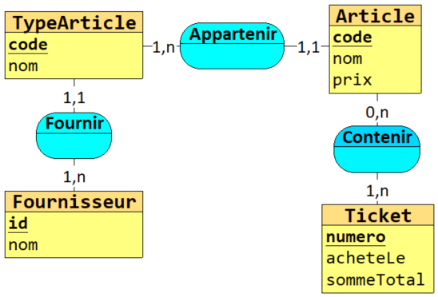
]
]

---
.left-column[
## Héritage
### Définition
]
.right-column[
**L'héritage** permet de définir une **entité spécialisée** par rapport à une entité générale. Dans un héritage, les entités ont beaucoup de caractéristiques communes mais sont toutefois différentes. L'entité générale est appelée entité surtype ou père, elle est dotée de toutes les caractéristiques communes aux entités spécialisées qui elles, sont appelées sous-type, fils ou enfant. Les entités sous-types ne disposent que des caractéristiques qui leur sont propres.

Vous pouvez établir un lien d'héritage entre une entité générale et des entités spécialisées. Dans un lien d'héritage, une ou plusieurs entités enfant héritent, au niveau physique, de tout ou partie des attributs d'une entité père.

.center[
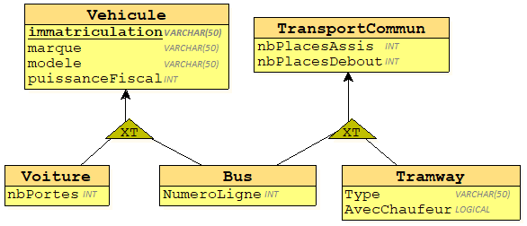
> *Heritage, Specialisation/Généralisation*
]
]

---
.left-column[
## Héritage
### Définition
### .red[Travaux Pratique]
]
.right-column[
Dans la société R, il y a différent profil, tel que des **responsables**, des **stagiaires** et des **employés**.

* Un stagiaire est représenté par un code, nom, prénom, date de naissance, mais n'est pas un employé

* Un responsable est un employé, mais il en plus responsable d'une équipe d'employé.

* L'equipe peut avoir un seul responsable.

* Un stagiaire peut occuper un poste durant une periode, mais ne peut faire parti d'une équipe d'employé.

Mettre à jour le MCD de la société R.
]

---
.left-column[
## Contraintes
### Intégrité fonctionnelle
]
.right-column[
### Définition
**La notion de contrainte d'intégrité fonctionnelle (CIF)** correspond à celle de la dépendance fonctionnelle (DF) forte **ET** stable. (stable signifiant que les occurrences des entités mises en jeu ne pourront jamais changer).

***Exemple :***

> Un enfant ne pourra jamais changer de père. De même la dépendance fonctionnelle entre commande et client est une contrainte d'intégrité fonctionnelle car le client qui a passé la commande ne peut pas changer.

La CIF traduit un lien fort et permanent (non modifiable sauf son annulation) de dépendance d'une entité par rapport à une ou plusieurs autres entités. Dans le cas où ce lien n'est pas permanent dans le temps, il s'agira donc d'une dépendance fonctionnelle entre
objets.

L'intérêt de mettre en évidence une CIF dans une relation de dimension supérieure à 2, réside dans le fait que l'on peut diminuer de 1 la dimension de la relation.
.center[
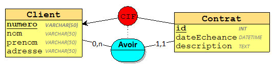
> *Ccontrainte d'intégrité fonctionnelle à deux entités*
]
]

---
.left-column[
## Contraintes
### D'intégrité fonctionnelle
]
.right-column[
.center[
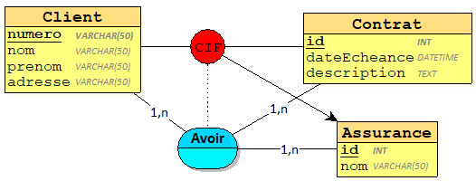
> *Cardinalité explication*
]

Dans l'exemple ci-dessus, l'existence d'un contrat d'assurance implique la connaissance de l'assuré. Il y a donc un lien fort et permanent de dépendance entre l'entité `Client` et l'entité `Contrat`.

La mise en évidence de cette CIF permet de décomposer le modèle en deux associations binaires (au lieu d'une association ternaire) : 
.center[
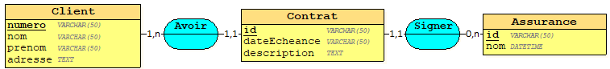
> *Cardinalité explication*
]
]

---
.left-column[
## Contraintes
### D'intégrité fonctionnelle
### D'exclusion
]
.right-column[
### Définition
**La contrainte d'exclusion** traduit le fait que toute occurrence d'une entité pivot participe à l'une ou l'autre des associations de la contrainte ou à aucune des deux, mais pas aux deux.

.info[
<i class="fas fa-info-circle"></i> La contrainte d'exclusion est représentée par un cercle contenant un **X**, et est reliée au pivot par un trait pointillé.
]
.center[
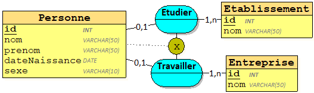
> *Contrainte d'exclusion*
]
.small[
Dans l'exemple ci-dessus, l'entité `Personne` est le pivot de la contrainte.

La contrainte exprimée est : 

Une personne étudie dans un établissement **ou bien** elle est salariée d'une entreprise **ou bien** elle est ni étudiante ni salariée. Mais **elle ne peut pas être** à la fois étudiante et salariée
]
]

---
.left-column[
## Contraintes
### D'intégrité fonctionnelle
### D'exclusion
### D'inclusion
]
.right-column[
**La contrainte d'inclusion** traduit le fait que les occurrences des entités participant à une relation **R1 participent implicitement à une autre relation R2**. En revanche, la réciproque est fausse.

.info[
  <i class="fas fa-info-circle"></i> La contrainte d'inclusion est représentée par un cercle contenant un I, et est reliée au pivot par un trait pointillé.
]

.center[
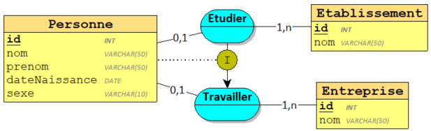
> *Contrainte d'inclusion*
]

.small[
Dans l'exemple ci-dessus, les occurrences de l'entité `Personne` qui participent à la relation `Etudier` participent également et **obligatoirement** à la relation `Travailler`. En revanche, le fait qu'une occurrence de l'entité personne participe à la relation `Travailler` **n'implique** pas qu'elle participe à la relation `Etudier`.

Cela se traduit par :**« Une personne qui étudie dans un établissement implique qu'elle
travaille dans une entreprise »**. (Cas d'une personne étudiant dans un lycée professionnel et
ayant l'obligation de faire un stage en entreprise). En revanche, la réciproque est fausse. 
]
]

---
.left-column[
## Contraintes
### D'intégrité fonctionnelle
### D'exclusion
### D'inclusion
### De totalité
]
.right-column[
**La contrainte de totalité** traduit le fait que toute occurrence du pivot participe à l'une ou l'autre des associations de la contrainte ou aux deux.

.info[
  <i class="fas fa-info-circle"></i> La contrainte de totalité est représentée par un cercle contenant un **T**, et est reliée au pivotpar un trait pointillé. 
]

.center[
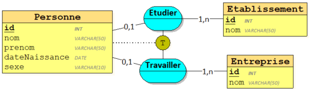
> *Contrainte de totalite*
]

.small[
Dans l'exemple, toute occurrence de l'entité `Personne` participe soit à la relation `Etudier`, soit à la relation `Travailler` soit au deux relations à la fois.

Cela se traduit par **« Une personne peut être étudiant dans un établissement de formation ou
salarié dans une entreprise ou les deux à la fois »** (Cas d'un étudiant en formation continue
par exemple).
]
]

---
.left-column[
## Contraintes
### D'intégrité fonctionnelle
### D'exclusion
### D'inclusion
### De totalité
### De partition
]
.right-column[
**La contrainte de partition** traduit le fait que **toute occurrence** du pivot participe **obligatoirement** à **l'une ou l'autre** des associations de la contrainte, **mais pas aux deux**.

.info[
  <i class="fas fa-info-circle"></i> La contrainte de partition est représentée par un cercle contenant un **XT**, et est reliée au pivot par un trait pointillé. 
]

.center[
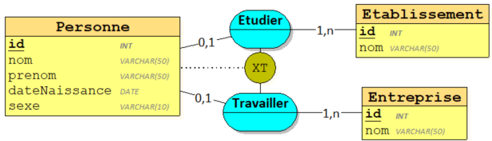
> *Contrainte de partition*
]
.small[
Dans l'exemple, toute occurrence de la table `Personne` participe soit à la relation `Etudier`, soit à la relation `Travailler` mais pas au deux à la fois.

Cela se traduit par **« Une personne est obligatoirement soit étudiant dans un établissement de formation soit salarié dans une entreprise »**

Cette contrainte est équivalente à une contrainte de totalité et une contrainte d'exclusion
]
]

---
.left-column[
## Contraintes
### D'intégrité fonctionnelle
### D'exclusion
### D'inclusion
### De totalité
### De partition
### De simultanéité
]
.right-column[
La contrainte d'égalité traduit deux inclusions symétriques. C'est à dire que toute occurrence d'une entité participant à une relation R1, participe simultanément à une relation R2.

.info[
  <i class="fas fa-info-circle"></i> La contrainte de partition est représentée par un cercle contenant un **S**, et est reliée au pivot par un trait pointillé. 
]

.center[
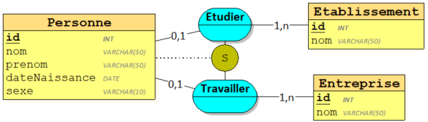
> *Contrainte de simultanéité*
]

.small[
Dans l'exemple ci-dessus, toutes les occurrences de l'entité `Personne` qui participent à la relation `Etudier` participent également et obligatoirement à la relation `Travailler`. Inversement toutes les occurrences de l'entité `Personne` qui participent à la relation `Travailler` participent également et obligatoirement à la
relation `Etudier`.

Cela se traduit par **« Une personne qui étudie dans un établissement implique qu'elle
travaille dans une entreprise »** ou **« une personne qui est salariée dans une entreprise
implique qu'elle étudie dans un établissement ».** 
]
]

---
.left-column[
## Règles de vérification du MCD
]
.right-column[
Le MCD a progressivement été élaboré à partir du dictionnaire de données et des règles de
gestion issues du recueil et de l'étude de l'existant.

Cependant, il reste à vérifier et valider ce MCD. Pour ce faire, des règles de vérification ont
été élaborées.
### __Règle n°1__
***Toute entité ou association doit avoir un identifiant et un seul***

L'identifiant d'une entité peut-être composé de plusieurs propriétés mais il n'y a toujours qu'un seul identifiant par entité.

L'identifiant de l'association n'apparaît pas clairement sur le modèle. Il se compose des identifiants des entités de la relation. L'identifiant de l'association `Avoir` est donc le couple de valeurs [`id` de `Classe`, `id` de `Eleve`].
.center[
  
> *Règle de validation n°1*
]
]

---
.left-column[
## Règles de vérification du MCD
]
.right-column[
### __Règle n°2__
***Toutes les propriétés doivent être élémentaires, c'est-à-dire non décomposables***

Cette règle a aussi une autre définition : toute propriété doit être dans sa forme atomique. Cela signifie que toute propriété ne doit pas être décomposable. Par exemple, la propriété `Adresse` pourrait être décomposée en `rue`, `ville`, `codePostal`, et `pays`. 

### __Règle n°3__
***Les propriétés d'une entité autres que l'identifiant doivent être en dépendance fonctionnelle monovaluée de cet identifiant.***

Pour une occurrence de l'identifiant d'une entité, chacune des propriétés ne peut prendre qu'une valeur. Par conséquent, il est impossible d'avoir une valeur répétitive pour une même propriété, comme il ne doit y avoir d'absence de valeur pour une même propriété.

**Par exemple :** Soit l'entité `Eleve` définie par les propriétés `id`, `nom`, `prenom`, `diplome`.

Cette entité peut recevoir des valeurs pour le cas où la personne a au plus un diplôme. Une solution consisterait à prévoir plusieurs propriétés concernant les diplômes : `diplome_1`, `diplome_2`, `diplome_3`. 

Rapidement, on se rend compte que dans certains cas ces propriétés ne serviraient pas, alors que dans d'autres, elles seraient insuffisantes. Une autre solution, la bonne, consiste à créer une entité `Diplome` et une relation l'associant à l'entité `Eleve`. 
]

---
.left-column[
## Règles de vérification du MCD
]
.right-column[
### __Règle n°4__
***Une propriété ne peut qualifier qu'un seul objet ou qu'une seule relation***

Une propriété ne peut être présente à la fois dans plusieurs entités.

Par exemple, la propriété `Nomclient` ne peut être présente à la fois dans l'entité `Client` et dans l'entité `Facture`.
___
### __Règle n°5__

***La dépendance fonctionnelle transitive doit être écartée***

Si une propriété est en dépendance fonctionnelle de l'identifiant, et d'une autre propriété de l'objet, elle-même en dépendance fonctionnelle simple de cet identifiant, il y a donc une entité imbriquée dans celle que l'on étudie. Chaque entité doit décrire un concept sémantique unique, et en conséquence, il faut éclater en deux entités celle qui contient une dépendance fonctionnelle transitive.
]

---
.left-column[
## Règles de vérification du MCD
]
.right-column[
.center[
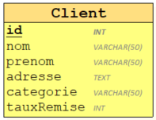
> *Règle de validation n°5 non-appliqué*

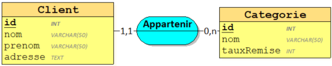
> *Règle de validation n°5 appliqué*
]

Dans l'exemple ci-dessous, considérons la règle de gestion suivante : le prix de vente au client est calculé sur le prix de vente public, diminué d'une remise dont le montant est fonction de la catégorie a laquelle appartient le client. Le client est forcément rattaché à une catégorie, et, au plus une. 
]

---
.left-column[
## Règles de vérification du MCD
]
.right-column[
### __Règle n°6__
***Toute propriété d'entité ou d'association ne peut prendre qu'une seule valeur***

Dans l'exemple ci-dessous, la propriété `note` caractérise le couple `id` de `Eleve` et `id` de `Matiere`. Un élève pouvant avoir plusieurs notes pour la même matière, ce schéma ne respecte donc pas cette règle.
.center[
  
> *Règle de validation n°6, non-respecté*
]
]

---
.left-column[
## Règles de vérification du MCD
]
.right-column[
.center[
  
> *Règle de validation n°6, respecté*
]

Pour obtenir un modèle correct, il suffit de préciser qu'un élève ne peut avoir plusieurs notes le même jour dans une même matière. 

Dans ces conditions, l'`Examen` est suffisamment discriminant. Il suffit de modifier le modèle de telle sorte que la propriété `note` soit une caractéristique du triplet `Eleve.id`, `Matière.id` et `Examen.id`. 
]

---
.left-column[
## Règles de vérification du MCD
## .red[Travaux Pratique]
]
.right-column[
La Société R, statisfait de votre travail et est très impliqué dans l'évolution technique de son système informatique.

Elle est désireuse d'améliorer le système qui permet le suivi de l'arrivée en port des containeurs de marchandise puis de leur chargement sur les camions. Pour cela une nouvelle base de données devra être mise en place, la société a établi le cahier des charges suivant :

* Les containeurs sont identifiés par un code international unique qui est reconnu dans tous les ports. Afin de placer ce containeur sur la remorque appropriée, il est nécessaire de connaître ses dimensions.
* Chaque containeur appartient à un client qui est identifié par son code et dont on veut conserver la raison sociale et les coordonnées.
* Il est nécessaire de connaître pour chaque client, le pays dans lequel il est inscrit. Ceci permettra de définir le pays d'origine de tous ces containeurs. Cette information est nécessaire pour les droits de douane. Les services douaniers fournissent, pour cette raison, une liste des pays comportant leur code et leur nom internationaux qui doivent être utilisés dans la base de données.
* Les containeurs ne peuvent pas transporter n'importe quel type de matière. En effet, les problématiques du
transport de liquides en vrac ou de produits finis emballés ne sont pas les mêmes. Pour cela, le système
informatique doit comporter la liste complète des types de matière susceptibles d'être transportés par la
société R (le code de ce type et son libellé suffisent).
* On veut connaître la quantité maximale de chaque type de matière que peut transporter un containeur.
* Dans le but de suivre l'activité de l'entreprise ainsi que celle des clients, il faut connaître le nombre
d'utilisations de chaque containeur, pour chaque année.
]

---
class: center, middle, inverse
# 3. Modèle Logique de données
.red[MLD]
---
.left-column[
## Presentation
]
.right-column[
Alors que le **Système d'Information** a été décrit au niveau conceptuel et organisationnel, il est maintenant nécessaire de le décrire sur le plan informatique.

**Le Modèle Logique des Données (MLD)** permet de prendre en compte la structuration technique propre au stockage informatisé. L'utilisation de l'informatique permet d'améliorer l'organisation et la gestion d'un SI. Depuis le début du cours, il a été vu comment constituer théoriquement une base de données. Cette base de données peut être réalisée et gérée par un **Système de Gestion de Bases de Données Relationnelles (SGBDR).**

**Un SGBDR** va permettre d'organiser un SI, de saisir ses données, de les modifier, de les supprimer et de les consulter.

La plupart des SGBDR courants sont fondés sur le modèle relationnel défini par E.F Codd en 1970. Le modèle relationnel présente deux aspects fondamentaux : des concepts structuraux de base comme la table, un algèbre permettant de manipuler les tables, ou une collection de tables.

Le Modèle Relationnel des Données (MRD), Parfois appelé Modèle Logique des Données (MLD) s'est largement imposé depuis la fin des années 80, et est donc devenu un standard de fait pour **la description du niveau logique**.

Le MCD représente donc l'ensemble des données d'un point de vue abstrait, sans tenir compte des contraintes d'implémentation dans une base de données ou des contraintes techniques associées. 
]
---
.left-column[
## Presentation
## Concepts
### Table, Attributs, Occurences
]
.right-column[
#### Table ou Relation
**La table** constitue la principale structure de stockage dans une base relationnelle.

Elle a une structure de **tableau**, composée de **lignes** et de **colonnes** dans lesquelles on stocke les informations. La table est désignée par un nom.

.info[
<i class="fas fa-info-circle"></i> La table du modèle relationnel correspond à l'entité et parfois l'association du MCD.
]

#### Attribut
L'attribut représente une colonne d'une table caractérisée par un nom. Une table possède autant d'attributs que d'informations à gérer.

.info[
<i class="fas fa-info-circle"></i> L'attribut du modèle relationnel correspond à la notion de propriété dans le MCD.
]

#### Occurence
Une occurrence de la table (ou de la relation) correspond à une ligne du table. Il y aura autant d'occurences qu'il y aura de valeurs. L'occurence correspond à l'enregistrement d'une ligne de la table. 

]
---
.left-column[
## Presentation
## Concepts
### Table, Attributs, Occurences
### Clé primaire
]
.right-column[
La clé primaire est un attribut particulier dont les valeurs définissent de manière unique les tuples de la table (ou de la relation).

La clé primaire est soulignée d'un trait continu.

.info[
<i class="fas fa-info-circle"></i>  La clé primaire du MLD corresponds à l'identifiant du MCD
]

#### Exemple 
.pull-right[
```
| id | nom     | prenom | dateNaissance |
|----|---------|--------|---------------|
| 1  | Intelli | Jean   | 2014-01-12    |
| 2  | Down    | Marc   | 2013-08-01    |
| 5  | Rateur  | Jane   | 1999-01-12    |
```
.center[
  > *Occurences, lignes de tables*
]
]
.pull-left.center[

> *MLD Table `Eleve`*
]
]
---
.left-column[
## Presentation
## Concepts
### Table, Attributs, Occurences
### Clé primaire
### Clé etrangère
]
.right-column[
La clé étrangère est un attribut particulier correspondant à une clé primaire de la table de référence.

Une table peut contenir 0, 1 ou plusieurs clé étrangères.

La clé étrangère est soulignée d'un trait pointillé, ou bien suivie du signe #.
.info[
<i class="fas fa-info-circle"></i>  La clé étrangère du MLD corresponds à l'association du MCD
]

.center[
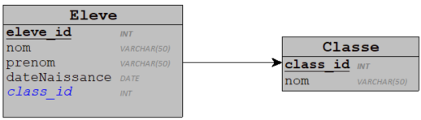
> *MLD Clé étrangère*
]

**Syntaxe de formalisation :**
.small[
Table_1 (<u>Cle_Primaire</u>, Attribut_1, Attribut_2, Attribut_n, #CleEtrangère_1, #CleEtrangère_n) 
]
]

---
.left-column[
## Presentation
## Concepts
### Table, Attributs, Occurences
### Clé primaire
### Clé etrangère
### Règles de passage d'un MCD à un MLD
]
.right-column[
#### Règles pour les entités du MCD
* L'entité se transforme en une table ;
* L'identifiant de l'entité devient la clé primaire de la table ;
* Les propriétés de l'entité deviennent des attributs de la table.

#### Règle pour les relations binaires (ou réflexives) de type (0,n) ou (1,n) – (0,1) ou (1,1)
Une relation binaire (ou réflexive) ayant des type (0,n) ou (1,n) – (0,1) ou (1,1) se traduit par une redondance de l’identifiant de l’objet à cardinalité (1,n) ou (0,n) dans la table issue de l’entité à cardinalité (1,1) ou (0,1). L’identifiant de l’entité à cardinalité (1,1) devient la
clé primaire de la table. La propriété dupliquée devient clé étrangère dans la table. Si la relation est réflexive, c’est l’identifiant de l’entité qui est dupliqué dans la table issue de ce même objet après avoir été renommé.

Si l’association est porteuse de données, celles-ci se retrouvent comme attributs dans la relation issue de l’entité à cardinalité (1,1) ou (0,1).
]

---
.left-column[
## Presentation
## Concepts
### Table, Attributs, Occurences
### Clé primaire
### Clé etrangère
### Règles de passage d'un MCD à un MLD
]
.right-column[

#### Les MCD à relation binaire ci dessous : 
.center[
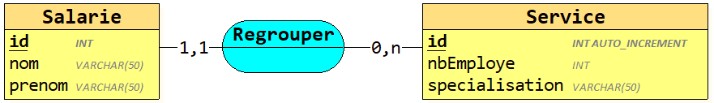
> Une relation binaire à cardinalités (0,n) ou (1,n) – (0,1) ou (1,1)

> Devient
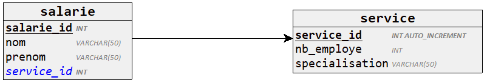
]

.small[
  salarie = (salarie_id INT, nom VARCHAR(50), prenom VARCHAR(50), #service_id);

  service = (service_id INT AUTO_INCREMENT, nb_employe INT, specialisation VARCHAR(50));
]

]

---
.left-column[
## Presentation
## Concepts
### Table, Attributs, Occurences
### Clé primaire
### Clé etrangère
#### Règles de passage d'un MCD à un MLD
]
.right-column[
  #### Le MCD à relation binaire et reflexive ci dessous
.center[

]

#### Règle pour les relations binaire de type (0,n) ou (1,n) – (0,n) ou (1,n)
.center[

]
]

---
.left-column[
## Presentation
## Concepts
### Table, Attributs, Occurences
### Clé primaire
### Clé etrangère
#### Règles de passage d'un MCD à un MLD
]
.right-column[

#### Règle pour les relations n-aire
.center[

]

#### Cas des héritages :
.center[

]
]

---
.left-column[
## Presentation
## Concepts
### Table, Attributs, Occurences
### Clé primaire
### Clé etrangère
### Règles de passage d'un MCD à un MLD
### .red[Travaux Pratique]
]
.right-column[
#### Transformer le MCD de gestion des employés de la société R vers le MLD.
* Donner des nom logique au clé primaire
* Verifier les clé etrangère
* Verifier la conformité des données.

#### Donner le MCD et MLD Textuelle de la demande suivante

Soit une PME spécialisée dans la mise à disposition des employés pour le compte ses clients. Chaque intervention donne lieu à un contrat avec le client.

Les principales informations du contrat sont:
* La description de l’intervention
* La date du début de l’intervention
* La qualification précise de chaque intervenant (il existe une vingtaine de qualifications possibles)
* Le nombre d’employé prévu pour x jours
* A chaque qualification correspond un tarif journalier. 

La PME s’accorde en interne une certaine souplesse sur la détermination précise de la qualification de son personnel en procédant de la manière suivante:

* Chaque personne possède a priori une qualification de base. 
* A chaque intervention il est possible de réajuster la qualification. 
* La qualification d’intervention est déterminée pour un contrat donné.
]

---
class: center, middle, inverse
# 4. Structured Query Language
.red[SQL]

---
.left-column[
## Introduction
]
.right-column[
### Historique
**SQL** est un langage de programmation standard spécialement conçu pour stocker, extraire, gérer ou manipuler les données à l'intérieur d'un système de gestion de bases de données relationnelles (SGBDR). SQL est devenu une norme ISO en 1987.

SQL est le langage de base de données le plus largement mis en oeuvre et soutenu par les systèmes de base de données relationnelles populaires, comme MySQL, SQL Server, et Oracle. Cependant, certaines fonctionnalités de la norme SQL sont implémentées différemment dans différents systèmes de bases de données.

SQL a été développé à l'origine par IBM au début des années 1970. Initialement, il s'appelait **SEQUEL** (Structured English Query Language), qui a ensuite été remplacé par **SQL**
]

---
.left-column[
## Introduction
### Ce que vous pouvez faire avec SQL
]
.right-column[
Il y a beaucoup de choses que vous pouvez faire avec **SQL**:

* Créer une base de données.
 
* Créer des tables dans une base de données.
 
* Interroger ou demander des informations à partir d'une base de données.
 
* Insérer des enregistrements dans une base de données.
 
* Mettre à jour ou modifier des enregistrements dans une base de données.
 
* Supprimer des enregistrements de la base de données.
 
* Définir les permissions ou le contrôle d'accès dans la base de données pour la sécurité des données.
 
* Créer des vues pour éviter de taper des requêtes complexes fréquemment utilisées.

La liste ne se termine pas ici, vous pouvez effectuer de nombreuses autres tâches liées à la base de données avec SQL. Vous en apprendrez plus sur chacune d'elles en détail.
]


---
.left-column[
## Introduction
### Ce que vous pouvez faire avec SQL
### Concept de base
]
.right-column[
Le SGBDR est utilisé pour gérer la base de données relationnelle. Une base de données relationnelle est une collection d'un ensemble organisé de **tables** liées les unes aux autres et à partir desquelles il est facile d'accéder aux données. La base de données relationnelle est la base de données la plus utilisée de nos jours.

#### Qu'est-ce qu'une table ?
Dans le modèle de base de données relationnelle, une table est un ensemble d'éléments de données organisés en lignes et en colonnes. Un tableau est également considéré comme une représentation commode des relations. Mais une table peut avoir une ligne de données en double alors qu'une relation vraie ne peut pas avoir de données en double. La table est la forme la plus simple de stockage de données.

.center[
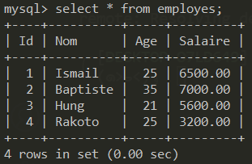
> *Un exemple de table d'employes*
]
]

---
.left-column[
## Introduction
### Ce que vous pouvez faire avec SQL
### Concept de base
]
.right-column[
#### Qu'est-ce qu'une occurence ?
Une seule entrée dans une table est appelée une occurence, un tuple, un enregistrement ou une ligne. Un tuple dans une table représente un ensemble de données liées. Par exemple, la table des employes precedement a 4 n-occurences/tuples/enregistrements/lignes.
#### Qu'est-ce qu'un attribut ?
Une table est constituée de plusieurs enregistrements (lignes), chaque enregistrement pouvant être décomposé en plusieurs parties de données plus petites appelées attributs. La table des employés ci-dessus comprend quatre attributs, `id`, `nom`, `age` et `salaire`.
]


---
.left-column[
## Introduction
### Ce que vous pouvez faire avec SQL
### Concept de base
### Syntaxe des instructions
]
.right-column[
SQL est suivi d'un ensemble unique de règles et de directives appelé syntaxe. Ce cours vous permet de démarrer rapidement avec SQL en listant toute la syntaxe SQL de base.

Toutes les instructions SQL commencent par l'un des mots clés tels que `SELECT`, `INSERT`, `UPDATE`, `DELETE`, `ALTER`, `DROP`, `CREATE`, `USE`, `SHOW` et toutes les instructions se terminent par un point-virgule `;`.

**exemple de commandes**
```sql
SELECT * FROM table_nom;

INSERT INTO table_name VALUES ('value1', 'value2');
```


Le point le plus important à noter ici est que **SQL est insensible à la casse**, ce qui signifie que `SELECT` et `select` ont la même signification dans les instructions SQL. Alors que MySQL fait la différence dans les noms de table. Donc, si vous travaillez avec MySQL, vous devez donner les noms de table tels qu’ils existent dans la base de données.
]


---
.left-column[
## Introduction
### Ce que vous pouvez faire avec SQL
### Concept de base
### Syntaxe des instructions
### Commandes SQL
]
.right-column[
Les commandes SQL standard pour interagir avec les bases de données relationnelles sont `CREATE`, `SELECT`, `INSERT`, `UPDATE`, `DELETE` et `DROP`. Ces commandes peuvent être classées dans les groupes suivants en fonction de leur nature.

#### Définition de données
| Commande | Description                                                                               |
|----------|-------------------------------------------------------------------------------------------|
| .red[CREATE]   | Crée une nouvelle table, une vue d’une table ou un autre objet de la base de données.     |
| .red[ALTER]    | Modifie un objet de base de données existant, tel qu'une table.                           |
| .red[DROP]     | Supprime une table entière, une vue d'une table ou d'autres objets de la base de données. |
]


---
.left-column[
## Introduction
### Ce que vous pouvez faire avec SQL
### Concept de base
### Syntaxe des instructions
### Commandes SQL
]
.right-column[
#### Manipulation de données
| Commande | Description                                                     |
|----------|-----------------------------------------------------------------|
| .red[SELECT]   | Récupère certains enregistrements d'une ou de plusieurs tables. |
| .red[INSERT]   | Crée un enregistrement.                                         |
| .red[UPDATE]   | Modifie les enregistrements.                                    |
| .red[DELETE]   | Supprime les enregistrements.                                   |

#### Contrôle de données
| Commande | Description                                        |
|----------|----------------------------------------------------|
| .red[GRANT]    | Donne un privilège à l'utilisateur.                |
| .red[REVOKE]   | Reprend les privilèges accordés par l'utilisateur. |

]

---
.left-column[
## Mise en place de Mysql
### Run container
]
.right-column[
Nous utiliserons Docker pour configurer notre environnement de travail avec le conteneur SGBDR Mysql dans sa version 5.7.

Nous devons exécuter la commande docker suivante pour extraire l'image docker du hub docker et l'exécuter sur votre machine.
```bash
docker run -p 3306:3306 --name=mysql-demo-db \
  -d mysql/mysql-server:5.7 mysqld --lower_case_table_names=1
```
Avec la commande ci-dessus, nous avons lancé un serveur mysql qui tourne sur notre machine via Docker.
Pour récuperer le mot de passe
```bash
docker logs mysql-demo-db 2>&1 | grep GENERATED
[Entrypoint] GENERATED ROOT PASSWORD: 6=J#+5Ir#1Q6W&.0H8ZDl=8%vO3UQqzY
```

Maintenant nous allons nous y connecter en utilisant le mot de passe generé ci-dessus
```bash
docker exec -it mysql-demo-db mysql -uroot -p
```
]

---
.left-column[
## Mise en place de Mysql
### Run container
### Accès
]
.right-column[
Nous allons mettre a jour le mot de passe pour un autre plus simple.
```mysql
ALTER USER 'root'@'localhost' IDENTIFIED BY 'root';
UPDATE mysql.user SET host='%' WHERE user='root';

# new user via tools
CREATE USER 'user'@'localhost' IDENTIFIED BY 'user';
GRANT ALL PRIVILEGES ON *.* TO 'user'@'localhost' WITH GRANT OPTION;
CREATE USER 'user'@'%' IDENTIFIED BY 'user';
GRANT ALL PRIVILEGES ON *.* TO 'user'@'%' WITH GRANT OPTION;

exit;
```

Pour se connecter dorenevant on peut utiliser la commande suivante :
```bash
 docker exec -it mysql-demo-db mysql -uroot -proot
```

Vous pouvez aussi utiliser l'extension VsCode `Mysql` de Juan Han en utilisant le user `user` precedement ajouté.
]

---
.left-column[
## Base de données
]
.right-column[
L'instruction CREATE DATABASE est utilisée pour créer une nouvelle base de données SQL.
```sql
CREATE DATABASE nomBDonnees;
```
.small.center[
<i class="fas fa-info-circle"></i> Notre utilisateur dispose des privilèges administrateur pour gerer les base de données.
]

Une fois la base de données créée, vous pouvez la vérifier comme suit dans la liste des bases de données.
```sql
SHOW DATABASES;
```

L'instruction DROP DATABASE est utilisée pour supprimer une base de données existante dans un schéma SQL.
```sql
DROP DATABASE nomBDonnees;
```

Vous devez sélectionner une base de données sur laquelle toutes les opérations seront effetuées. L'instruction USE permet de sélectionner une base de données existante dans le schéma SQL.
```sql
USE nomBDonnees;
```
]

---
.left-column[
## Base de données
## Type de données
]
.right-column[
#### Qu'est-ce que c'est ?
**Les types de données** sont utilisés pour représenter une nature de données pouvant être stockée dans la base de données. 

Le type de données est l'ensemble des valeurs représentables. Il est également connu sous le nom d'attribut qui spécifie un type de données de l'objet. Chaque colonne, variable et expression a le type de données associé dans le code SQL lors de la création de la table.

#### Nous listerons les types de données les plus couramment utilisés.
Certains fournisseurs de bases de données relationnelles ont leurs types de données qui ne sont peut-être pas répertoriés ici. 

**Par exemple,** Microsoft SQL Server comporte des types de données money et smallmoney, mais étant donné que les autres fournisseurs de bases de données préférés ne les prennent pas en charge, elles ne sont pas répertoriées ici.

#### Types de données SQL principalement classés en six catégories pour chaque base de données.
]

---
.left-column[
## Base de données
## Type de données
### Numériques
]
.right-column[
| Type de données | De                         | A                         |
|-----------------|----------------------------|---------------------------|
| BIT             | 0                          | 1                         |
| TINIYINT         | 0                          | 255                       |
| SMALLINT        | -32,768                    | 32,767                    |
| INT             | -2,147,483,648             | 2,147,483,647             |
| BIGINT          | -9,223,372,036,854,775,808 | 9,223,372,036,854,775,807 |
| DECIMAL         | -10^38 +1                  | 10^38 -1                  |
| NUMERIC         | -10^38 +1                  | 10^38 -1                  |
| FLOAT           | -1.79E + 308               | 1.79E + 308               |
| REAL            | -3.40E + 38                | 3.40E + 38                |
]


---
.left-column[
## Base de données
## Type de données
### Numériques
### Date et Heure
]
.right-column[

| Type de données | Description                                                                                                                           |
|-----------------|---------------------------------------------------------------------------------------------------------------------------------------|
| DATE            | Stocke la date dans le format YYYY-MM-DD                                                                                              |
| TIME            | Stocke l'heure dans le format HH:MI:SS                                                                                                |
| DATETIME        | Stocke les informations de date et heure au format YYYY-MM-DD HH:MI:SS                                                                |
| TIMESTAMP       | Stocke le nombre de secondes écoulées depuis l'époque Unix (Horodatage) (‘1970-01-01 00:00:00' UTC)                                   |
| YEAR            | Stocke l'année en format 2 chiffres ou 4 chiffres. Plage 1901 à 2155 en format à 4 chiffres. Plage 70 à 69, représentant 1970 à 2069. |

]

---
.left-column[
## Base de données
## Type de données
### Numériques
### Date et Heure
### Caractères et chaînes
]
.right-column[
| Type de données | Description                                                                                             |
|-----------------|---------------------------------------------------------------------------------------------------------|
| CHAR            | Longueur fixe avec une longueur maximale de 8 000 caractères                                            |
| VARCHAR         | Stockage de longueur variable avec une longueur maximale de 8 000 caractères                            |
| VARCHAR(max)    | Stockage à longueur variable avec le nombre maximum de caractères fourni |
| TEXT            | Le stockage de longueur variable avec une taille maximale de 2 Go de données                            |
]

---
.left-column[
## Base de données
## Type de données
### Numériques
### Date et Heure
### Caractères et chaînes
### Unicode caractères et chaînes
]
.right-column[
| Type de données | Description                                                                  |
|-----------------|------------------------------------------------------------------------------|
| NCHAR           | Longueur fixe avec une longueur maximale de 4 000 caractères                 |
| NVARCHAR        | Stockage de longueur variable avec une longueur maximale de 4 000 caractères |
| NVARCHAR(max)   | Stockage de longueur variable avec max caractères fournis                    |
| NTEXT           | Stockage de longueur variable avec une taille maximale de 1 Go de données    |
]

---
.left-column[
## Base de données
## Type de données
### Numériques
### Date et Heure
### Caractères et chaînes
### Unicode
### Binaires
]
.right-column[
| Type de données | Description                                                                        |
|-----------------|------------------------------------------------------------------------------------|
| BINARY          | Longueur fixe avec une longueur maximale de 8 000 octets                           |
| VARBINARY       | Stockage de longueur variable avec une longueur maximale de 8 000 octets           |
| VARBINARY(max)  | Stockage de longueur variable avec le nombre max d'octets fournis                  |
| IMAGE           | Stockage de longueur variable avec une taille maximale de 2 Go de données binaires |
]

---
.left-column[
## Base de données
## Type de données
### Numériques
### Date et Heure
### Caractères et chaînes
### Unicode
### Binaires
### Autres
]
.right-column[
| Type de données | Description                                              |
|-----------------|----------------------------------------------------------|
| CLOB            | Grands objets de caractère pouvant contenir jusqu'à 2 Go |
| BLOB            | Pour les gros objets binaires                            |
| XML             | Pour stocker des données XML                             |
| JSON            | Pour stocker des données JSON                            |
]

---
.left-column[
## Table
### Création
]
.right-column[
La création d'une table de base implique de nommer la table et de définir ses colonnes et le type de données de chaque colonne.

L'instruction `CREATE TABLE` permet de créer une nouvelle table.
```sql
CREATE TABLE nom_table(
    column1 type_donnees [contraintes],
    column2 type_donnees [contraintes],
    .....
    columnN type_donnees [contraintes],
    PRIMARY KEY( une ou plusieurs colonnes )
);
```
Le code suivant est un exemple, qui crée une table `eleve` avec un `id` en tant que clé primaire et `NOT NULL` sont les contraintes indiquant que ces champs ne peuvent pas être `NULL` lors de la création d'enregistrements dans cette table.
```sql
CREATE TABLE eleve(
    id INT NOT NULL AUTO_INCREMENT,
    nom VARCHAR (50) NOT NULL,
    prenom VARCHAR (50) NOT NULL,
    date_naissance DATE NOT NULL,
    PRIMARY KEY( id )
);
```
]

---
.left-column[
## Table
### Création
]
.right-column[
Une fois la table créée, vous pouvez la vérifier comme suit dans la liste des tables.
```sql
SHOW TABLES;
+-------------------------+
| Tables_in_formation_sql |
+-------------------------+
| eleve                   |
+-------------------------+
```

Pour avoir la description de la table vous pouvez utiliser
```sql
DESC eleve;
+----------------+-------------+------+-----+---------+-------+
| Field          | Type        | Null | Key | Default | Extra |
+----------------+-------------+------+-----+---------+-------+
| id             | int(11)     | NO   | PRI | NULL    |       |
| nom            | varchar(50) | NO   |     | NULL    |       |
| prenom         | varchar(50) | NO   |     | NULL    |       |
| date_naissance | date        | NO   |     | NULL    |       |
+----------------+-------------+------+-----+---------+-------+
```

Pour connaitre la commande `CREATE TABLE` pour une table existante
```sql
SHOW CREATE TABLE eleve;
```
]

---
.left-column[
## Table
### Création
### Suppression
]
.right-column[
L'instruction `DROP TABLE` permet de supprimer une définition de table ainsi que toutes les données, index, déclencheurs, contraintes et spécifications de permission de cette table.

.info[
<i class="fas fa-exclamation-triangle"></i> Attention ! Vous devez être très prudent lorsque vous utilisez cette commande car une fois la table supprimée, toutes les informations disponibles dans cette table seront également définitivement perdues.
]

```sql
DROP TABLE nom_table;
```
]

---
.left-column[
## Table
### Création
### Suppression
### Modification
]
.right-column[
La commande SQL `ALTER TABLE` permet d'ajouter, de supprimer ou de modifier des colonnes dans une table existante. Vous devez également utiliser la commande `ALTER TABLE` pour ajouter et supprimer diverses contraintes sur une table existante.

#### Ajouter une colonnes
`ADD` est utilisé avec la base de la commande `ALTER TABLE` pour ajouter une nouvelle colonne dans une table existante.
```sql
ALTER TABLE eleve ADD adresse VARCHAR(100);
```

#### Supprimer une colonnes
`DROP COLUMN` est utilisé pour supprimer une colonne dans une table. Suppression des colonnes indésirables de la table.
```sql
ALTER TABLE eleve DROP COLUMN adresse;
```

#### Modifier une colonne
`MODIFY` est utilisée pour modifier les colonnes existantes dans une table. Plusieurs colonnes peuvent également être modifiées à la fois.
```sql
ALTER TABLE eleve MODIFY nom VARCHAR(100);
```


---
.left-column[
## Table
### Création
### Suppression
### Modification
]
.right-column[
#### Renommer une colonne
`RENAME` est utilisée pour modifier les colonnes existantes dans une table
```sql
ALTER TABLE eleve RENAME COLUMN nom TO name;
```

#### Chnager une colonne
`CHANGE` est utilisée pour modifier les colonnes existantes dans une table
```sql
ALTER TABLE eleve CHANGE name nom VARCHAR(50) NOT NULL;
```
]

---
.left-column[
## Contraintes
]
.right-column[
**Les contraintes** sont les règles appliquées aux colonnes de données d'une table. Celles-ci sont utilisées pour limiter le type de données pouvant aller dans une table. Cela garantit l'exactitude et la fiabilité des données de la base de données.

Les contraintes peuvent être au niveau de la colonne ou de la table. Les contraintes de niveau de colonne ne sont appliquées qu'à une seule colonne, alors que les contraintes de niveau de table s'appliquent à l'ensemble de la table.

```sql
CREATE TABLE nom_table(
    column1 type_donnees [contraintes]
);
```

Les contraintes les plus communes sont :
.pull-left[
* `NOT NULL`

* `DEFAULT`

* `UNIQUE`

* `CHECK`

Et bien d'autres ...
]

.pull-left[
* `INDEX`

* `PRIMARY KEY`

* `AUTO_INCREMENT`

* `FOREIGN KEY`
]
]

---
.left-column[
## Contraintes
### NOT NULL
]
.right-column[
Par défaut, une colonne peut contenir des valeurs `NULL`. Si vous ne souhaitez pas qu'une colonne ait une valeur `NULL`, vous devez définir une telle contrainte sur cette colonne en spécifiant que `NULL` n'est plus autorisé pour cette colonne.

`NULL` n'est pas la même chose que pas de données, il représente plutôt des données inconnues.

Exemple lors d'un `CREATE TABLE`, pour `id` et `nom` on specifie la contrainte pour ne pas avoir `NULL`.
```sql
CREATE TABLE eleve(
    id              INT           NOT NULL,
    nom             VARCHAR (50)  NOT NULL,
    prenom          VARCHAR (50),
    date_naissance  DATE          NOT NULL,
    PRIMARY KEY( id )
);
```
Exemple lors d'un `ALTER TABLE`, pour ajouter une contrainte `NOT NULL` à la colonne `prenom`
```sql
ALTER TABLE eleve
    MODIFY prenom VARCHAR (50) NOT NULL;
```
]

---
.left-column[
## Contraintes
### NOT NULL
### DEFAULT
]
.right-column[
**La contrainte `DEFAULT`** fournit une valeur par défaut à une colonne lorsque l'instruction `INSERT INTO` ne fournit pas de valeur spécifique.

Exemple lors d'un `CREATE TABLE`, le champs date_naissance aura par default une date avec la valeur `2015-01-01`
```sql
CREATE TABLE eleve(
    id              INT           NOT NULL,
    nom             VARCHAR (50)  NOT NULL,
    prenom          VARCHAR (50)  NOT NULL,
    date_naissance  DATE          DEFAULT '2015-01-01',
    PRIMARY KEY( id )
);
```
Exemple lors d'un `ALTER TABLE`, pour ajouter une contrainte `DEFAULT` à la colonne `prenom`.
```sql
ALTER TABLE eleve
    MODIFY prenom VARCHAR (50) DEFAULT 'marc';
```

Pour supprimer une contrainte DEFAULT, utilisez la requête suivante :
```sql
ALTER TABLE eleve
    ALTER COLUMN prenom DROP DEFAULT;
```
]

---
.left-column[
## Contraintes
### NOT NULL
### DEFAULT
### UNIQUE
]
.right-column[
**La contrainte `UNIQUE`** empêche que deux enregistrements aient des valeurs identiques dans une colonne.

Exemple lors d'un `CREATE TABLE`, la colonne `prenom` est définie sur `UNIQUE`, de sorte que vous ne pouvez pas avoir deux enregistrements portant le même `prenom`.
```sql
CREATE TABLE eleve(
    id              INT           NOT NULL,
    nom             VARCHAR (50)  NOT NULL,
    prenom          VARCHAR (50)  NOT NULL UNIQUE,
    PRIMARY KEY( id )
);
```

Exemple lors d'un `ALTER TABLE`, pour ajouter une contrainte `UNIQUE` à la colonne `nom`.
```sql
ALTER TABLE eleve
    MODIFY nom VARCHAR (50) UNIQUE;
```
]

---
.left-column[
## Contraintes
### NOT NULL
### DEFAULT
### UNIQUE
### CHECK
]
.right-column[
**La contrainte `CHECK`** active une condition permettant de vérifier la valeur saisie dans un enregistrement. Si la condition est évaluée à false, l'enregistrement viole la contrainte et n'est pas entré dans la table.

.info.center[
  <i class="fas fa-exclamation-triangle"></i> Disponible depuis la version 8.0 de Mysql
]

```sql
CREATE TABLE eleve(
    id              INT           NOT NULL AUTO_INCREMENT,
    nom             VARCHAR (50)  NOT NULL,
    prenom          VARCHAR (50)  NOT NULL,
    date_naissance  DATE          NOT NULL CHECK (date_naissance <= '2010-01-01'),
    PRIMARY KEY( id )
);
```
Exemple lors d'un `ALTER TABLE`, pour ajouter une contrainte `CHECK` à la colonne `date_naissance`.
```sql
ALTER TABLE eleve ADD CHECK (date_naissance <= '2010-01-01');
```
]

---
.left-column[
## Contraintes
### NOT NULL
### DEFAULT
### UNIQUE
### CHECK
### INDEX
]
.right-column[
L'`INDEX` est utilisé pour créer et récupérer des données de la base de données très rapidement. Un index peut être créé en utilisant une seule colonne ou un groupe de colonnes dans une table. Lors de la création de l'index, un `ROWID` est attribué à chaque ligne avant le tri des données.

Les index appropriés sont bons pour les performances dans les bases de données volumineuses, mais vous devez être prudent lors de la création d'un index. Une sélection de champs dépend de ce que vous utilisez dans vos requêtes SQL.

Vous pouvez créer un index sur une ou plusieurs colonnes en utilisant la syntaxe donnée ci-dessous.
```sql
CREATE INDEX nom_index
    ON nom_table ( colonne1, colonne1, ...);
```

Pour créer un index sur la colonne `nom`, afin d'optimiser la recherche d'éléves pour un nom spécifique, vous pouvez utiliser la syntaxe suivante :
```sql
CREATE INDEX idx_nom
    ON eleve (nom);
```

Pour supprimer une contrainte INDEX, utilisez la syntaxe SQL suivante.
```sql
ALTER TABLE eleve
    DROP INDEX idx_nom;
```
]

---
.left-column[
## Contraintes
### NOT NULL
### DEFAULT
### UNIQUE
### CHECK
### INDEX
### PRIMARY KEY
]
.right-column[
**Une clé primaire** est un champ dans une table qui identifie de manière unique chaque ligne/enregistrement dans une table de base de données. Les clés primaires doivent contenir des valeurs uniques. Une colonne de clé primaire ne peut pas avoir de valeur `NULL`.

**Une table ne peut avoir qu'une seule clé primaire**, qui peut consister en **un ou plusieurs champs**. Lorsque plusieurs champs sont utilisés comme clé primaire, ils sont appelés clé **composite**.

Si une table a une clé primaire définie sur un ou plusieurs champs, vous ne pouvez **pas avoir deux enregistrements** ayant la même valeur pour pour ces champs.

```sql
CREATE TABLE eleve(
    id  INT NOT NULL,
    [...]
    PRIMARY KEY( id )
);
```

Ci-dessous une autre syntaxe pour definir la clé primaire, si elle ne concerne qu'un seul champs
```sql
CREATE TABLE eleve(
    id INT PRIMARY KEY NOT NULL,
    [...]
);
```
L’usage le plus fréquent sur la clé primaire, consiste à créer une colonne numérique qui s’incrémente automatiquement à chaque enregistrement grâce à `AUTO_INCREMENT`.
]

---
.left-column[
## Contraintes
### NOT NULL
### DEFAULT
### UNIQUE
### CHECK
### INDEX
### PRIMARY KEY
### AUTO_INCREMENT
]
.right-column[
`AUTO_INCREMENT` est utilisée afin de spécifier qu’une colonne numérique avec une clé primaire (`PRIMARY KEY`) sera incrémentée automatiquement à chaque ajout d’enregistrement dans celle-ci.

```sql
CREATE TABLE eleve(
    id              INT PRIMARY KEY NOT NULL AUTO_INCREMENT,
    [...]
);
```
Par défaut, l’auto-increment débute à la valeur “1” et s’incrémentera de un pour chaque nouvel enregistrement. Il est possible de modifier la valeur initiale avec la requête SQL suivante :

```sql
ALTER TABLE `eleve` AUTO_INCREMENT = 50;
```
Dans l’exemple ci-dessus, la valeur initiale pour cette incrémentation sera 50.
]

---
.left-column[
## Contraintes
### NOT NULL
### DEFAULT
### UNIQUE
### CHECK
### INDEX
### PRIMARY KEY
### AUTO_INCREMENT
### FOREIGN KEY
]
.right-column[
**Une clé étrangère** est une clé utilisée pour relier deux tables. Ceci est parfois appelé aussi clé de référencement. **Une clé étrangère** est une colonne ou une combinaison de colonnes dont les valeurs correspondent à une **clé primaire** dans une autre table.

**La relation entre 2 tables** correspond à la **clé primaire** dans l'une des tables avec **une clé étrangère** dans la seconde table.

```sql
CREATE TABLE examen(
    [...]
    FOREIGN KEY (eleve_id) REFERENCES eleve(id) );

/* Via ALTER TABLE*/
ALTER TABLE examen ADD FOREIGN KEY (eleve_id) REFERENCES eleve(id);
```

Pour supprimer une contrainte `FOREIGN KEY`, utilisez la syntaxe suivante :
```sql
ALTER TABLE examen DROP FOREIGN KEY;
```

Toute contrainte que vous avez définie peut être supprimée à l'aide de la commande `ALTER TABLE` avec l'option `DROP CONSTRAINT`.

```sql
ALTER TABLE Nom_table DROP CONSTRAINT nom_contrainte;
```
]

---
.left-column[
## Contraintes
### NOT NULL
### DEFAULT
### UNIQUE
### CHECK
### INDEX
### PRIMARY KEY
### AUTO_INCREMENT
### FOREIGN KEY
### .red[Travaux Pratique]
]
.right-column[
Reprennons le modele logique de données (MLD / MLR) generé pour la société R.

* Nous pouvons soit generé la structure des tables ou les réecrire une a une.

* Ajouter une nouvelle base de données qui se nommera `societe_r` en utilisant par defaut le charset utf8 via l'exemple suivant
```sql
CREATE DATABASE mydatabase CHARACTER SET utf8 COLLATE utf8_general_ci;
```

* Utilser la base de données

* Une fois que nous avons la structure des table, verifier et jouer le script dans Mysql.

* Afficher la liste des tables
]

---
.left-column[
## Opérateurs
]
.right-column[
Un opérateur est un mot réservé ou un caractère utilisé principalement dans la clause `WHERE` d'une instruction SQL pour effectuer des opérations, telles que des comparaisons et des opérations arithmétiques. Ces opérateurs sont utilisés pour spécifier des conditions dans une instruction SQL et pour servir de conjonctions pour plusieurs conditions dans une instruction.
 
* Opérateurs arithmétiques
* Opérateurs de comparaison
* Opérateurs logiques
]

---
.left-column[
## Opérateurs
### Arithmétiques
]
.right-column[
Un opérateur est un mot réservé ou un caractère utilisé principalement dans la clause `WHERE` d'une instruction SQL pour effectuer des opérations, telles que des comparaisons et des opérations arithmétiques. Ces opérateurs sont utilisés pour spécifier des conditions dans une instruction SQL et pour servir de conjonctions pour plusieurs conditions dans une instruction.
 
* Opérateurs arithmétiques

* Opérateurs de comparaison

* Opérateurs logiques

### Arithmétiques
| Opérateur              | Description                                                        |
|------------------------|--------------------------------------------------------------------|
| .red[+] (Addition)           | Ajoute des valeurs de chaque côté de l'opérateur.                  |
| .red[-] (Soustraction)       | Soustrait l'opérande droit de l'opérande gauche.                   |
| .red[*] (Multiplication)     | Multiplie les valeurs de chaque côté de l'opérateur.               |
| .red[/] (Division)           | Divise l'opérande gauche par l'opérande droit.                     |
| .red[%] (Reste de division) | Divise l'opérande gauche par l'opérande droit et renvoie le reste. |
]

---
.left-column[
## Opérateurs
### Arithmétiques
### Comparaison
]
.right-column[
| Opérateur | Description |
|---|---|
| .red[=] | Vérifie si les valeurs de deux opérandes sont égales ou non, si oui, la condition devient vraie. |
| .red[!=] | Vérifie si les valeurs de deux opérandes sont égales ou non, si les valeurs ne sont pas égales, alors la condition devient vraie. |
| .red[<>] | Vérifie si les valeurs de deux opérandes sont égales ou non, si les valeurs ne sont pas égales, alors la condition devient vraie. |
| .red[>] | Vérifie si la valeur de l'opérande gauche est supérieure à la valeur de l'opérande droit. Si oui, la condition devient vraie. |
| .red[<] | Vérifie si la valeur de l'opérande gauche est inférieure à la valeur de l'opérande droit. Si oui, la condition devient vraie. |
| .red[\>=] | Vérifie si la valeur de l'opérande de gauche est supérieure ou égale à la valeur de l'opérande de droite, si oui, la condition devient vraie. |
| .red[<=] | Vérifie si la valeur de l'opérande gauche est inférieure ou égale à la valeur de l'opérande droit. Si oui, la condition devient vraie. |
| .red[!<] | Vérifie si la valeur de l'opérande gauche n'est pas inférieure à la valeur de l'opérande de droite. Alors la condition devient vraie. |
| .red[!>] | Vérifie si la valeur de l'opérande de gauche n'est pas supérieure à la valeur de l'opérande de droite. Alors la condition devient vraie. |
]

---
.left-column[
## Opérateurs
### Arithmétiques
### Comparaison
### Logiques
]
.right-column[
| Opérateur | Description |
|---|---|
| .red[ALL] | L'opérateur ALL permet de comparer une valeur à toutes les valeurs d'un autre jeu de valeurs. |
| .red[ANY] | L'opérateur ANY est utilisé pour comparer une valeur à une valeur applicable de la liste conformément à la condition. |
| .red[BETWEEN] | L'opérateur BETWEEN permet de rechercher des valeurs comprises dans un ensemble de valeurs, en fonction de la valeur minimale et de la valeur maximale. |
| .red[EXISTS] | L'opérateur EXISTS est utilisé pour rechercher la présence d'une ligne dans une table spécifiée qui répond à un certain critère. |
| .red[IN] | L'opérateur IN est utilisé pour comparer une valeur à une liste de valeurs littérales spécifiées. |
| .red[LIKE] | L'opérateur LIKE est utilisé pour comparer une valeur à des valeurs similaires à l'aide d'opérateurs génériques. |
]

---
.left-column[
## Opérateurs
### Arithmétiques
### Comparaison
### Logiques
]
.right-column[
| Opérateur | Description |
|---|---|
| .red[NOT] | L'opérateur NOT inverse la signification de l'opérateur logique avec lequel il est utilisé. Ex.: NOT EXISTS, NOT BETWEEN, NOT IN, etc. Ceci est un opérateur de négation. |
| .red[AND] | L'opérateur AND permet l'existence de plusieurs conditions dans la clause WHERE d'une instruction SQL. |
| .red[OR] | L'opérateur OR est utilisé pour combiner plusieurs conditions dans la clause WHERE d'une instruction SQL. |
| .red[IS NULL] | L'opérateur IS NULL est utilisé pour comparer une valeur avec une valeur NULL. |
| .red[UNIQUE] | L'opérateur UNIQUE recherche dans chaque ligne de la table spécifiée l'unicité (pas de doublons). |
]
---
.left-column[
## Opérateurs
## Instructions
### INSERT
]
.right-column[
### Insertion des enregistrements
L'instruction INSERT INTO est utilisée pour ajouter de nouvelles lignes de données à une table de la base de données.

Il existe deux syntaxes de l'instruction INSERT INTO
```sql
/* Avec les nom de colones */
INSERT INTO eleve (id, nom, prenom, date_naissance) 
  VALUES (1, 'Lizedesan', 'Anna', '2010-01-25');

/* Sans les nom de colones */
INSERT INTO eleve VALUES (1, 'Lizedesan', 'Anna', '2010-01-25');
```
Lorsque les nom de colonnes ne sont pas spécifier, il faut suivre l'ordre des champs dans la table.

Pour insérer plusieurs enregistrements dans la table, utilisez la syntaxe suivante
```sql
/* Avec les nom de colones */
INSERT INTO eleve (id, nom, prenom, date_naissance) VALUES 
(1, 'Lizedesan', 'Anna', '2010-01-25'),
(2, 'Dente', 'Hal', '2009-06-15'),
(3, 'Down', 'Marc', '2005-04-21');
```
]

---
.left-column[
## Opérateurs
## Instructions
### INSERT
### UPDATE
]
.right-column[
La requête `UPDATE` est utilisée pour modifier les enregistrements existants dans une table. Vous pouvez utiliser la clause `WHERE` avec la requête `UPDATE` pour mettre à jour les lignes sélectionnées, sinon toutes les lignes seraient affectées.

```sql
UPDATE nom_table
SET colonne1 = valeur1, colonne2 = valeur2...., colonneN = valeurN
[WHERE condition];
```

La requête suivante mettra à jour les point de chaque élève en ajoutant 900 points à ses anciens points.
```sql
UPDATE eleve SET points = points + 900;
```

La requête suivante mettra à jour les point de chaque eleve dont la date de naissance est inferieur ou égal au 01/01/2021.
```sql
UPDATE eleve SET points = points + 600 WHERE date_naissance <= '2011-01-01';
```
]

---
.left-column[
## Opérateurs
## Instructions
### INSERT
### UPDATE
### DELETE
]
.right-column[
La requête `DELETE` est utilisée pour supprimer les enregistrements existants d'une table.

Vous pouvez utiliser la clause WHERE avec une requête `DELETE` pour supprimer les lignes sélectionnées, sinon tous les enregistrements seraient supprimés.
```sql
DELETE FROM nom_table
[WHERE condition];
```

La requête suivante supprime un eleve dont l'`id` est 4.
```sql
DELETE FROM eleve WHERE id = 3;
```

Si vous souhaitez supprimer tous les enregistrements de la table `eleve`, vous n'avez pas besoin d'utiliser la clause `WHERE`.
```sql
DELETE FROM eleve;
```
]

---
.left-column[
## Opérateurs
## Instructions
### INSERT
### UPDATE
### DELETE
### SELECT
]
.right-column[
`SELECT` est l'instruction la plus couramment utilisée en SQL. L'instruction `SELECT` en SQL permet d'extraire des données d'une base de données. Nous pouvons récupérer la table entière ou selon certaines règles spécifiées. Les données renvoyées sont stockées dans une table de résultats. Cette table de résultats s'appelle également jeu de résultats.

```sql
SELECT colonne1, colonne2, ..., colonneN FROM nom_table;
```
Ici, `colonne1, colonne2, ..., colonneN` sont les champs d'une table dont vous voulez récupérer les valeurs. Si vous voulez récupérer tous les champs, vous pouvez utiliser la syntaxe suivante :
```sql
SELECT * FROM nom_table;
```

**Exemples 1 :** Recuperer la liste de tout les eleves
```sql
SELECT * FROM eleve;
+----+-----------+--------+----------------+
| id | nom       | prenom | date_naissance |
+----+-----------+--------+----------------+
|  1 | Lizedesan | Anna   | 2010-01-25     |
|  2 | Dente     | Hal    | 2009-06-15     |
|  3 | Down      | Marc   | 2005-04-21     |
+----+-----------+--------+----------------+
```
]

---
.left-column[
## Opérateurs
## Instructions
### INSERT
### UPDATE
### DELETE
### SELECT
]
.right-column[
**Exemples 1 :** Recuperer certains champs de la liste de tout les eleves
```sql
SELECT id, prenom, date_naissance AS `Date de naissance` FROM eleve;
+----+--------+-------------------+
| id | prenom | Date de naissance |
+----+--------+-------------------+
|  1 | Anna   | 2010-01-25        |
|  2 | Hal    | 2009-06-15        |
|  3 | Marc   | 2005-04-21        |
+----+--------+-------------------+
```
Pour renommer une colonne spécifique dans le jeu de résultats, utilisez le mot clé `AS` dans la requête.
]

---
.left-column[
## Opérateurs
## Instructions
### INSERT
### UPDATE
### DELETE
### SELECT
### .red[Travaux Pratique]
]
.right-column[
1. Remplir les tables generer auparavant avec des données en utilisant https://generatedata.com/generator

2. Donner la requete SQL pour chaque demande

* Une des employés (numero 10) s'est marié recemment et souhaite mettre à jour son nouveau non qui est "Moreno"

* La RH voudrait faire un clean de toute les données de stagiaire

* La RH voudrais definir obligatoirement pour chaque employe le salaire dans la base de données, avec par defaut 1600 €.

* Ajouter deux nouveaux employés 
  * nom : Gator, prenom : Ali, date de naissance : 16/08/2001, salaire : 1900, equipe : 1
  * nom : San, prenom : fil, date de naissance : 10/11/1991, salaire : 1500, equipe : 2

* Afficher la liste de tout les employés
]

---
.left-column[
## Opérateurs
## Instructions
## Clauses
]
.right-column[
Pour pouvoir travailler sur les **clauses** nous utiliserons la structure suivante de la table `eleve`:
```sql
CREATE TABLE eleve(
    id              INT           NOT NULL AUTO_INCREMENT,
    nom             VARCHAR (50)  NOT NULL,
    prenom          VARCHAR (50)  NOT NULL,
    date_naissance  DATE          NOT NULL,
    points  		INT           NOT NULL DEFAULT 200,
    PRIMARY KEY( id ) );
```

Ainsi que les donnés ci-dessous
```sql
INSERT INTO eleve (nom, prenom, date_naissance, points) VALUES 
  ('Lizedesan', 'Anna', '2010-01-25', 230),
  ('Dente', 'Hal', '2009-06-15', 420),
  ('Down', 'Marc', '2005-04-21', 120),
  ('Proviste', 'Alain', '2004-08-01', 200),
  ('Homalie', 'Anne', '2012-01-31', 320);
```
]

---
.left-column[
## Opérateurs
## Instructions
## Clauses
### WHERE
]
.right-column[
La clause `WHERE` est utilisée pour spécifier une condition lors de l'extraction des données d'une seule table ou de plusieurs tables associées. Si la condition donnée est satisfaite, elle renvoie uniquement une valeur spécifique de la table. Vous devez utiliser la clause `WHERE` **pour filtrer les enregistrements** et extraire uniquement les enregistrements nécessaires.

La clause `WHERE` est non seulement utilisée dans l'instruction `SELECT`, mais également dans l'instruction `UPDATE`, `DELETE`, etc.

.info[
 <i class="fas fa-info-circle"></i> N'hesitez pas vous refererer au cours sur les operateur.
]

Syntaxe :
```sql
SELECT colonne1, colonne2,..., colonneN 
FROM nom_table
WHERE [condition]
```
Vous pouvez spécifier une condition à l'aide des **opérateurs de comparaison ou logiques**.

La requête suivante est un exemple qui extrairait les champs id, nom, prenom, points de la table eleve où le nombre de point est superieur à 200.
```sql
SELECT id, nom, prenom, points FROM eleve WHERE points > 200;
```
]

---
.left-column[
## Opérateurs
## Instructions
## Clauses
### WHERE
#### AND
]
.right-column[
Les opérateurs `AND` et `OR` permettent de combiner plusieurs conditions pour limiter les données dans une instruction SQL. Ces deux opérateurs sont appelés **opérateurs conjonctifs**.

Ces opérateurs permettent d'effectuer plusieurs comparaisons avec différents opérateurs dans la même instruction SQL.

#### L'opérateur AND
Cet opérateur affiche uniquement les enregistrements dans lesquels toutes les conditions sont évaluées sur `true`.
```sql
SELECT colonne1, colonne1, ... 
FROM nom_table
WHERE [condition1] AND [condition2]...AND [conditionN];
```

**Exemple :**
```sql
SELECT id, nom FROM eleve WHERE points > 200 
  AND date_naissance BETWEEN '2006-01-01' AND '2012-12-31';
+----+-----------+
| id | nom       |
+----+-----------+
|  1 | Lizedesan |
|  2 | Dente     |
+----+-----------+
```
]

---
.left-column[
## Opérateurs
## Instructions
## Clauses
### WHERE
#### AND
#### OR
]
.right-column[
Cet opérateur affiche les enregistrements pour lesquels au moins une condition est évaluée à `true`.
```sql
SELECT colonne1, colonne2, ... 
FROM nom_table
WHERE [condition1] OR [condition2]...OR [conditionN]
```

**Exemple :**
```sql
SELECT id, nom FROM eleve WHERE points > 200 
  OR date_naissance BETWEEN '2006-01-01' AND '2012-12-31';
+----+-----------+
| id | nom       |
+----+-----------+
|  1 | Lizedesan |
|  2 | Dente     |
|  5 | Homalie   |
+----+-----------+
```
]

---
.left-column[
## Opérateurs
## Instructions
## Clauses
### WHERE
#### AND
#### OR
#### .red[Travaux Pratique]
]
.right-column[
Soit la base de données d’un festival de musique : Dans une représentation peut participer un ou plusieurs musiciens. Un musicien ne peut participer qu’à une seule représentation.

```sql
representation (id, titre , lieu)
musicien (id, nom , #representation_id)
programmer (id, date , #representation_id, tarif)
```

### Donner les requete SQL pour chaque demande

1. La liste des titres des représentations.

2. La liste des titres des représentations ayant lieu au « théâtre allissa »

3. La liste des musiciens qui participent à la représentation n°20.

4. La liste des id de représentation ayant un tarif superieur à 20 € ou inferieur à 12 €

5. La liste des id de représentation ayant un tarif à 15 € et prévu le 15/12/2021

]

---
.left-column[
## Opérateurs
## Instructions
## Clauses
### WHERE
### LIKE
]
.right-column[
Parfois, nous pouvons exiger des enregistrements de la base de données qui correspondent à certains modèles. Par exemple, nous pouvons souhaiter extraire toutes les colonnes où les enregistrement commencent par la lettre "y" ou par "b" et se terminent par "a", ou même par des motifs de chaîne plus compliqués et restrictifs. C'est ici que la lause `LIKE` vient nous sauver, souvent associée à la clause `WHERE` en SQL.

Deux types de caractères génériques sont utilisés pour filtrer les résultats:
* .red[`%`]  : Utilisé pour faire correspondre zéro, un ou plusieurs caractères. (Longueur variable)
* .red[`_`]  : Utilisé pour correspondre exactement à un caractère. (Longueur fixe)

| Modèle | Liste les chaînes |
|---|---|
| .red[`"a%"`] | Qui commencent par "a" |
| .red[`"%a"`] | Qui se terminent par "a" |
| .red[`"a%t"`] | Qui commencent par «a» et se terminent par «t». |
| .red[`"%abc%"`] | Qui contiennent la sous-chaîne "abc" en n'importe quelle position. |
| .red[`"_abc%"`] | Contenant la sous-chaîne "abc" en deuxième position. |
| .red[`"_a%"`] | Contenant «a» à la deuxième position. |
| .red[`"a\__%__%"`] | Qui commencent par "a" et contiennent au moins 2 caractères supplémentaires. |

]

---
.left-column[
## Opérateurs
## Instructions
## Clauses
### WHERE
### LIKE
#### Exemples
]
.right-column[
La requête suivante va chercher tous les élèves dont les prenoms commencent par "An"
```sql
SELECT * FROM eleve WHERE prenom LIKE "An%";
+----+-----------+--------+----------------+--------+
| id | nom       | prenom | date_naissance | points |
+----+-----------+--------+----------------+--------+
|  1 | Lizedesan | Anna   | 2010-01-25     |    230 |
|  5 | Homalie   | Anne   | 2012-01-31     |    120 |
+----+-----------+--------+----------------+--------+
```

La requete suivante va lister tous les eleves avec un nom finissant par "s" suivi de 2 caractères et ayant plus de 200 points
```sql
SELECT * FROM eleve WHERE nom LIKE "%s__" AND points > 200;
+----+-----------+--------+----------------+--------+
| id | nom       | prenom | date_naissance | points |
+----+-----------+--------+----------------+--------+
|  1 | Lizedesan | Anna   | 2010-01-25     |    230 |
+----+-----------+--------+----------------+--------+
```
]

---
.left-column[
## Opérateurs
## Instructions
## Clauses
### WHERE
### LIKE
#### Exemples
#### .red[Travaux Pratique]
]
.right-column[
**table :** livre

| id | titre | isbn_10 | auteur | prix |
|---|---|---|---|---|
| 1 | Forteresse digitale | 2709626306 | Dan Brown | 20.5 |
| 2 | La jeune fille et la nuit | 2253237620 | Guillaume Musso | 21.9 |
| 3 | T'choupi se brosse les dents | 2092589547 | Thierry Courtin | 5.7 |
| 4 | La Dernière Chasse | 2226439412 | Jean-Christophe Grangé | 22.9 |
| 5 | Le Signal | 2226319484 | Maxime Chattam | 23.9 |

* Quelle requête utiliser pour afficher l'ensemble des enregistrements dont le titre contient "ss" ?
* Quelle requête utiliser pour afficher l'ensemble des enregistrements dont le titre commence par "La " ?
* Quelle requête utiliser pour sélectionner uniquement les livres qui ont un prix strictement supérieur à 20 ?
* Quelle requête utiliser pour récupérer les livres qui ont un prix compris entre 20 et 22 ?
* Quelle requête utiliser pour récupérer tous les livres à l'exception de celui portant la valeur pour la colonne isbn_10 : 2092589547 ?

]

---
.left-column[
## Opérateurs
## Instructions
## Clauses
### WHERE
### LIKE
### ORDER BY
]
.right-column[
L’instruction `ORDER BY` dans SQL est utilisée pour trier les données extraites par ordre croissant ou décroissant selon une ou plusieurs colonnes.
* Par défaut, `ORDER BY` trie les données par ordre croissant.
* Vous pouvez utiliser le mot-clé
  * `DESC` pour trier les données par ordre décroissant et le mot-clé
  * `ASC` pour trier par ordre croissant.

**Syntaxe :**
```sql
SELECT liste-colonnes
FROM nom_table 
[WHERE condition] 
[ORDER BY colonne1, colonne2, .. ] [ASC | DESC];
```
.info[
**Attention !** Vous pouvez utiliser plusieurs colonnes dans la clause `ORDER BY`. Assurez-vous que les colonnes que vous utilisez pour trier ces enregistrements doivent figurer dans la liste des colonnes (liste-colonnes).
]

Lorsque vous utilisez `ORDER BY` sur plusieurs colonnes, le tri commence par la première colonne, si deux ou plusieurs enregistrements ont le même rang, alors le tri passe à la colonne suivante, etc.

]

---
.left-column[
## Opérateurs
## Instructions
## Clauses
### WHERE
### LIKE
### ORDER BY
#### Exemples
]
.right-column[
Liste les éléves trié par date de naissance descendant.
```sql
SELECT * FROM eleve ORDER BY date_naissance DESC;
+----+-----------+--------+----------------+--------+
| id | nom       | prenom | date_naissance | points |
+----+-----------+--------+----------------+--------+
|  5 | Homalie   | Anne   | 2012-01-31     |    120 |
|  1 | Lizedesan | Anna   | 2010-01-25     |    230 |
|  2 | Dente     | Hal    | 2009-06-15     |    420 |
|  3 | Down      | Marc   | 2005-04-21     |    120 |
|  4 | Proviste  | Alain  | 2004-08-01     |    120 |
+----+-----------+--------+----------------+--------+
```


Liste les éléves trié par point ascendant puis date de naissance descendant.
```sql
SELECT * FROM eleve ORDER BY points ASC, date_naissance DESC;
+----+-----------+--------+----------------+--------+
| id | nom       | prenom | date_naissance | points |
+----+-----------+--------+----------------+--------+
|  5 | Homalie   | Anne   | 2012-01-31     |    120 |
|  3 | Down      | Marc   | 2005-04-21     |    120 |
|  4 | Proviste  | Alain  | 2004-08-01     |    120 |
|  1 | Lizedesan | Anna   | 2010-01-25     |    230 |
|  2 | Dente     | Hal    | 2009-06-15     |    420 |
+----+-----------+--------+----------------+--------+
```
]
---
.left-column[
## Opérateurs
## Instructions
## Clauses
### WHERE
### LIKE
### ORDER BY
### LIMIT
]
.right-column[
La clause `LIMIT` est utilisé dans une requête SQL pour spécifier le nombre maximum de résultats que l’ont souhaite obtenir. Cette clause est souvent associé à un `OFFSET`, c’est-à-dire effectuer un décalage sur le jeu de résultat. Ces 2 clauses permettent par exemple d’effectuer des système de pagination (comme récupérer les 10 articles de la page 4).

**Syntaxe :**
```sql
SELECT liste-colonnes
FROM nom_table 
[WHERE condition] 
[ORDER BY colonne1, colonne2, .. ] [ASC | DESC]
[LIMIT n ] [OFFSET x];
```

**Exemples :**
```sql
SELECT * FROM eleve LIMIT 2;
+----+-----------+--------+----------------+--------+
| id | nom       | prenom | date_naissance | points |
+----+-----------+--------+----------------+--------+
|  1 | Lizedesan | Anna   | 2010-01-25     |    230 |
|  2 | Dente     | Hal    | 2009-06-15     |    420 |
+----+-----------+--------+----------------+--------+

SELECT * FROM eleve LIMIT 2 OFFSET 4;
+----+---------+--------+----------------+--------+
| id | nom     | prenom | date_naissance | points |
+----+---------+--------+----------------+--------+
|  5 | Homalie | Anne   | 2012-01-31     |    120 |
+----+---------+--------+----------------+--------+
```

]
---
.left-column[
## Opérateurs
## Instructions
## Clauses
### WHERE
### LIKE
### ORDER BY
### LIMIT
### .red[Travaux Pratique]
]
.right-column[
A l'occasion de sa 100 ème année, La société R souhaite que vous puissez lui extraire certaines données sur ces employés.

* Donner une augmentation aleatoire à chaque employé via `salaire = salaire + FLOOR(RAND()*100) * FLOOR(RAND()*10)` 
* Lister les 10 immatriculations les plus anciennes de la société.
* Lister les 25 profils avec immatrculation, nom, prenom les plus agées.
* Lister 5 premieres personnes qui ont "mit" ou "ith" dans leur nom et afficher dans l'ordre de salaire ascendant. 
* Lister les immatriculations des 5 derniers employe embauché
* Lister les 5 immatriculation suivantes de la precedente requete.
]
---
.left-column[
## Jointures
]
.right-column[
La clause `JOIN` est utilisée pour récupérer les données de deux ou plusieurs tables, qui sont jointes pour apparaître comme un seul ensemble de données. Elle est utilisée pour combiner des colonnes de deux tables ou plus en utilisant des valeurs communes aux deux tables.

Le mot-clé `JOIN` est utilisé dans les requêtes SQL pour joindre deux tables ou plus. Les conditions minimales requises pour joindre la table sont (n-1), n étant le nombre de tables. Une table peut également se joindre à elle-même, appelée `SELF JOIN`.

Voici les types de jointure que nous pouvons utiliser en SQL:

* `CROSS`

* `INNER`

* `LEFT`

* `RIGHT`

* `SELF`
]
---
.left-column[
## Jointures
]
.right-column[
Pour pouvoir travailler sur les **Jointures** nous utiliserons la structure suivante de la table `eleve` et `classe`:
```sql
CREATE TABLE classe(
  id              INT           PRIMARY KEY NOT NULL AUTO_INCREMENT,
  nom             VARCHAR (50)  NOT NULL);

CREATE TABLE eleve(
    id              INT           PRIMARY KEY NOT NULL AUTO_INCREMENT,
    nom             VARCHAR (50)  NOT NULL,
    prenom          VARCHAR (50)  NOT NULL,
    date_naissance  DATE          NOT NULL,
    points          INT           DEFAULT 200 NOT NULL,
    classe_id       INT,
    FOREIGN KEY (classe_id) REFERENCES classe(id));
```

Ainsi que les donnés ci-dessous
```sql
INSERT INTO classe (id, nom) VALUES (1, 'CP'), (2, 'CE1'), (3, 'CE2'), (4, 'CM1');

INSERT INTO eleve (nom, prenom, date_naissance, points, classe_id) VALUES 
  ('Lizedesan', 'Anna', '2010-01-25', 230, 1),
  ('Dente', 'Hal', '2009-06-15', 420, 1),
  ('Down', 'Marc', '2005-04-21', 120, 2),
  ('Proviste', 'Alain', '2004-08-01', 210, null),
  ('Homalie', 'Anne', '2012-01-31', 320, 3);
```
]
---
.left-column[
## Jointures
### CROSS JOIN
]
.right-column[
Ce type de JOIN renvoie le produit cartésien des lignes des tables de la jointure. Elle renverra un jeu de résultats des enregistrements combinant chaque ligne de la première table avec chaque ligne de la deuxième table.

**Synthaxe :**
```sql
SELECT liste-colonnes
FROM
table1 CROSS JOIN table2;
```

**Exemple :**
```sql
SELECT * FROM eleve CROSS JOIN classe;
+----+-----------+--------+----------------+--------+-----------+----+-----+
| id | nom       | prenom | date_naissance | points | classe_id | id | nom |
+----+-----------+--------+----------------+--------+-----------+----+-----+
|  1 | Lizedesan | Anna   | 2010-01-25     |    230 |         1 |  1 | CP  |
|  1 | Lizedesan | Anna   | 2010-01-25     |    230 |         1 |  2 | CE1 |
|  1 | Lizedesan | Anna   | 2010-01-25     |    230 |         1 |  3 | CE2 |
...
|  4 | Proviste  | Alain  | 2004-08-01     |    210 |      NULL |  3 | CE2 |
|  5 | Homalie   | Anne   | 2012-01-31     |    320 |         3 |  1 | CP  |
|  5 | Homalie   | Anne   | 2012-01-31     |    320 |         3 |  2 | CE1 |
|  5 | Homalie   | Anne   | 2012-01-31     |    320 |         3 |  3 | CE2 |
+----+-----------+--------+----------------+--------+-----------+----+-----+
```

Comme vous pouvez le constater, cette jointure renvoie le produit cartésien de tous les enregistrements présents dans les deux tables.
]
---
.left-column[
## Jointures
### CROSS JOIN
### INNER JOIN
]
.right-column[
La jointure la plus importante et la plus utilisée est la jointure **INNER**. Elle est également appelée jointure d'égalité.

**INNER JOIN** crée un jeu de résultats en combinant les valeurs de colonne de deux tables (`table1` et `table2`) en fonction du prédicat de jointure. La requête compare chaque ligne de `table1(A)` avec chaque ligne de `table2(B)` pour rechercher toutes les paires de lignes satisfaisant le prédicat de jointure. Lorsque le prédicat de jointure est satisfait, les valeurs de colonne de chaque paire de lignes correspondante de A et de B sont combinées dans une ligne de résultat.

**Synthaxe :**
```sql
SELECT liste-colonnes
FROM table1 
  INNER JOIN table2
  ON table1.champ_commun = table1.champ_commun;
```

**Exemple :**
```sql
SELECT * FROM eleve INNER JOIN classe ON eleve.classe_id = classe.id;
+----+-----------+--------+----------------+--------+-----------+----+-----+
| id | nom       | prenom | date_naissance | points | classe_id | id | nom |
+----+-----------+--------+----------------+--------+-----------+----+-----+
|  1 | Lizedesan | Anna   | 2010-01-25     |    230 |         1 |  1 | CP  |
|  2 | Dente     | Hal    | 2009-06-15     |    420 |         1 |  1 | CP  |
|  3 | Down      | Marc   | 2005-04-21     |    120 |         2 |  2 | CE1 |
|  5 | Homalie   | Anne   | 2012-01-31     |    320 |         3 |  3 | CE2 |
+----+-----------+--------+----------------+--------+-----------+----+-----+
```
]
---
.left-column[
## Jointures
### CROSS JOIN
### INNER JOIN
### LEFT JOIN
]
.right-column[
**LEFT JOIN** renvoie toutes les lignes de la table de gauche, même s'il n'y a pas de correspondance dans la table de droite. Cela signifie que si la clause `ON` **correspond à 0 (zéro) enregistrements** dans la table de droite; la jointure retournera toujours une ligne dans le résultat, mais avec `NULL` dans chaque colonne de la table de droite.

Cela signifie qu'une jointure gauche renvoie toutes les valeurs de la table de gauche, ainsi que les valeurs correspondantes de la table de droite ou `NULL` en cas d'absence de prédicat de jointure correspondant.

**Synthaxe :**
```sql
SELECT liste-colonnes
FROM table1 
  LEFT JOIN table2
  ON table1.champ_commun = table1.champ_commun;
```

**Exemple :**
```sql
SELECT * FROM eleve LEFT JOIN classe ON eleve.classe_id = classe.id;
+----+-----------+--------+----------------+--------+-----------+------+------+
| id | nom       | prenom | date_naissance | points | classe_id | id   | nom  |
+----+-----------+--------+----------------+--------+-----------+------+------+
|  1 | Lizedesan | Anna   | 2010-01-25     |    230 |         1 |    1 | CP   |
|  2 | Dente     | Hal    | 2009-06-15     |    420 |         1 |    1 | CP   |
|  3 | Down      | Marc   | 2005-04-21     |    120 |         2 |    2 | CE1  |
|  5 | Homalie   | Anne   | 2012-01-31     |    320 |         3 |    3 | CE2  |
|  4 | Proviste  | Alain  | 2004-08-01     |    210 |      NULL | NULL | NULL |
+----+-----------+--------+----------------+--------+-----------+------+------+
```
]
---
.left-column[
## Jointures
### CROSS JOIN
### INNER JOIN
### LEFT JOIN
### RIGHT JOIN
]
.right-column[
`RIGHT JOIN` renvoie toutes les lignes de la table de droite, même s'il n'y a pas de correspondance dans la table de gauche. Cela signifie que si la clause `ON` **correspond à 0 (zéro) enregistrements** dans la table de gauche; la jointure retournera toujours une ligne dans le résultat, mais avec `NULL` dans chaque colonne de la table de gauche.

**Synthaxe :**
```sql
SELECT liste-colonnes
FROM table1 
  LEFT JOIN table2
  ON table1.champ_commun = table1.champ_commun;
```

**Exemple :**
```sql
SELECT * FROM eleve RIGHT JOIN classe ON eleve.classe_id = classe.id;
+------+-----------+--------+----------------+--------+-----------+----+-----+
| id   | nom       | prenom | date_naissance | points | classe_id | id | nom |
+------+-----------+--------+----------------+--------+-----------+----+-----+
|    1 | Lizedesan | Anna   | 2010-01-25     |    230 |         1 |  1 | CP  |
|    2 | Dente     | Hal    | 2009-06-15     |    420 |         1 |  1 | CP  |
|    3 | Down      | Marc   | 2005-04-21     |    120 |         2 |  2 | CE1 |
|    5 | Homalie   | Anne   | 2012-01-31     |    320 |         3 |  3 | CE2 |
| NULL | NULL      | NULL   | NULL           |   NULL |      NULL |  4 | CM1 |
+------+-----------+--------+----------------+--------+-----------+----+-----+
```
]
---
.left-column[
## Jointures
### CROSS JOIN
### INNER JOIN
### LEFT JOIN
### RIGHT JOIN
### SELF JOIN
]
.right-column[
**SELF JOIN** est utilisée pour joindre une table à elle-même comme si la table était deux tables; renommer temporairement au moins une table dans l'instruction SQL.

**Synthaxe :**
```sql
SELECT liste-colonnes
FROM table1 AS T1, table1 AS T2
WHERE T1.champ_commun = T2.champ_commun;
```

Ici, la clause `WHERE` peut être toute expression donnée en fonction de vos besoins.

**Exemple :**
```sql
SELECT t1.nom, t1.prenom, t1.points, t2.nom, t2.prenom, t2.points 
FROM eleve t1, eleve t2 WHERE t1.points > t2.points;
+-----------+--------+--------+-----------+--------+--------+
| nom       | prenom | points | nom       | prenom | points |
+-----------+--------+--------+-----------+--------+--------+
| Dente     | Hal    |    420 | Lizedesan | Anna   |    230 |
| Homalie   | Anne   |    320 | Lizedesan | Anna   |    230 |
| Lizedesan | Anna   |    230 | Down      | Marc   |    120 |
| Dente     | Hal    |    420 | Down      | Marc   |    120 |
| Proviste  | Alain  |    210 | Down      | Marc   |    120 |
| Homalie   | Anne   |    320 | Down      | Marc   |    120 |
| Lizedesan | Anna   |    230 | Proviste  | Alain  |    210 |
| Dente     | Hal    |    420 | Proviste  | Alain  |    210 |
| Homalie   | Anne   |    320 | Proviste  | Alain  |    210 |
| Dente     | Hal    |    420 | Homalie   | Anne   |    320 |
+-----------+--------+--------+-----------+--------+--------+
```
]
---
.left-column[
## Jointures
### CROSS JOIN
### INNER JOIN
### LEFT JOIN
### RIGHT JOIN
### SELF JOIN
### .red[Travaux Pratique]
]
.right-column[
Soit le modèle relationnel suivant relatif à la gestion des notes annuelles d’une promotion d’étudiants :

.center[

> *Un exemple de table d'employes*
]
* Afficher la liste des nom d'etudiants qui ont été evalué sur un coeficient en 2 et 5

* Afficher le nom, prenom des élèves qui n'ont pas eu d'evaluation dans la matière "Mathematique"

* Afficher le nom, prenom, libelle de la matière, coefficient et note des 20 premiers élèves evalué.
]
---
.left-column[
## Fonctions d'agregation
]
.right-column[
**La fonction d'agrégation** SQL est utilisée pour effectuer les calculs sur plusieurs lignes d'une seule colonne d'une table. Elle retourne une valeur unique.

Elle est également utilisée pour résumer les données.

La norme ISO définit cinq fonctions d'agrégation, à savoir

* .red[`COUNT`]
 
* .red[`SUM`]
 
* .red[`AVG`]
 
* .red[`MIN`]
 
* .red[`MAX`]

.info[
<i class="fas fa-info-circle"></i> **Remarque !**  Toutes les fonctions d'agrégation excluent par défaut les valeurs **`NULL`** avant de travailler sur les données.
]
]

---
.left-column[
## Fonctions d'agregation
### COUNT
]
.right-column[
La fonction `COUNT` est utilisée pour compter le nombre de lignes dans une table de base de données. Il peut fonctionner sur les types de données numériques et non numériques.

La fonction COUNT utilise `COUNT(*)` qui renvoie le nombre de toutes les lignes d'une table spécifiée. `COUNT(*)` considère les doublons et Null.

**Synthaxe :**
```sql
SELECT COUNT(*) FROM table;
/* ou */
SELECT COUNT( [ALL|DISTINCT] nom_colonne ) FROM table;
```
]

---
.left-column[
## Fonctions d'agregation
### COUNT
#### Exemples
]
.right-column[
**Exemple :**
La requête suivante comptera les enregistrements dans la table `eleve`
```sql
SELECT COUNT(*) FROM eleve;
+----------+
| COUNT(*) |
+----------+
|        5 |
+----------+
```

**Exemple :**
La requête suivante comptera les éléves affecté à une classe
```sql
SELECT COUNT(classe_id) FROM eleve;
+------------------+
| COUNT(classe_id) |
+------------------+
|                4 |
+------------------+
```

**Exemple :**
La requête suivante comptera les differentes classe des élèves (sans doublons).
```sql
SELECT COUNT(DISTINCT classe_id) AS nb_classes FROM eleve;
+------------+
| nb_classes |
+------------+
|          3 |
+------------+
```
]
---
.left-column[
## Fonctions d'agregation
### COUNT
### SUM
]
.right-column[
La fonction `SUM` renvoie la somme de toutes les valeurs de la colonne spécifiée. SUM fonctionne uniquement sur les champs numériques.


**Synthaxe :**
```sql
SELECT SUM( [ALL|DISTINCT] nom_colonne ) FROM table;
```

**Exemple :**
La requête suivante comptera les enregistrements dans la table `eleve`
```sql
SELECT SUM(points) FROM eleve;
+-------------+
| SUM(points) |
+-------------+
|        1300 |
+-------------+
```
]
---
.left-column[
## Fonctions d'agregation
### COUNT
### SUM
### AVG
]
.right-column[
La fonction AVG renvoie la moyenne des valeurs d'une colonne spécifiée. Tout comme la fonction SUM, elle ne fonctionne que sur les types de données numériques.

**Synthaxe :**
```sql
SELECT AVG( [ALL|DISTINCT] nom_colonne ) FROM table;
```

**Exemple :**
La requête suivante comptera les enregistrements dans la table `eleve`
```sql
SELECT AVG(points) FROM eleve;
+-------------+
| AVG(points) |
+-------------+
|    260.0000 |
+-------------+
```
]
---
.left-column[
## Fonctions d'agregation
### COUNT
### SUM
### AVG
### MIN
]
.right-column[
La fonction `MIN` est utilisée pour déterminer la plus petite valeur de toutes les valeurs sélectionnées d'une colonne.

**Synthaxe :**
```sql
SELECT MIN( [ALL|DISTINCT] nom_colonne ) FROM table;
```

**Exemple :**
La requête suivante retounera les points minimum dans la table `eleve`
```sql
SELECT MIN(points) FROM eleve;
+-------------+
| MIN(points) |
+-------------+
|         120 |
+-------------+
```
]
---
.left-column[
## Fonctions d'agregation
### COUNT
### SUM
### AVG
### MIN
### MAX
]
.right-column[
Comme son nom l'indique, la fonction `MAX` est l'opposé de la fonction `MIN`. Elle renvoie la plus grande valeur de toutes les valeurs sélectionnées d'une colonne.

**Synthaxe :**
```sql
SELECT MAX( [ALL|DISTINCT] nom_colonne ) FROM table;
```

**Exemple :**
La requête suivante retounera les points minimum dans la table `eleve`
```sql
SELECT MAX(points) FROM eleve;
+-------------+
| MAX(points) |
+-------------+
|         120 |
+-------------+
```
]
---
.left-column[
## Fonctions d'agregation
## Groupement de données
### GROUP BY
]
.right-column[
La clause `GROUP BY` en SQL permet d’organiser des données identiques en groupes à l’aide de certaines fonctions. C'est-à-dire si une colonne particulière a les mêmes valeurs dans différentes lignes, elle organisera ces lignes dans un groupe.

* La clause `GROUP BY` est utilisée avec l'instruction `SELECT`.
* Dans la requête, la clause `GROUP BY` est placée après la clause `WHERE`.
* Dans la requête, la clause `GROUP BY` est placée avant la clause `ORDER BY` si elle est utilisée.

Vous pouvez également utiliser certaines fonctions d'agrégation telles que `COUNT`, `SUM`, `MIN`, `MAX`, `AVG`, etc. sur la colonne groupée.

**Synthaxe :**
```sql
SELECT colonne1, colonne2, ... colonneN, fonction_agregation (nom_colonne)  
FROM tables  
[WHERE conditions]  
GROUP BY colonne1, colonne2, ... colonneN;
```

**`colonne1, colonne2, ... colonneN`** - spécifie les colonnes(ou expressions) qui ne sont pas encapsulées dans une fonction d'agrégation et doivent être incluses dans la clause `GROUP BY`.

**`fonction_agregation (nom_colonne)`** - Nom de la fonction d'agrégation utilisée, par exemple, `SUM()`, `AVG()`...

**`WHERE conditions`** - C'est optionnel. Elle spécifie les conditions qui doivent être remplies pour que les enregistrements soient sélectionnés.

]
---
.left-column[
## Fonctions d'agregation
## Groupement de données
### GROUP BY
]
.right-column[
Pour pouvoir travailler sur les **Groupement de données** nous ajouterons les donnés suivantes à la table `eleve`:
```sql
INSERT INTO eleve (nom, prenom, date_naissance, points, classe_id) VALUES 
  ('Kan', 'Jerry', '2009-01-25', 140, 2),
  ('Bon', 'Jean', '2009-06-15', 310, 1),
  ('Tallu', 'Jean', '2005-04-21', 380, 2),
  ('Aire', 'Axel', '2013-08-01', 210, 4),
  ('Aroide', 'paul', '2015-03-05', 320, 3);
```

]
---
.left-column[
## Fonctions d'agregation
## Groupement de données
### GROUP BY
#### Sur 1 colonne
]
.right-column[

#### Regroupement à l'aide d'une seule colonne
Regroupement à l'aide d'une seule colonne signifie placer toutes les lignes ayant la même valeur que cette colonne particulière dans un groupe.

Pour mieux comprendre l'effet de la clause `GROUP BY`, exécutons une requête simple qui renvoie toutes les entrées `classe_id` de la table `eleve`.


```sql
SELECT classe_id FROM eleve;
```
Supposons que nous voulions obtenir les valeurs uniques pour `classe_id`. Nous pouvons utiliser une requête suivante

```sql
SELECT classe_id FROM eleve GROUP BY classe_id;
```
Notez qu'il n'y a plus de doublons.

Vous pouvez maintenant compter le nombre d'eleves de chaque groupe à l'aide de la clause `COUNT`
```sql
SELECT classe_id, COUNT(*) FROM eleve GROUP BY classe_id;
```
]

---
.left-column[
## Fonctions d'agregation
## Groupement de données
### GROUP BY
#### Sur 1 colonne
#### Sur plusieurs colonne
]
.right-column[
#### Regroupement sur plusieurs colonnes
Regroupement par plusieurs colonnes, par exemple, `GROUP BY colonne1, colonne2`. Cela signifie placer toutes les lignes avec les mêmes valeurs des colonnes `colonne1` et `colonne2` dans un groupe.
**Exemple :**
Supposons maintenant que nous voulions regrouper tous les eleves en fonction de leur classe et de leur points.
```sql
SELECT classe_id, points, COUNT(*) FROM eleve GROUP BY classe_id, points;
```
Afficher à la requete precedente le nom de la classe
```sql
SELECT classe.nom, points, COUNT(*) 
FROM eleve 
  INNER JOIN classe ON eleve.classe_id = classe.id
GROUP BY classe_id, points;
```
]

---
.left-column[
## Fonctions d'agregation
## Groupement de données
### GROUP BY
### HAVING
]
.right-column[
Nous savons que la clause `WHERE` est utilisée pour imposer des conditions aux colonnes, mais que se passe-t-il si nous voulons imposer des conditions aux groupes?

C'est ici que la clause `HAVING` entre en vigueur. Nous pouvons utiliser la clause `HAVING` pour poser des conditions afin de décider quel groupe fera partie de l'ensemble des résultats finaux. De plus, nous ne pouvons pas utiliser les fonctions d'agrégation telles que `SUM()`, `COUNT()`, etc. avec la clause `WHERE`. Nous devons donc utiliser la clause HAVING si nous voulons utiliser l'une de ces fonctions dans les conditions.

**Synthaxe :**
```sql
SELECT colonne1, colonne2, ... colonneN,   
fonction_agregation (nom_colonne)  
FROM tables  
[WHERE conditions]  
GROUP BY colonne1[, colonne2, ... colonneN]
HAVING condition ;
```
]

---
.left-column[
## Fonctions d'agregation
## Groupement de données
### GROUP BY
### HAVING
#### Exemple
]
.right-column[
**Exemple :**

La requête suivante récupère les noms de classe et les points moyen de chaque classe

```sql
SELECT classe.nom, AVG(eleve.points) AS points_moyens
FROM eleve
  INNER JOIN classe ON classe.id = eleve.classe_id
GROUP BY classe.nom;
```

Supposons maintenant que nous ne voulions montrer que les classes dont les points moyen est supérieur à 300 ?

```sql
SELECT classe.nom, AVG(eleve.points) AS points_moyens
FROM eleve
  INNER JOIN classe ON classe.id = eleve.classe_id
GROUP BY classe.nom
HAVING points_moyens > 300;
```
]

---
.left-column[
## Fonctions d'agregation
## Groupement de données
### GROUP BY
### HAVING
### .red[Travaux pratique]
]
.right-column[
Soit le modele relationnel suivant :
.center[
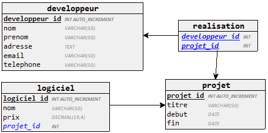
> *TP logiciel*
]

Pour chaque demande donner la requete SQL qui correspond.
1. Afficher les noms et les prix des logiciels appartenant au projet ayant comme titre « gestion de stock », triés dans l’ordre décroissant des prix
2. Afficher le total des prix des logiciels du projet numéro 10. Lors de l’affichage, le titre de la colonne sera « cours total du projet ».
3. Afficher le nombre de développeurs qui ont participé au projet intitulé « gestion de stock »
4. Afficher les projets qui ont plus que 5 logiciels
]

---
.left-column[
## Fonctions d'agregation
## Groupement de données
## Sous-requêtes
]
.right-column[
Une sous-requête, également appelée requête imbriquée ou sous-sélection, est une requête `SELECT` intégrée à la clause `WHERE` ou `HAVING` d'une autre requête SQL. Les données renvoyées par la sous-requête sont utilisées par l'instruction externe de la même manière qu'une valeur littérale serait utilisée.

Les sous-requêtes constituent un moyen simple et efficace de gérer les requêtes qui dépendent des résultats d'une autre requête. Elles sont presque identiques aux instructions `SELECT` normales, mais il existe peu de restrictions. Les plus importantes sont :

* Une sous-requête doit toujours apparaître entre parenthèses.
* Une sous-requête doit renvoyer une seule colonne. Cela signifie que vous ne pouvez pas utiliser `SELECT *` dans une sous-requête à moins que la table à laquelle vous faites référence ne comporte qu'une seule colonne. Vous pouvez utiliser une sous-requête qui renvoie plusieurs colonnes si le but est la comparaison de lignes.
* Vous ne pouvez utiliser que des sous-requêtes renvoyant plusieurs lignes avec des opérateurs de valeurs multiples, tels que l'opérateur `IN` ou `NOT IN`.
* Une clause `ORDER BY` ne peut pas être utilisée dans une sous-requête, bien que la requête principale puisse utiliser un `ORDER BY`
* La clause `GROUP BY` peut être utilisée pour exécuter la même fonction que `ORDER BY` dans une sous-requête.
* Une sous-requête ne peut pas être une `UNION`. Une seule instruction `SELECT` est autorisée.

Les sous-requêtes sont le plus souvent utilisées avec l'instruction `SELECT`. Toutefois, vous pouvez également les utiliser dans une instruction `INSERT`, `UPDATE` ou `DELETE` ou dans une autre sous-requête.
]

---

.left-column[
## Fonctions d'agregation
## Groupement de données
## Sous-requêtes
]
.right-column[
```sql
CREATE TABLE expose(
  id                INT           PRIMARY KEY NOT NULL AUTO_INCREMENT,
  nom               VARCHAR (50)  NOT NULL,
  duree             INT           NOT NULL,
  date_realisation  DATETIME      NOT NULL);

CREATE TABLE participer(
  expose_id INT NOT NULL,
  eleve_id  INT NOT NULL,
  PRIMARY KEY (expose_id, eleve_id),
  FOREIGN KEY(expose_id) REFERENCES expose (id),
  FOREIGN KEY(eleve_id) REFERENCES eleve (id));
```

```sql
INSERT INTO expose VALUES 
(1, 'La Terre', 200, NOW()),
(2, 'Planete Mars', 160, '2021-09-21 16:54:00'),
(3, 'Planete Venus', 178, '2021-11-11 14:54:00');

INSERT INTO participer (eleve_id, expose_id) VALUES 
(1, 1), (1, 2), (2, 3), (3, 2), (4, 1), (4, 3), (5, 1), (5, 2),
(6, 1), (6, 2), (7, 3), (7, 1), (8, 1), (8, 3), (9, 1), (10, 2);
```
]

---

.left-column[
## Fonctions d'agregation
## Groupement de données
## Sous-requêtes
### Instruction SELECT
]
.right-column[
Les sous-requêtes sont le plus souvent utilisées avec l'instruction `SELECT`. La syntaxe de base est la suivante :
```sql
SELECT nom_colonne [, nom_colonne ]
FROM   table1 [, table2 ]
WHERE  nom_colonne OPERATOR
    (SELECT nom_colonne [, nom_colonne ]
    FROM table1 [, table2 ]
    [WHERE])
```

Il existe principalement deux types de sous-requêtes :
* Sous-requêtes indépendantes

* Sous-requêtes corrélées


]

---

.left-column[
## Fonctions d'agregation
## Groupement de données
## Sous-requêtes
### Instruction SELECT
]
.right-column[
#### Sous-requêtes indépendantes
Dans les sous-requêtes indépendantes, l'exécution de la requête commence de la requête la plus interne vers la plus externe. L'exécution d'une requête interne est indépendante de la requête externe, mais le résultat de la requête interne est utilisé dans l'exécution de la requête externe. Divers opérateurs tels que `IN`, `NOT IN`, `ANY`, `ALL`, etc. sont utilisés pour l'écriture de sous-requêtes indépendantes.


**Exemple :**

Si nous voulons connaître les Ids des élèves qui participent aux exposés «La Terre» ou «La planete Mars», nous pouvons l’écrire à l’aide d’une sous-requête indépendante et d’un opérateur `IN`. A partir de la table Exposé, nous pouvons trouver les `expose.id` pour les exposés «La Terre» ou «La planete Mars» et nous pouvons utiliser ces `expose.id` pour trouver les Ids des élèves à partir de la table `particper`.

Nous pouvons le faire en deux étapes :

```sql
/** Etape 1 - Trouver id pour les expose «La Terre» ou «La planete Mars» **/
SELECT id FROM expose WHERE titre = "La Terre" OR titre = "La planete Mars";

/* Etape 2 - Utiliser les id de la 1ere etape pour trouver les id des élèves à partir de la table participer */
SELECT DISTINCT eleve_id FROM participer
WHERE expose_id IN (SELECT id FROM expose WHERE titre = "La Terre" OR titre = "La planete Mars");
```


]

---

.left-column[
## Fonctions d'agregation
## Groupement de données
## Sous-requêtes
### Instruction SELECT
]
.right-column[
#### Sous-requêtes corrélées
Une sous-requête corrélée est une sous-requête dont le résultat est différent selon les valeurs de la ligne de la requête externe pour laquelle la sous-requête est exécutée. Cela rend nécessaire d'exécuter la sous-requête pour chaque ligne extraite par la requête externe et ajoute au coût de performance de la requête.

**Exemple:**
Trouver l'élève avec le plus grand nombre de point dans sa classe
```sql
SELECT nom FROM eleve e1
WHERE e1.points = (SELECT MAX(e2.points) FROM eleve e2 
  WHERE e1.classe_id = e2.classe_id);
```

#### Sous-requêtes vs jointures
Comparées aux jointures, les sous-requêtes sont simples à utiliser et à lire. Ils ne sont pas aussi compliqués que les jointures. Par conséquent, les débutants en SQL l'utilisent fréquemment.

Mais les sous-requêtes posent des problèmes de performances. L'utilisation d'une jointure au lieu d'une sous-requête peut parfois vous donner **un gain de performances jusqu'à 500 fois**. Si vous avez le choix, il est recommandé d'utiliser une jointure plutôt qu'une sous-requête.

Les sous-requêtes ne doivent être utilisées comme solution de secours que lorsque vous ne pouvez pas utiliser une opération JOIN pour atteindre les objectifs ci-dessus.
]

