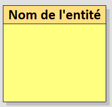
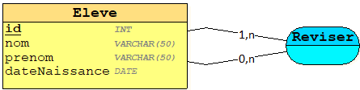

name: inverse
class: center, middle, inverse
# Modele Conceptuel - SQL
# .red[Methode Merise]


---

class: middle
.left-column[
## Objectif
]
.right-column[
- Vous présenter la méthode de conception des systèmes d’information Merise.

- Vous rendre capable de concevoir ou de participer à la conception d’un système d’information. 

- Vous permettre d'apporter des solutions pertinantes aux projet.

- Vous permettre de repondre aux besoin de votre entreprise.

- Gagner en confiance et motivation
]

---

class: middle
.left-column[
## Objectif
## Au programme
]
.right-column[
- **Méthode MERISE**
- **Modele Conceptuel de Données**
  - Entité
  - Relations
  - Héritage
- **Modele Logique Relationnel**
- **SQL**
  - select
  - order by
  - limit
  - where
  - functions
]
---
class: center, middle, inverse
# 1. Méthode MERISE
---

class: middle
.left-column[
## Présentation
]
.right-column[
La conception d'un système d'information n'est pas évidente car il faut réfléchir à l'ensemble de l'organisation que l'on doit mettre en place. La phase de conception nécessite des méthodes permettant **de mettre en place un modèle** sur lequel on va s'appuyer. 

**La modélisation** consiste à créer une représentation virtuelle d'une réalité de telle façon à faire ressortir les points auxquels on s'intéresse.

Ce type de méthode est appelé **analyse**. Il existe plusieurs méthodes d'analyse, la méthode la plus utilisée en France est la méthode **MERISE**.

**MERISE** est une méthode de conception, de développement et de réalisation de projets informatiques. Le but de cette méthode est d'arriver à concevoir un système d'information. La méthode MERISE est basée sur **la séparation des données et des traitements à effectuer** en plusieurs modèles conceptuels et physiques.

La séparation des données et des traitements assure une longévité au modèle. En effet, l'agencement des données n'a pas à être souvent remanié, tandis que les traitements le sont plus fréquemment.
]
---

class: middle
.left-column[
## Présentation
## Système d'information
]
.right-column[
### Qu’est-ce qu’un système ?
Un système est **un ensemble d’éléments matériels ou immatériels en interaction** (hommes, machines, règles…) transformant par un processus des éléments en d’autres éléments.
Une entreprise qui fonctionne en vue de réaliser ses objectifs est une forme de système.
Il existe différents types de système :
* **Le système opérant :** comparable à une boîte noire, il s’agit d’un système physique qui transforme un flux physique entrant (matière première, flux financier…) en un flux physique de sortie (produit, service…).

* **Le système de pilotage :** son rôle est de réguler et contrôler le système opérant, et adapte son fonctionnement en fonction des objectifs prédéfinis. 

Afin de faire l’interface entre le système opérant et le système de pilotage, il est nécessaire de mettre en place le système d’information.
]
---

class: middle
.left-column[
## Présentation
## Système d'information
]
.right-column[


On peut comparer le système d’information à une **« boîte noire »** par laquelle transitent les principaux flux d’information entre le système de pilotage et le système opérant d’une part (règles de fonctionnement, ressources allouées, priorités d’exécution)

Le système d’information assure donc l’interface entre les systèmes opérant et de pilotage, mais il peut aussi assurer l’interface avec le pôle client et/ou le pôle fournisseur. Le système d’information n’est pas fermé sur une organisation interne
]

---

class: middle
.left-column[
## Présentation
## Système d'information
## Cycle de Conception d'un Système d'information
]
.right-column[
.pull-left.center[

]
.pull-right[
La conception du système d'information se fait par étapes, afin d'aboutir à un système d'information fonctionnel reflétant une réalité physique
* **Système d'information manuel :** Faire l'inventaire des éléments nécessaires au système
* **Expression des besoins :** Délimiter le système en s'informant auprès des futurs utilisateurs
Grâce à ses deux étapes nous avons ce que l'on attend du système d'informtion
* **Modèle conceptuel :** Décrit les règles et les contraintes à prendre en compte.
* **Modele Logique :** Représente le choix logiciel pour le système d'information.
* **Modèle physique :** reflète le choix matériel pour le système d'information.
]
]

---

class: middle
.left-column[
## Présentation
## Système d'information
## Cycle de Conception d'un Système d'information
## Niveaux de Modelisations
]
.right-column[
Les trois niveaux conceptuel, logique, et physique facilitent l’analyse d’un problème en se focalisant respectivement sur les aspects de gestion, d’organisation, et d’implémentation.


Aborder un problème selon ces trois axes en facilite l’analyse. Ainsi, 
* **Le gestionnaire** définira les traitements relatifs à une commande reçue dans l’entreprise,

* **Les aspects organisationnels** seront étudiés par l’organisateur, 

* **L’informaticien** précisera les moyens techniques à mettre en œuvre pour satisfaire les besoins relatifs aux niveaux précédents.

]

---

class: middle
.left-column[
## Présentation
## Système d'information
## Cycle de Conception d'un Système d'information
## Niveaux de Modelisations
]
.right-column[
  Ce tableau fait clairement apparaître les modèles que propose la méthode MERISE pour la
formalisation des données et des traitements à chacun des niveaux supportés. Les différents
modèles Merise sont donc :
* **MCD :** Modèle Conceptuel de Données

* **MCT :** Modèle Conceptuel de Traitements

* **MLD :** Modèle Logique de Données

* **MOT :** Modèle Organisationnel de Traitements

* **MPD :** Modèle Physique de Données

* **MPT :** Modèle Physique de Traitements.

La séparation des données et des traitements est conforme aux principes des bases de données relationnelles. Elle met en évidence la relative invariance des données par rapport aux traitements. 

**Par exemple**, un processus de facturation peut consister en l’envoi d’une facture et l’attente du paiement ou en prélèvement automatique. Pour autant, les données nécessaires à chacun de ces traitements restent sensiblement les mêmes.
]
---
class: center, middle, inverse
# 2. Modèle Conceptuel de données
.red[MCD]
---

class: middle
.left-column[
## Presentation
]
.right-column[
Le modèle conceptuel des données **(MCD)** a pour but d'écrire de façon formelle les données qui seront utilisées par le système d'information. Il s'agit donc d'une représentation des données, facilement compréhensible, permettant de décrire le système d'information à l'aide d'entités.

Il doit être le plus complet possible. Sa représentation doit se faire en toute indépendance de considérations techniques et/ou organisationnelles. Le MCD est une représentation statique des données et, par conséquent, ne doit comporter aucune référence aux traitements effectués.

Le Modèle Conceptuel de Données (MCD) permet de faire la description des données et des relations entre les données, grâce aux concepts du formalisme **Entité-Association**. 
]

---

.left-column[
## Presentation
## Entité
]
.right-column[
**L'entité** est définie comme un objet de gestion considéré d'intérêt pour représenter l'activité à modéliser (exemple : entité `Pays`, `Eleve`, ...). 

**L’élève** est une entité, l’élève **« Pierre Dupond »** est une occurrence de l’entité élève. 
  .pull-left.center[
    
  ]

  .pull-left.center[
    
  ]
]
---

.left-column[
## Presentation
## Entité
## Propriété
]
.right-column[
À son tour, chaque entité (ou objet) est porteuse d'une ou **plusieurs propriétés**.

**Une propriété** est une donnée élémentaire susceptible de prendre une valeur. C’est le plus petit élément manipulé du système d’information et qui a un sens en lui-même. 

Une propriété peut-être élémentaire ou calculée, simple ou composée.

* La note d’un élève est une propriété élémentaire, en revanche sa moyenne est une propriété calculée.

* La date de naissance de l’élève est une propriété simple alors que le nom complet de l’élève est une propriété composée.

.center[
  
> *Le nom de la propriété est inscrit à l’intérieur de l’entité.*
]
]

---
.left-column[
## Presentation
## Entité
## Propriété
## Identifiant
]
.right-column[
**L’identifiant est une propriété particulière de l’entité** telle qu’à chaque valeur de la propriété corresponde une et une seule occurrence de l’entité. 

La valeur de l’identifiant **rend unique chaque occurrence** de l’entité. Ainsi pour éviter les synonymes, **les numéros ou les codes font les meilleurs identifiants**.

.center[
  
> *Dans le MCD, l’identifiant figure en première position dans la liste des propriétés et est souligné*
]
.small[
* **Le numéro d’un élève** sera l’identifiant pour l’entité élève, son nom ne suffirait pas pour l’identifier de manière unique dans le SI.

* **Le numéro INSEE** pourra être l’identifiant d’une personne.

* **Le numéro d’immatriculation** pourra être l’identifiant de l’entité voiture.
]

]

---
.left-column[
## Presentation
## Entité
## Propriété
## Identifiant
## .red[Travaux Pratique]
]
.right-column[
**La société R** est desireuse de vouloir analyser ses besoins afin de mettre en place une nouvelle version de son logiciel utilisé en interne.

Elle fait appel à vous pour lui réaliser un modele conceptuel de données dans un premier temps.

* La société R gere des employes qui sont identifié par un numero d'immatriculation. Elle souhaite ainsi stocker le nom, prénom, date de naissance, date d'entrée dans l'entreprise.

* Egalement elle souhaite pouvoir lister tout les postes de travail qu'elle gere. Chaque poste de travaille est identifié par un code unique et possède donc un intitulé, une description. La société souhaiterai en plus gerer la disponibilité du poste.

]

---
.left-column[
## Relation / Association
### Définition
]
.right-column[
**Une association** est la représentation **d’une relation entre plusieurs entités**. Elle est dépourvue d’existence propre et est subordonnée à l’existence des entités qui la composent. 

Pour définir la reation on utilise généralement un verbe.

L’entité `Eleve` est en association avec l’entité `Classe`.

.center[
  
> *La relation peut être binaire*
]

.small[
**On traduit par :**
* L'élève **a une** classe.

* La classe **a un ou plusieurs** élèves.
]
]

---
.left-column[
## Relation / Association
### Définition
### Porteuse de données
]
.right-column[
La relation peut aussi **être porteuse d’une ou plusieurs propriétés** : 

L’entité `Eleve` est en association avec l’entité `Matiere` et porte la propriété `note`.

.center[
  
> *La relation peut être porteuse de données*
]
.small[
**On traduit par :**
* L'élève **a une ou plusieurs notes** de matières.

* Une Matière **a une ou plusieurs notes** d'élèves.
]

]

---
.left-column[
## Relation / Association
### Définition
### Porteuse de données
### Relation n-aire
]
.right-column[
La relation peut aussi être lié à plus de deux entités.

L’entité `Eleve` est en association avec les entités `Matiere`, `Examen` et porte la propriété `note`.

.center[
  
> *Relation ternaire*
]
.small[
**On traduit par :**
* L'élève **a une ou plusieurs notes** de matières pour une ou plusieurs examens.

* Une Matière **a une ou plusieurs notes** d'élèves pour une ou plusieurs examens.

* Un Examen **a une ou plusieurs notes** d'élèves pour une ou plusieurs matières.
]

.red[
  <i class="fas fa-info-circle"></i> Dans une relation ternaire, il n’y a jamais de cardinalités à 1,1 ou 0,1]
]

---
.left-column[
## Relation / Association
### Définition
### Porteuse de données
### Relation n-aire
### Relation réflexive
]
.right-column[
La relation peut être aussi **réflexive** (ou unaire). C’est une relation qui relie une entité à elle-même.
.center[
  
> *Relation reflexive*
]
.small[
**On traduit par :**
* L'élève **a une ou plusieurs** revisions avec d'autres élèves.
]
]

---
.left-column[
## Relation / Association
### Définition
### Porteuse de données
### Relation n-aire
### Relation réflexive
### Relation identifiante
]
.right-column[
**L’association identifiante** traduit la relation de composition entre une entité composante et une entité composée. 

* L’exemple classique est la relation entre une commande et ses lignes de commande. Une ligne de commande n’a pas d’existence propre. Elle est toujours relative à une commande. 
.center[
  
> *Relation identifiante*
]

* Un autre exemple classique est celui de l’hôtel et des ses chambres. Les chambres seules n’ont pas d’existence propre.
.center[
  
> *Relation reflexive*
]

L’association identifiante (appelée lien identifiant) est notée `1,1(R)` dans le MCD.
]

---
.left-column[
## Relation / Association
### Définition
### Porteuse de données
### Relation n-aire
### Relation réflexive
### Relation identifiante
### .red[Travaux pratique]
]
.right-column[
  La société R
]

---
.left-column[
## Cardinalité
### Presentation
]
.right-column[
**La cardinalité** d’une entité par rapport à une relation s’exprime par deux nombres appelés **cardinalité minimale** et **cardinalité maximale**.
.center[
  
]

**Cardinalité minimale**
* La cardinalité minimale, égale à `0` ou `1`, est le nombre de fois minimum qu’une occurrence d’une entité participe aux occurrences de la relation. 
* Si la cardinalité minimale est égale à `0`, c’est qu’il existe parmi toutes les occurrences de l’entité, au moins une occurrence qui ne participe pas à la relation. 

.small[
  Par exemple, dans une équipe de sport, tous les membres de l’équipe ne participent pas forcément à un match. En revanche, si la cardinalité minimale est égale à 1, cela implique que toutes les occurrences d’une entité participent à toutes les occurrences de la relation. Dans notre exemple, cela se traduit par le fait qu’un joueur joue tous les matchs.
]

**Cardinalité maximale**
* La cardinalité maximale, égale à `1` ou `n`, indique le nombre de fois maximum qu’une occurrence de l’entité participe aux occurrences de la relation (n est équivalent à infini). 
]

---
.left-column[
## Cardinalité
### Presentation
### Cardinalités possibles
]
.right-column[
.pull-left.center[

> *Cardinalité 0,1*
  

> *Cardinalité 1,1*


> *Cardinalité 1,1(R)*
]
.pull-right.center[

> *Cardinalité 0,n*


> *Cardinalité 1,n*


> *Cardinalité x,y*
]
]

---
.left-column[
## Cardinalité
### Presentation
### Cardinalités possibles
### Explication
]
.right-column[
.center[

> *Cardinalité explication*
]

Dans l’exemple ci-dessus
* **la cardinalité minimale** entre l’entité `Client` et la relation `Passer` qui est à **« 0 »** exprime le fait qu’un client peut ne pas passer de commande. C’est un client potentiel.

* **La cardinalité maximale** entre l’entité `Client` et la relation `Passer` qui est à **« n »** exprime le fait qu’un client peut passer au plus « n » commandes.

* **La cardinalité minimale** entre la relation `Passer` et l’entité `Commande` qui est à **« 1 »** exprime le fait qu’à une commande correspond toujours un client.

* **La cardinalité maximale** entre la relation `Passer` et l’entité `Commande` qui est à **« 1 »** exprime le fait qu’à une commande correspond un seul client au maximum. 
]

---
.left-column[
## Cardinalité
### Presentation
### Cardinalités possibles
### Explication
### .red[Travaux Pratique]
]
.right-column[
  
]

---
.left-column[
## Héritage
### Définition
]
.right-column[
**L'héritage** permet de définir une **entité spécialisée** par rapport à une entité générale. Dans un héritage, les entités ont beaucoup de caractéristiques communes mais sont toutefois différentes. L'entité générale est appelée entité surtype ou père, elle est dotée de toutes les caractéristiques communes aux entités spécialisées qui elles, sont appelées sous-type, fils ou enfant. Les entités sous-types ne disposent que des caractéristiques qui leur sont propres.

Vous pouvez établir un lien d'héritage entre une entité générale et des entités spécialisées. Dans un lien d'héritage, une ou plusieurs entités enfant héritent, au niveau physique, de tout ou partie des attributs d'une entité père.

.center[

> *Heritage, Specialisation/Génralisation*
]
]

---
.left-column[
## Héritage
### Définition
### .red[Travaux Pratique]
]
.right-column[]

---
.left-column[
## Contraintes
### Intégrité fonctionnelle
]
.right-column[
### Définition
**La notion de contrainte d’intégrité fonctionnelle (CIF)** correspond à celle de la dépendance fonctionnelle (DF) forte **ET** stable. (stable signifiant que les occurrences des entités mises en jeu ne pourront jamais changer).

***Exemple :***

> Un enfant ne pourra jamais changer de père. De même la dépendance fonctionnelle entre commande et client est une contrainte d’intégrité fonctionnelle car le client qui a passé la commande ne peut pas changer.

La CIF traduit un lien fort et permanent (non modifiable sauf son annulation) de dépendance d’une entité par rapport à une ou plusieurs autres entités. Dans le cas où ce lien n’est pas permanent dans le temps, il s’agira donc d’une dépendance fonctionnelle entre
objets.

L’intérêt de mettre en évidence une CIF dans une relation de dimension supérieure à 2, réside dans le fait que l’on peut diminuer de 1 la dimension de la relation.
.center[

> *Ccontrainte d’intégrité fonctionnelle à deux entités*
]
]

---
.left-column[
## Contraintes
### D'intégrité fonctionnelle
]
.right-column[
.center[

> *Cardinalité explication*
]

Dans l’exemple ci-dessus, l’existence d’un contrat d’assurance implique la connaissance de l’assuré. Il y a donc un lien fort et permanent de dépendance entre l’entité `Client` et l’entité `Contrat`.

La mise en évidence de cette CIF permet de décomposer le modèle en deux associations binaires (au lieu d’une association ternaire) : 
.center[

> *Cardinalité explication*
]
]

---
.left-column[
## Contraintes
### D'intégrité fonctionnelle
### D'exclusion
]
.right-column[
### Définition
**La contrainte d’exclusion** traduit le fait que toute occurrence d’une entité pivot participe à l’une ou l’autre des associations de la contrainte ou à aucune des deux, mais pas aux deux.

.info[
<i class="fas fa-info-circle"></i> La contrainte d’exclusion est représentée par un cercle contenant un **X**, et est reliée au pivot par un trait pointillé.
]
.center[

> *Contrainte d'exclusion*
]
.small[
Dans l’exemple ci-dessus, l’entité `Personne` est le pivot de la contrainte.

La contrainte exprimée est : 

Une personne étudie dans un établissement **ou bien** elle est salariée d’une entreprise **ou bien** elle est ni étudiante ni salariée. Mais **elle ne peut pas être** à la fois étudiante et salariée
]
]

---
.left-column[
## Contraintes
### D'intégrité fonctionnelle
### D'exclusion
### D'inclusion
]
.right-column[
**La contrainte d’inclusion** traduit le fait que les occurrences des entités participant à une relation **R1 participent implicitement à une autre relation R2**. En revanche, la réciproque est fausse.

.info[
  <i class="fas fa-info-circle"></i> La contrainte d’inclusion est représentée par un cercle contenant un I, et est reliée au pivot par un trait pointillé.
]

.center[

> *Contrainte d'inclusion*
]

.small[
Dans l’exemple ci-dessus, les occurrences de l’entité `Personne` qui participent à la relation `Etudier` participent également et **obligatoirement** à la relation `Travailler`. En revanche, le fait qu’une occurrence de l’entité personne participe à la relation `Travailler` **n'implique** pas qu’elle participe à la relation `Etudier`.

Cela se traduit par :**« Une personne qui étudie dans un établissement implique qu’elle
travaille dans une entreprise »**. (Cas d’une personne étudiant dans un lycée professionnel et
ayant l’obligation de faire un stage en entreprise). En revanche, la réciproque est fausse. 
]
]

---
.left-column[
## Contraintes
### D'intégrité fonctionnelle
### D'exclusion
### D'inclusion
### De totalité
]
.right-column[
**La contrainte de totalité** traduit le fait que toute occurrence du pivot participe à l’une ou l’autre des associations de la contrainte ou aux deux.

.info[
  <i class="fas fa-info-circle"></i> La contrainte de totalité est représentée par un cercle contenant un **T**, et est reliée au pivotpar un trait pointillé. 
]

.center[

> *Contrainte de totalite*
]

.small[
Dans l’exemple, toute occurrence de l’entité `Personne` participe soit à la relation `Etudier`, soit à la relation `Travailler` soit au deux relations à la fois.

Cela se traduit par **« Une personne peut être étudiant dans un établissement de formation ou
salarié dans une entreprise ou les deux à la fois »** (Cas d’un étudiant en formation continue
par exemple).
]
]

---
.left-column[
## Contraintes
### D'intégrité fonctionnelle
### D'exclusion
### D'inclusion
### De totalité
### De partition
]
.right-column[
**La contrainte de partition** traduit le fait que **toute occurrence** du pivot participe **obligatoirement** à **l’une ou l’autre** des associations de la contrainte, **mais pas aux deux**.

.info[
  <i class="fas fa-info-circle"></i> La contrainte de partition est représentée par un cercle contenant un **XT**, et est reliée au pivot par un trait pointillé. 
]

.center[

> *Contrainte de partition*
]
.small[
Dans l’exemple, toute occurrence de la table `Personne` participe soit à la relation `Etudier`, soit à la relation `Travailler` mais pas au deux à la fois.

Cela se traduit par **« Une personne est obligatoirement soit étudiant dans un établissement de formation soit salarié dans une entreprise »**

Cette contrainte est équivalente à une contrainte de totalité et une contrainte d’exclusion
]
]

---
.left-column[
## Contraintes
### D'intégrité fonctionnelle
### D'exclusion
### D'inclusion
### De totalité
### De partition
### De simultanéité
]
.right-column[
La contrainte d’égalité traduit deux inclusions symétriques. C’est à dire que toute occurrence d’une entité participant à une relation R1, participe simultanément à une relation R2.

.info[
  <i class="fas fa-info-circle"></i> La contrainte de partition est représentée par un cercle contenant un **S**, et est reliée au pivot par un trait pointillé. 
]

.center[

> *Contrainte de simultanéité*
]

.small[
Dans l’exemple ci-dessus, toutes les occurrences de l’entité `Personne` qui participent à la relation `Etudier` participent également et obligatoirement à la relation `Travailler`. Inversement toutes les occurrences de l’entité `Personne` qui participent à la relation `Travailler` participent également et obligatoirement à la
relation `Etudier`.

Cela se traduit par **« Une personne qui étudie dans un établissement implique qu’elle
travaille dans une entreprise »** ou **« une personne qui est salariée dans une entreprise
implique qu’elle étudie dans un établissement ».** 
]
]

---
class: center, middle, inverse
# 3. Modèle Logique de données
.red[MLD]
---
.left-column[
## Presentation
]
.right-column[
Alors que le **Système d'Information** a été décrit au niveau conceptuel et organisationnel, il est maintenant nécessaire de le décrire sur le plan informatique.

**Le Modèle Logique des Données (MLD)** permet de prendre en compte la structuration technique propre au stockage informatisé. L’utilisation de l’informatique permet d’améliorer l’organisation et la gestion d’un SI. Depuis le début du cours, il a été vu comment constituer théoriquement une base de données. Cette base de données peut être réalisée et gérée par un **Système de Gestion de Bases de Données Relationnelles (SGBDR).**

**Un SGBDR** va permettre d’organiser un SI, de saisir ses données, de les modifier, de les supprimer et de les consulter.

La plupart des SGBDR courants sont fondés sur le modèle relationnel défini par E.F Codd en 1970. Le modèle relationnel présente deux aspects fondamentaux : des concepts structuraux de base comme la table, un algèbre permettant de manipuler les tables, ou une collection de tables.

Le Modèle Relationnel des Données (MRD), Parfois appelé Modèle Logique des Données (MLD) s’est largement imposé depuis la fin des années 80, et est donc devenu un standard de fait pour **la description du niveau logique**.

Le MCD représente donc l’ensemble des données d’un point de vue abstrait, sans tenir compte des contraintes d’implémentation dans une base de données ou des contraintes techniques associées. 
]
---
.left-column[
## Presentation
## Concepts
### Table, Attributs, Occurences
]
.right-column[
#### Table ou Relation
**La table** constitue la principale structure de stockage dans une base relationnelle.

Elle a une structure de **tableau**, composée de **lignes** et de **colonnes** dans lesquelles on stocke les informations. La table est désignée par un nom.

.info[
<i class="fas fa-info-circle"></i> La table du modèle relationnel correspond à l’entité et parfois l'association du MCD.
]

#### Attribut
L’attribut représente une colonne d’une table caractérisée par un nom. Une table possède autant d’attributs que d’informations à gérer.

.info[
<i class="fas fa-info-circle"></i> L’attribut du modèle relationnel correspond à la notion de propriété dans le MCD.
]

#### Occurence
Une occurrence de la table (ou de la relation) correspond à une ligne du table. Il y aura autant d'occurences qu’il y aura de valeurs. L'occurence correspond à l’enregistrement d’une ligne de la table. 

]
---
.left-column[
## Presentation
## Concepts
### Table, Attributs, Occurences
### Clé primaire
]
.right-column[
La clé primaire est un attribut particulier dont les valeurs définissent de manière unique les tuples de la table (ou de la relation).

La clé primaire est soulignée d’un trait continu.

.info[
<i class="fas fa-info-circle"></i>  La clé primaire du MLD corresponds à l’identifiant du MCD
]

#### Exemple 
.pull-right[
```
| id | nom     | prenom | dateNaissance |
|----|---------|--------|---------------|
| 1  | Intelli | Jean   | 2014-01-12    |
| 2  | Down    | Marc   | 2013-08-01    |
| 5  | Rateur  | Jane   | 1999-01-12    |
```
.center[
  > *Occurences, lignes de tables*
]
]
.pull-left.center[

> *MLD Table `Eleve`*
]
]
---
.left-column[
## Presentation
## Concepts
### Table, Attributs, Occurences
### Clé primaire
### Clé etrangère
]
.right-column[
La clé étrangère est un attribut particulier correspondant à une clé primaire de la table de référence.

Une table peut contenir 0, 1 ou plusieurs clé étrangères.

La clé étrangère est soulignée d’un trait pointillé, ou bien suivie du signe #.
.info[
<i class="fas fa-info-circle"></i>  La clé étrangère du MLD corresponds à l’association du MCD
]

.center[

> *MLD Clé étrangère*
]
]

---
.left-column[
## Presentation
## Concepts
### Table, Attributs, Occurences
### Clé primaire
### Clé etrangère
### Règles de passage d’un MCD à un MLD
]
.right-column[
#### Règles pour les entités du MCD
* L’entité se transforme en une table ;
* L’identifiant de l’entité devient la clé primaire de la table ;
* Les propriétés de l’entité deviennent des attributs de la table. 
]
---
class: center, middle, inverse
# 4. Structured Query Language
.red[SQL]

---
.left-column[
## Presentation
]
.right-column[
**SQL** est un langage de programmation standard spécialement conçu pour stocker, extraire, gérer ou manipuler les données à l'intérieur d'un système de gestion de bases de données relationnelles (SGBDR). SQL est devenu une norme ISO en 1987.

SQL est le langage de base de données le plus largement mis en oeuvre et soutenu par les systèmes de base de données relationnelles populaires, comme MySQL, SQL Server, et Oracle. Cependant, certaines fonctionnalités de la norme SQL sont implémentées différemment dans différents systèmes de bases de données.

SQL a été développé à l'origine par IBM au début des années 1970. Initialement, il s’appelait **SEQUEL** (Structured English Query Language), qui a ensuite été remplacé par **SQL**
]

---
.left-column[
## Presentation
## Ce que vous pouvez faire avec SQL
]
.right-column[
Il y a beaucoup de choses que vous pouvez faire avec **SQL**:

* Créer une base de données.
 
* Créer des tables dans une base de données.
 
* Interroger ou demander des informations à partir d'une base de données.
 
* Insérer des enregistrements dans une base de données.
 
* Mettre à jour ou modifier des enregistrements dans une base de données.
 
* Supprimer des enregistrements de la base de données.
 
* Définir les permissions ou le contrôle d'accès dans la base de données pour la sécurité des données.
 
* Créer des vues pour éviter de taper des requêtes complexes fréquemment utilisées.

La liste ne se termine pas ici, vous pouvez effectuer de nombreuses autres tâches liées à la base de données avec SQL. Vous en apprendrez plus sur chacune d'elles en détail dans les prochains cours.
]

---
.left-column[
## Presentation
## Ce que vous pouvez faire avec SQL
## Mise en place de Mysql
### Container
]
.right-column[
Nous utiliserons Docker pour configurer notre environnement de travail avec le conteneur SGBDR Mysql dans sa version 5.7.

Nous devons exécuter la commande docker suivante pour extraire l'image docker du hub docker et l'exécuter sur votre machine.
```bash
docker run -p 3306:3306 --name=mysql-demo-db \
  -d mysql/mysql-server:5.7 mysqld --lower_case_table_names=1
```
Avec la commande ci-dessus, nous avons lancé un serveur mysql qui tourne sur notre machine via Docker.
Pour récuperer le mot de passe
```bash
docker logs mysql-demo-db 2>&1 | grep GENERATED
[Entrypoint] GENERATED ROOT PASSWORD: 6=J#+5Ir#1Q6W&.0H8ZDl=8%vO3UQqzY
```

Maintenant nous allons nous y connecter en utilisant le mot de passe generé ci-dessus
```bash
docker exec -it mysql-demo-db mysql -uroot -p
```
]

---
.left-column[
## Presentation
## Ce que vous pouvez faire avec SQL
## Mise en place de Mysql
### Container
### Accès
]
.right-column[
Nous allons mettre a jour le mot de passe pour un autre plus simple.
```mysql
ALTER USER 'root'@'localhost' IDENTIFIED BY 'root';
UPDATE mysql.user SET host='%' WHERE user='root';

# new user via tools
CREATE USER 'user'@'localhost' IDENTIFIED BY 'user';
GRANT ALL PRIVILEGES ON *.* TO 'user'@'localhost' WITH GRANT OPTION;
CREATE USER 'user'@'%' IDENTIFIED BY 'user';
GRANT ALL PRIVILEGES ON *.* TO 'user'@'%' WITH GRANT OPTION;

exit;
```

Pour se connecter dorenevant on peut utiliser la commande suivante :
```bash
 docker exec -it mysql-demo-db mysql -uroot -proot
```

Vous pouvez aussi utiliser l'extension VsCode `Mysql` de Juan Han en utilisant le user `user` precedement ajouté.
]

---
.left-column[
## Syntaxe des instructions
]
.right-column[]

---
.left-column[
## Syntaxe des instructions
## Base de données
]
.right-column[
L'instruction CREATE DATABASE est utilisée pour créer une nouvelle base de données SQL.
```sql
CREATE DATABASE nomBDonnees;
```
.small.center[
<i class="fas fa-info-circle"></i> Notre utilisateur dispose des privilèges administrateur pour gerer les base de données.
]

Une fois la base de données créée, vous pouvez la vérifier comme suit dans la liste des bases de données.
```sql
SHOW DATABASES;
```

L'instruction DROP DATABASE est utilisée pour supprimer une base de données existante dans un schéma SQL.
```sql
DROP DATABASE nomBDonnees;
```

Vous devez sélectionner une base de données sur laquelle toutes les opérations seront effetuées. L'instruction USE permet de sélectionner une base de données existante dans le schéma SQL.
```sql
USE nomBDonnees;
```
]

---
.left-column[
## Syntaxe des instructions
## Base de données
## Type de données
]
.right-column[

]

---
.left-column[
## Table
### Création
]
.right-column[
La création d'une table de base implique de nommer la table et de définir ses colonnes et le type de données de chaque colonne.

L'instruction `CREATE TABLE` permet de créer une nouvelle table.
```sql
CREATE TABLE nom_table(
    column1 type_donnees [contraintes],
    column2 type_donnees [contraintes],
    .....
    columnN type_donnees [contraintes],
    PRIMARY KEY( une ou plusieurs colonnes )
);
```
Le code suivant est un exemple, qui crée une table Employes avec un ID en tant que clé primaire et NOT NULL sont les contraintes indiquant que ces champs ne peuvent pas être NULL lors de la création d'enregistrements dans cette table.
```sql
CREATE TABLE eleve(
    id INT NOT NULL,
    nom VARCHAR (50) NOT NULL,
    prenom VARCHAR (50) NOT NULL,
    date_naissance DATE NOT NULL,
    PRIMARY KEY( id )
);
```
]

---
.left-column[
## Table
### Création
]
.right-column[
Une fois la table créée, vous pouvez la vérifier comme suit dans la liste des tables.
```sql
SHOW TABLES;
```

Pour avoir la description de la table vous pouvez utiliser
```sql
DESC eleve;
```

Pour connaitre la commande `CREATE TABLE` pour une table existante
```sql
SHOW CREATE TABLE eleve;
```
]

---
.left-column[
## Table
### Création
### Suppression
]
.right-column[
L'instruction `DROP TABLE` permet de supprimer une définition de table ainsi que toutes les données, index, déclencheurs, contraintes et spécifications de permission de cette table.

.info[
<i class="fas fa-exclamation-triangle"></i> Attention ! Vous devez être très prudent lorsque vous utilisez cette commande car une fois la table supprimée, toutes les informations disponibles dans cette table seront également définitivement perdues.
]

```sql
DROP TABLE nom_table;
```
]

---
.left-column[
## Table
### Création
### Suppression
### Modification
]
.right-column[
La commande SQL `ALTER TABLE` permet d’ajouter, de supprimer ou de modifier des colonnes dans une table existante. Vous devez également utiliser la commande `ALTER TABLE` pour ajouter et supprimer diverses contraintes sur une table existante.

#### Ajouter une colonnes
`ADD` est utilisé avec la base de la commande `ALTER TABLE` pour ajouter une nouvelle colonne dans une table existante.
```sql
ALTER TABLE eleve ADD adresse VARCHAR(100);
```

#### Supprimer une colonnes
`DROP COLUMN` est utilisé pour supprimer une colonne dans une table. Suppression des colonnes indésirables de la table.
```sql
ALTER TABLE eleve DROP COLUMN adresse;
```

#### Modifier une colonnes
`MODIFY` est utilisée pour modifier les colonnes existantes dans une table. Plusieurs colonnes peuvent également être modifiées à la fois.
```sql
ALTER TABLE eleve MODIFY nom VARCHAR(100);
```
]

---
.left-column[
## Table
### Création
### Suppression
### Modification
### .red[Travaux Pratique]
]
.right-column[]

---
.left-column[
## Contraintes
]
.right-column[
**Les contraintes** sont les règles appliquées aux colonnes de données d'une table. Celles-ci sont utilisées pour limiter le type de données pouvant aller dans une table. Cela garantit l'exactitude et la fiabilité des données de la base de données.

Les contraintes peuvent être au niveau de la colonne ou de la table. Les contraintes de niveau de colonne ne sont appliquées qu'à une seule colonne, alors que les contraintes de niveau de table s'appliquent à l'ensemble de la table.

Les contraintes les plus communes sont :
 
* `NOT NULL`

* `DEFAULT`

* `UNIQUE`

* `CHECK`

* `PRIMARY KEY`

* `FOREIGN KEY`

* `INDEX`
]

---
.left-column[
## Contraintes
### NOT NULL
]
.right-column[
Par défaut, une colonne peut contenir des valeurs `NULL`. Si vous ne souhaitez pas qu'une colonne ait une valeur `NULL`, vous devez définir une telle contrainte sur cette colonne en spécifiant que `NULL` n'est plus autorisé pour cette colonne.

`NULL` n'est pas la même chose que pas de données, il représente plutôt des données inconnues.

Exemple lors d'un `CREATE TABLE`, pour `id` et `nom` on specifie la contrainte pour ne pas avoir `NULL`.
```sql
CREATE TABLE eleve(
    id              INT           NOT NULL,
    nom             VARCHAR (50)  NOT NULL,
    prenom          VARCHAR (50),
    PRIMARY KEY( id )
);
```
Exemple lors d'un `ALTER TABLE`, pour ajouter une contrainte `NOT NULL` à la colonne `prenom`
```sql
ALTER TABLE eleve
    MODIFY prenom VARCHAR (50) NOT NULL;
```
]

---
.left-column[
## Contraintes
### NOT NULL
### DEFAULT
]
.right-column[
La contrainte `DEFAULT` fournit une valeur par défaut à une colonne lorsque l'instruction `INSERT INTO` ne fournit pas de valeur spécifique.

Exemple lors d'un `CREATE TABLE`, le champs date_naissance aura par default une date avec la valeur `2015-01-01`
```sql
CREATE TABLE eleve(
    id              INT           NOT NULL,
    nom             VARCHAR (50)  NOT NULL,
    prenom          VARCHAR (50)  NOT NULL,
    date_naissance  DATE          DEFAULT '2015-01-01'
    PRIMARY KEY( id )
);
```
Exemple lors d'un `ALTER TABLE`, pour ajouter une contrainte DEFAULT à la colonne `prenom`.
```sql
ALTER TABLE eleve
    MODIFY prenom VARCHAR (50) DEFAULT 'marc';
```

Pour supprimer une contrainte DEFAULT, utilisez la requête suivante :
```sql
ALTER TABLE eleve
    ALTER COLUMN prenom DROP DEFAULT;
```
]

---
.left-column[
## Contraintes
### NOT NULL
### DEFAULT
### UNIQUE
]
.right-column[
La contrainte UNIQUE empêche que deux enregistrements aient des valeurs identiques dans une colonne.

Exemple lors d'un `CREATE TABLE`, la colonne `prenom` est définie sur `UNIQUE`, de sorte que vous ne pouvez pas avoir deux enregistrements portant le même `prenom`.
```sql
CREATE TABLE eleve(
    id              INT           NOT NULL,
    nom             VARCHAR (50)  NOT NULL,
    prenom          VARCHAR (50)  NOT NULL UNIQUE,
    PRIMARY KEY( id )
);
```
]

---
.left-column[
## INSERT
]
.right-column[
### Insertion des enregistrements
L'instruction INSERT INTO est utilisée pour ajouter de nouvelles lignes de données à une table de la base de données.
]