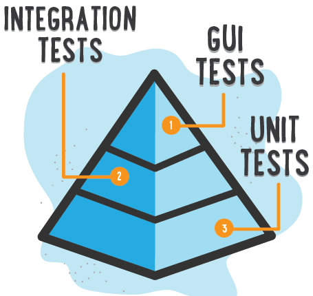

name: inverse
class: center, middle, inverse


<div class="logo"><svg class="logo-1" fill="white" width="196" height="64" viewBox="0 0 196 64" style="fill-rule: evenodd; clip-rule: evenodd; stroke-linejoin: round; stroke-miterlimit: 2;"><g transform="matrix(0.101031,0,0,0.101031,2.39526,-0.329946)"><g transform="matrix(1.27705,0,0,1.27705,1143.65,155.404)"><path d="M320.958,94.576C320.958,107.301 317.357,117.884 310.155,126.323C302.952,134.763 293.386,140.971 281.456,144.947L331.695,223.685L290.072,223.685L246.727,150.647L230.025,150.647L230.025,223.685L193.837,223.685L193.837,40.361L247.787,40.361C296.568,40.361 320.958,58.433 320.958,94.576ZM283.312,94.576C283.312,84.855 280.462,77.764 274.762,73.301C269.062,68.838 260.38,66.607 248.715,66.607L230.025,66.607L230.025,124.931L249.908,124.931C260.954,124.931 269.283,122.501 274.895,117.641C280.506,112.78 283.312,105.092 283.312,94.576Z" style="fill-rule: nonzero;"></path></g><g transform="matrix(1.27705,0,0,1.27705,1486.87,208.548)"><path d="M313.005,64.751L241.159,227.264L208.153,217.058L277.612,67.402L195.163,67.402L195.163,40.361L313.005,40.361L313.005,64.751Z" style="fill-rule: nonzero;"></path></g><g transform="matrix(1.27705,0,0,1.27705,1335.53,155.404)"><path d="M253.752,12.524C257.994,12.524 261.75,13.43 265.019,15.241C268.289,17.053 270.852,19.55 272.708,22.731C274.563,25.912 275.491,29.447 275.491,33.335C275.491,37.224 274.563,40.758 272.708,43.94C270.852,47.121 268.289,49.64 265.019,51.495C261.75,53.351 257.994,54.279 253.752,54.279C249.51,54.279 245.733,53.351 242.419,51.495C239.105,49.64 236.52,47.121 234.664,43.94C232.808,40.758 231.88,37.224 231.88,33.335C231.88,29.447 232.808,25.912 234.664,22.731C236.52,19.55 239.105,17.053 242.419,15.241C245.733,13.43 249.51,12.524 253.752,12.524ZM201.658,83.309L276.419,83.309L276.419,198.897L313.402,198.897L313.402,223.685L200.332,223.685L200.332,198.897L241.424,198.897L241.424,108.097L201.658,108.097L201.658,83.309Z" style="fill-rule: nonzero;"></path></g><g transform="matrix(2.01117,0,0,2.01117,165.834,-128.735)"><path d="M261.043,177.319L211.622,177.319L211.622,218.681L254.382,218.681L254.382,228.302L211.622,228.302L211.622,271.803L264.332,271.803L264.332,280.93L201.096,280.93L201.096,167.944L262.441,167.944L261.043,177.319ZM213.76,150.758L245.501,134.23L250.682,143.851L216.72,156.432L213.76,150.758Z" style="fill-rule: nonzero;"></path></g><g transform="matrix(2.01117,0,0,2.01117,165.834,-128.735)"><path d="M312.861,273.201C321.248,273.201 329.06,270.651 336.297,265.553L341.642,272.46C337.969,275.53 333.501,277.984 328.238,279.82C322.975,281.657 317.987,282.575 313.272,282.575C304.994,282.575 297.922,280.766 292.056,277.148C286.191,273.529 281.723,268.376 278.653,261.688C275.583,255 274.048,247.133 274.048,238.088C274.048,229.426 275.583,221.696 278.653,214.898C281.723,208.101 286.218,202.756 292.139,198.863C298.059,194.971 305.131,193.025 313.354,193.025C323.935,193.025 333.282,196.287 341.395,202.81L335.968,210.129C328.128,204.757 320.426,202.07 312.861,202.07C307.488,202.07 302.733,203.441 298.594,206.182C294.455,208.923 291.22,212.993 288.89,218.393C286.561,223.793 285.396,230.358 285.396,238.088C285.396,245.927 286.547,252.465 288.849,257.7C291.152,262.935 294.373,266.828 298.512,269.377C302.65,271.926 307.434,273.201 312.861,273.201Z" style="fill-rule: nonzero;"></path></g><g transform="matrix(2.01117,0,0,2.01117,165.834,-128.735)"><path d="M386.388,193.025C394.118,193.025 400.641,194.834 405.959,198.452C411.277,202.07 415.251,207.224 417.883,213.912C420.514,220.6 421.83,228.549 421.83,237.759C421.83,246.421 420.473,254.137 417.759,260.907C415.046,267.677 411.003,272.981 405.63,276.819C400.258,280.656 393.761,282.575 386.141,282.575C378.412,282.575 371.874,280.725 366.529,277.024C361.184,273.324 357.168,268.13 354.482,261.441C351.796,254.753 350.453,246.914 350.453,237.923C350.453,228.987 351.81,221.148 354.523,214.405C357.237,207.662 361.294,202.413 366.694,198.658C372.093,194.903 378.658,193.025 386.388,193.025ZM386.388,201.988C369.887,201.988 361.636,213.967 361.636,237.923C361.636,261.661 369.805,273.529 386.141,273.529C402.478,273.529 410.646,261.606 410.646,237.759C410.646,213.912 402.56,201.988 386.388,201.988Z" style="fill-rule: nonzero;"></path></g><g transform="matrix(2.01117,0,0,2.01117,165.834,-128.735)"><path d="M463.945,261.359C463.945,265.635 465.301,268.76 468.015,270.734C470.729,272.707 474.443,273.694 479.157,273.694C483.982,273.694 489.053,272.652 494.37,270.569L497.33,278.463C494.973,279.669 492.136,280.656 488.82,281.424C485.503,282.191 481.953,282.575 478.171,282.575C473.566,282.575 469.413,281.739 465.713,280.067C462.012,278.395 459.093,275.955 456.955,272.748C454.817,269.541 453.748,265.745 453.748,261.359L453.748,168.52L426.94,168.52L426.94,159.639L463.945,159.639L463.945,261.359Z" style="fill-rule: nonzero;"></path></g><g transform="matrix(2.01117,0,0,2.01117,165.834,-128.735)"><path d="M520.121,241.87C520.231,248.833 521.491,254.657 523.904,259.345C526.316,264.032 529.509,267.513 533.483,269.788C537.458,272.063 541.885,273.201 546.764,273.201C551.15,273.201 555.11,272.57 558.646,271.309C562.182,270.048 565.979,268.02 570.035,265.224L575.38,272.872C571.433,275.942 566.952,278.326 561.936,280.026C556.919,281.725 551.999,282.575 547.175,282.575C539.336,282.575 532.552,280.725 526.823,277.024C521.094,273.324 516.722,268.102 513.707,261.359C510.692,254.616 509.184,246.777 509.184,237.841C509.184,229.125 510.705,221.381 513.748,214.611C516.791,207.84 521.08,202.55 526.617,198.74C532.154,194.93 538.486,193.025 545.613,193.025C552.52,193.025 558.496,194.711 563.539,198.082C568.583,201.454 572.434,206.278 575.093,212.555C577.751,218.832 579.081,226.246 579.081,234.798C579.081,236.059 578.999,238.417 578.834,241.87L520.121,241.87ZM545.859,202.564C541.09,202.564 536.855,203.674 533.155,205.894C529.454,208.114 526.48,211.472 524.232,215.967C521.985,220.463 520.669,226.027 520.285,232.66L569.377,232.66C569.158,222.793 566.938,215.31 562.717,210.211C558.496,205.113 552.876,202.564 545.859,202.564Z" style="fill-rule: nonzero;"></path></g><path d="M250.428,75.558C385.339,75.558 494.87,185.089 494.87,320C494.87,454.911 385.339,564.442 250.428,564.442C115.517,564.442 5.986,454.911 5.986,320C5.986,185.089 115.517,75.558 250.428,75.558ZM131.233,450.023L131.233,203.31L220.202,205.493C297.709,207.676 311.355,209.314 331.55,219.685C400.87,255.709 417.79,343.587 365.937,402.536L344.65,426.552L356.658,438.014L368.12,450.023L256.772,450.023L256.772,339.22L269.872,351.228L282.972,363.782L294.434,352.32C308.08,338.674 309.171,325.575 297.163,309.2C294.835,305.797 292.624,303.334 289.625,301.561C283.483,297.931 274.034,297.192 253.497,297.192L218.564,297.192L218.564,450.023L131.233,450.023Z"></path></g></svg></div>

---

class: middle
.center[
### Programme
]
.pull-left[
**Introduction**

* Qu'est-ce que le testing et pourquoi est-il important ?
* Présentation de PHPUnit et Symfony
* Types de tests : unitaires, d'intégration, fonctionnels et end-to-end (e2e)

**Installation et configuration de l'environnement de développement**

* Installation de Symfony
* Installation de PHPUnit via Composer
* Configuration de base de PHPUnit

**Tests unitaires**

* Qu'est-ce qu'un test unitaire ?
* Écrire des tests unitaires avec PHPUnit
* Les assertions de PHPUnit
* Utilisation de mocks et stubs pour isoler les dépendances
]
.pull-right[

**Tests d'intégration**

* Qu'est-ce qu'un test d'intégration ?
* Écrire des tests d'intégration avec PHPUnit et Symfony
* Utilisation de la base de données dans les tests
* Utilisation de l'ORM Doctrine

**Tests fonctionnels**

* Qu'est-ce qu'un test fonctionnel ?
* Écrire des tests fonctionnels en utilisation du composant BrowserKit pour simuler des requêtes HTTP
* Tester les formulaires

**Tests end-to-end**

* Qu'est-ce qu'un test end-to-end ?
* Écrire des tests end-to-end avec PHPUnit et Symfony
* Utilisation du composant Panther pour piloter un navigateur web
* Tester une application en interaction avec un navigateur
]

---

class: middle, center, inverse

# Introduction

---
class: middle

#### Qu'est-ce que le testing et pourquoi est-il important ?

**Le testing, ou l'écriture de tests,** est un élément essentiel du développement logiciel qui vise à garantir la qualité et la fiabilité d'un programme. Il consiste à vérifier que le code fonctionne comme prévu et qu'il répond correctement aux différentes exigences et scénarios d'utilisation. Le testing est important pour plusieurs raisons :

* Il permet de détecter et de **corriger les erreurs avant qu'elles n'affectent les utilisateurs finaux.**

* Il facilite la maintenance et l'évolution du code en **évitant les régressions et en documentant le comportement attendu.**

* Il favorise la collaboration entre les développeurs en **instaurant un environnement de confiance et en facilitant la révision du code.**

* Il réduit les coûts à long terme en **minimisant les risques d'incidents et en améliorant la qualité** globale du logiciel.


#### Présentation de PHPUnit et Symfony

**PHPUnit est un framework de testing pour PHP,** qui est largement utilisé pour écrire des tests automatisés pour les applications PHP. Il permet de créer des tests unitaires, d'intégration et fonctionnels pour les applications PHP et offre une variété d'outils et d'assertions pour vérifier le comportement du code.

**Symfony**, quant à lui, est un framework de développement web PHP très populaire qui facilite la création et la maintenance d'applications web robustes et évolutives. Symfony est conçu pour être flexible et extensible, et intègre un certain nombre de composants réutilisables pour simplifier le développement. **Symfony et PHPUnit** fonctionnent bien ensemble et permettent de créer des tests pour les applications Symfony de manière simple et efficace.

---

class: middle

#### Les différents types de tests en PHP:

Il existe différents types de tests en PHP, chacun ayant un objectif différent:

* **Les tests unitaires:** Les tests unitaires sont utilisés pour tester les composants individuels d'une application. Ils sont écrits pour tester le comportement d'une méthode ou d'une classe spécifique et sont généralement exécutés rapidement. Les tests unitaires peuvent être utilisés pour garantir que chaque composant de l'application Symfony fonctionne comme prévu.

* **Les tests d'intégration:** Les tests d'intégration sont utilisés pour tester les interactions entre les différents composants de l'application. Les tests d'intégration peuvent être utilisés pour vérifier que les différents composants de l'application Symfony interagissent correctement.

* **Les tests fonctionnels:** Les tests fonctionnels sont utilisés pour tester le comportement de l'application du point de vue de l'utilisateur final. Les tests fonctionnels peuvent être utilisés pour s'assurer que l'application Symfony répond aux exigences fonctionnelles.

* **Les tests end-to-end:** Les tests end-to-end sont utilisés pour tester l'application dans son ensemble, en simulant des scénarios réels d'utilisation de l'application. Les tests end-to-end peuvent être utilisés pour s'assurer que l'application Symfony répond aux exigences de l'utilisateur final.

.pull-left[
Chacun de ces types de tests joue un rôle important dans la garantie de la qualité et la fiabilité du logiciel. Ils contribuent à assurer que chaque composant fonctionne correctement et que l'application dans son ensemble répond aux attentes des utilisateurs et des parties prenantes.

**En combinant ces différents types de tests,** les développeurs peuvent bâtir une stratégie de testing complète et efficace pour leur application.
]
.pull-right[
.center[
    
]
]

---
class: middle, inverse, center

# Installation et configuration
# de l'environnement de développement

---
class: middle

#### Installation de Symfony

Pour commencer la formation, il est nécessaire d'installer Symfony. Symfony est un framework PHP qui fournit un ensemble de composants pour construire des applications web modernes.

Durant cette formation nous allons utiliser **Gitpod** pour installer Symfony, il suffit d'utiliser le template suivant : https://github.com/mkl-devops-ri7/formation-symfony-template  

Suivons les étapes du `README.md` l'installation de symfony se fera automatiquement et lancera le projet sur le port `8080`.

**Configuration de l'environnement de développement**

Une fois Symfony installé, il est recommandé de configurer l'environnement de développement. Il est possible de créer un fichier `.env.local` à la racine du projet pour stocker les variables d'environnement spécifiques au développement.

Dans ce fichier, vous pouvez définir des paramètres tels que la configuration de la base de données. Nous utiliserons Sqlite comme base de données lors de cette formation. Ajoutez-y la configuration suivante :

```dotenv
# .env.local
DATABASE_URL="sqlite:///%kernel.project_dir%/var/data.db"
```

---
class: middle

#### Installation de PHPUnit via Composer

Une fois que Symfony est installé et configuré, connectez-vous au container via `make docker-sh`.

Vous pouvez installer PHPUnit en utilisant **Composer**. PHPUnit est disponible sous forme de paquet Composer, qui peut être installé en utilisant la commande suivante :

```bash
symfony composer require tests
```

Cette commande installera PHPUnit dans le répertoire `vendor` de votre projet et ajoutera également une entrée pour PHPUnit dans le fichier `composer.json` de votre projet.

Pour exécuter les tests unitaires avec PHPUnit, vous pouvez utiliser la commande suivante :

```bash
symfony php bin/phpunit
```


---

class: middle

####  Configuration de base de PHPUnit

PHPUnit utilise un fichier de configuration XML pour déterminer comment exécuter les tests. Dans un projet Symfony, ce fichier se nomme généralement phpunit.xml.dist et se trouve à la racine du projet.  C'est le fichier de configuration principal pour PHPUnit. Il permet de définir les paramètres globaux, les répertoires de test et les options d'exécution pour les tests de votre projet. Voici quelques détails sur les éléments couramment utilisés dans ce fichier .

.pull-left[
* **`<phpunit>` :** L'élément racine du fichier de configuration. Il contient plusieurs attributs importants :
  * `colors` : Active ou désactive l'affichage des couleurs dans la sortie du terminal (défaut : false).
  * `bootstrap` : Spécifie le fichier PHP à inclure avant l'exécution des tests.
* **`<testsuites>` :** Contient une ou plusieurs balises `<testsuite>`, chacune définissant un ensemble de tests. Chaque `testsuite` doit avoir un nom unique et peut inclure un ou plusieurs répertoires contenant les fichiers de test.
* **`<coverage>` :** configure la couverture de code pour PHPUnit. Elle permet d'inclure ou d'exclure des fichiers ou des répertoires spécifiques lors du calcul de la couverture.
* **`<php>` :** Contient des éléments de configuration spécifiques à PHP, tels que les options `ini` et les variables d'environnement (env et server). Par exemple, on peut définir le niveau de rapport d'erreur de PHP ou configurer l'environnement de l'application (`APP_ENV`) pour les tests.
]
.pull-right[
```xml
<?xml version="1.0" encoding="UTF-8"?>
<phpunit xmlns:xsi="http://www.w3.org/2001/XMLSchema-instance"
         colors="true"
         bootstrap="tests/bootstrap.php"
>
    <php>
        <ini name="display_errors" value="1" />
        <ini name="error_reporting" value="-1" />
        <server name="APP_ENV" value="test" force="true" />
        <server name="SHELL_VERBOSITY" value="-1" />
        <server name="SYMFONY_PHPUNIT_REMOVE" value="" />
        <server name="SYMFONY_PHPUNIT_VERSION" value="9.5" />
    </php>

    <testsuites>
        <testsuite name="Project Test Suite">
            <directory>tests</directory>
        </testsuite>
    </testsuites>

    <coverage processUncoveredFiles="true">
        <include>
            <directory suffix=".php">src</directory>
        </include>
    </coverage>
</phpunit>
```

]
---

class: middle, center, inverse

# Tests unitaires

---
class: middle


#### Qu'est-ce qu'un test unitaire ?

Un test unitaire est un test automatisé qui vérifie le comportement d'une méthode ou d'une classe spécifique dans une application. Un test unitaire est conçu pour tester une petite partie de code, appelée "unité", afin de garantir que cette unité fonctionne correctement. 

Les tests unitaires doivent être écrits de manière à être indépendants des autres parties de l'application et doivent être facilement reproductibles.


Les tests unitaires sont également rapides à exécuter et permettent aux développeurs de détecter les erreurs plus tôt dans le processus de développement.

.center[
    
]
---
class: middle

#### Écrire des tests unitaires avec PHPUnit

PHPUnit fournit des outils pour écrire des tests unitaires en PHP. Les tests unitaires écrits avec PHPUnit sont généralement organisés en classes de test qui contiennent plusieurs méthodes de test. Chaque méthode de test est conçue pour tester une unité spécifique de code.

Voici un exemple simple de test unitaire écrit avec PHPUnit:

```php
use PHPUnit\Framework\TestCase;

class MyTest extends TestCase
{
    public function testAddition()
    {
        $result = 1 + 2;
        static::assertEquals(3, $result);
    }
}
```

Dans cet exemple, nous avons créé une classe de test `MyTest` qui hérite de la classe de test de base de PHPUnit `TestCase`. La méthode de test `testAddition` teste l'addition de deux nombres et vérifie que le résultat est égal à 3 à l'aide de la méthode d'assertion `assertEquals`.

Lancer les tests :

```bash
symfony php bin/phpunit

PHPUnit 9.6.7 by Sebastian Bergmann and contributors.

Testing 
.                                                                   1 / 1 (100%)

Time: 00:00.010, Memory: 6.00 MB

OK (1 test, 1 assertion)
```

---
class: middle

#### Les assertions de PHPUnit

PHPUnit fournit plusieurs méthodes d'assertion pour tester le comportement du code dans les tests unitaires. Voici quelques exemples d'assertions couramment utilisées:

* `assertEquals()` : Vérifie que deux valeurs sont égales.
* `assertTrue()` : Vérifie qu'une expression est vraie.
* `assertFalse()` : Vérifie qu'une expression est fausse.
* `assertInstanceOf()` : Vérifie qu'un objet est une instance d'une classe spécifique.
* `assertNull()` : Vérifie qu'une valeur est nulle.

Via la commande `symfony console make:entity book`, génère une nouvelle entité `Book` dans notre application Symfony avec les propriétés suivantes : 

* `title` *(string, 255, no)*
* `author` *(string, 255, no)*
* `year` *(string, 4, no)*

Nous pouvons écrire un test unitaire pour cette entité pour nous assurer que les méthodes `getId`, `getTitle`, `getAuthor` et `getYear` fonctionnent correctement.

La commade `symfony console make:test TestCase  BookTest` genère une class test template pour rediger vos tests.

---

class: middle

Voici un exemple de test unitaire pour cette entité :

```php
use PHPUnit\Framework\TestCase;
use App\Entity\Book;

class BookTest extends TestCase
{
    public function testGetId()
    {
        $book = new Book();
        $book->setId(1);
        static::assertEquals(1, $book->getId());
    }

    public function testGetTitle()
    {
        $book = new Book();
        $book->setTitle('Le Petit Prince');
        static::assertEquals('Le Petit Prince', $book->getTitle());
    }

    public function testGetAuthor()
    {
        $book = new Book();
        $book->setAuthor('Antoine de Saint-Exupéry');
        static::assertEquals('Antoine de Saint-Exupéry', $book->getAuthor());
    }
}
```

Lancer les tests unitaires et verfiez le bon fonctionnement.

---
class: middle

### Utilisation de mocks et stubs pour isoler les dépendances

Lors des tests, il est souvent nécessaire d'isoler les dépendances pour éviter que des éléments externes, tels que les bases de données ou les services web, n'affectent les résultats des tests. **Les mocks et les stubs** sont des objets de substitution qui imitent le comportement des dépendances réelles, permettant ainsi de contrôler et de simuler les interactions entre les objets.

#### Les mocks

.pull-left[

Considérez l'exemple suivant avec les classes `Book` et `Category` généré :

```php
class Category
{
    ...

    public function getName(): ?string
    {
        return $this->name;
    }
}

class Book
{
    public function __construct(
        #[ORM\ManyToOne(inversedBy: 'books')]
        #[ORM\JoinColumn(nullable: false)]
        private ?Category $category = null
    ) {
    }

    public function getCategoryName(): string
    {
        return $this->category->getName();
    }
}
```

]
.pull-right[
  Pour tester la classe `Book`, nous pouvons créer un mock de la classe `Category` à l'aide de PHPUnit :

```php
namespace App\Tests;

use App\Book;
use App\Category;
use PHPUnit\Framework\TestCase;

class BookTest extends TestCase
{
    public function testGetCategoryName()
    {
        // Crée un mock de la classe Category
        $categoryMock = $this->createMock(Category::class);

        // Configure le mock pour retourner 'Fiction' lors de l'appel à la méthode 'getName'
        $categoryMock->method('getName')->willReturn('Fiction');

        // Utilise le mock de Category lors de la création de l'instance de Book
        $book = new Book($categoryMock);

        // Teste si la méthode 'getCategoryName' retourne le nom de la catégorie défini par le mock
        $this->assertEquals('Fiction', $book->getCategoryName());
    }
}
```

]

---
class: middle

#### Les stubs

Les stubs sont similaires aux mocks en ce sens qu'ils sont également utilisés pour remplacer des dépendances réelles par des objets de substitution. Cependant, les stubs sont généralement plus simples et se concentrent sur la fourniture de réponses prédéfinies aux appels de méthodes, sans se préoccuper du nombre ou de l'ordre des appels.

Dans l'exemple précédent avec les classes `Book` et `Category`, nous pouvons également utiliser un stub pour remplacer la dépendance Category. Voici comment créer un stub avec PHPUnit en utilisant la méthode `getMockBuilder()`:

.pull-left[

```php
namespace App\Tests;

use App\Book;
use App\Category;
use PHPUnit\Framework\TestCase;

class BookTest extends TestCase
{
  public function testGetCategoryName()
  {
    // Crée un stub de la classe Category
    $categoryStub = $this->getMockBuilder(Category::class)
                          ->setMethods(['getName'])
                          ->getMock();

    // Configure le stub pour retourner 'Fiction'  lors de l'appel à la méthode 'getName'
    $categoryStub->method('getName')->willReturn('Fiction');

    // Utilise le stub de Category lors de la création de l'instance de Book
    $book = new Book($categoryStub);

    // Teste si la méthode 'getCategoryName' 
    // retourne le nom de la catégorie défini par le stub
    $this->assertEquals('Fiction', $book->getCategoryName());
  }
}
```

]
.pull-right[
Dans cet exemple, nous utilisons `getMockBuilder()` pour créer un stub de la classe `Category`. Nous spécifions les méthodes à remplacer avec `setMethods()` et appelons `getMock()` pour générer le stub. Ensuite, nous configurons le stub pour retourner une valeur prédéfinie ('Fiction') lors de l'appel à la méthode `getName()`.

.info[
Notez que, dans cet exemple, la différence entre un mock et un stub est minime, car PHPUnit utilise la même classe `MockObject` pour créer les deux. Cependant, la distinction conceptuelle entre les mocks et les stubs est importante: les mocks vérifient les interactions et les comportements, tandis que les stubs fournissent des réponses prédéfinies sans se préoccuper des détails des interactions.
]
]

---

class: middle, center, inverse

# Tests d'intégration

---

class: middle

#### Qu'est-ce qu'un test d'intégration ?

**Les tests d'intégration visent à vérifier la bonne interaction entre plusieurs composants ou modules d'une application**. Contrairement aux tests unitaires, qui se concentrent sur le fonctionnement individuel des composants, les tests d'intégration valident que l'ensemble des composants fonctionne correctement lorsqu'ils sont combinés.

Les tests d'intégration sont généralement plus lents que les tests unitaires, car ils nécessitent de créer un environnement d'exécution complet pour l'application. Cependant, ils sont souvent plus efficaces pour détecter les problèmes de fonctionnement de l'application.

.center[
    
]

---

class: middle

#### Écrire des tests d'intégration avec PHPUnit et Symfony

**Les tests d'intégration** sont souvent réalisés en utilisant le composant `KernelTestCase` de Symfony, qui permet de tester les **interactions entre les différents composants** de l'application **sans passer par le client HTTP**.

Ce composant étend la classe `TestCase` de PHPUnit et offre des fonctionnalités supplémentaires pour tester les interactions entre les différentes parties de l'application, notamment les services et les bases de données.

Ajoutez un service `src/Service/BookFormatter` qui formate le titre et l'auteur d'un livre en une chaîne de caractères.

```php
namespace App\Service;

use App\Entity\Book;
use Symfony\Component\String\Slugger\SluggerInterface;

final readonly class BookFormatter
{

    public function __construct(
        private SluggerInterface $slugger
    ) {       
    }

    public function format(Book $book): string
    {
        $text = sprintf(
            '%s by %s (%s)',
            $book->getTitle(),
            $book->getAuthor(),
            $book->getCategoryName()
        ); 
        
        return $this->slugger->slug($text);
    }
}
```

---

class: middle

.pull-left[
Définissez le test d'intégration pour le service `BookFormatter` en utilisant `KernelTestCase`

via `symfony console make:test KernelTestCase BookFormatterTest`

```php
namespace App\Tests;

use App\Entity\Book;
use App\Service\BookFormatter;
use Symfony\Bundle\FrameworkBundle\Test\KernelTestCase;

class BookFormatterTest extends KernelTestCase
{
    public function testFormatBookInfo()
    {
        // Récupère le service BookFormatter
        $bookFormatter = self::getContainer()->get(BookFormatter::class);
        
        // Crée un nouveau livre
        $category = (new Category())->setName('Fiction');
        $book = (new Book($category))
          ->setTitle('Test Book')
          ->setAuthor('John Doe');
        
        // Formate les informations du livre
        $formattedInfo = $bookFormatter->format($book);
        
        // Vérifie si les informations du livre sont correctement formatées
        static::assertEquals(
            'Fiction-Test-Book-by-John-Doe', 
            $formattedInfo
        );
    }
}
```

]
.pull-right[

.info[
    ❗Vous pouvez avoir une erreur `ServiceNotFoundException` pour le résoudre déclaré `public` les services.

    services:
        # ...
        App\:
            public: true
]

Dans cet exemple, nous utilisons la classe `KernelTestCase` pour initialiser le noyau et accéder au conteneur de services. Nous récupérons ensuite le service `BookFormatter` et créons un nouveau livre avec un titre et un auteur. Enfin, nous appelons la méthode `format()` pour formater les informations du livre et vérifions que la chaîne de caractères retournée est correctement formatée.

Cet exemple illustre comment écrire un test d'intégration pour un service personnalisé en utilisant `KernelTestCase`, indépendamment de Doctrine ou d'autres services tiers.

La classe `KernelTestCase` est idéale pour les tests d'intégration qui n'impliquent pas de requêtes HTTP et permet d'écrire des tests plus rapides et plus ciblés sur les interactions entre les composants de l'application.
]

---

class: middle

#### Utilisation de la base de données dans les tests

Pour utiliser une base de données dans les tests d'intégration, il est recommandé de créer une base de données de test séparée afin de ne pas affecter les données de production. Vous pouvez utiliser le bundle dama/doctrine-test-bundle pour faciliter la gestion de la base de données lors des tests. Voici comment procéder :

1. **Installation du bundle dama/doctrine-test-bundle :**

    ```bash
    symfony composer require --dev dama/doctrine-test-bundle
    ```

    ```xml
        <!-- et ajoutez l'extension sur la config phpunit.xml.dist -->
        <extensions>
            <!-- ... -->
            <extension class="DAMA\DoctrineTestBundle\PHPUnit\PHPUnitExtension" />
        </extensions>
    ```

2. **Configuration de la base de données de test :**

    Dans le fichier `.env.test` de votre projet Symfony, modifiez la variable `DATABASE_URL` pour pointer vers votre base de données de test.

    ```dotenv
    DATABASE_URL="sqlite:///%kernel.project_dir%/var/test.db"
    ```

3. **Génération du schéma de la base de données de test :**

    Pour créer la structure de la base de données de test, exécutez la commande suivante :

    ```bash
    APP_ENV=test symfony console doctrine:schema:create
    ```

    Maintenant, vous pouvez utiliser cette base de données de test dans vos tests d'intégration. Le bundle `dama/doctrine-test-bundle` fournit des fonctionnalités supplémentaires pour faciliter la manipulation de la base de données lors des tests, telles que le chargement des jeux de données de test et le nettoyage de la base de données entre les tests.

---
class: middle

#### Utilisation de l'ORM Doctrine

✍ Lors de l'écriture de tests d'intégration avec Symfony, vous pouvez utiliser l'ORM Doctrine pour interagir avec la base de données de test. Voici un exemple de test d'intégration qui utilise Doctrine pour tester la récupération d'un livre par son identifiant :

.pull-left[

```php
namespace App\Tests;

use App\Entity\Book;
use App\Entity\Category;
use App\Repository\BookRepository;
use Doctrine\ORM\EntityManagerInterface;
use Symfony\Bundle\FrameworkBundle\Test\KernelTestCase;

class BookRepositoryTest extends KernelTestCase
{
    public function testFindById()
    {
        $category = (new Category())->setName('Fiction');
        $book = (new Book($category))
          ->setTitle('Test Book')
          ->setAuthor('John Doe')
          ->setYear('1987');

        $entityManager = self::getContainer()
            ->get(EntityManagerInterface::class);
        
        $entityManager->persist($category);
        $entityManager->persist($book);
        $entityManager->flush();

        // Recherche le livre par son identifiant
        $foundBook = $self::getContainer()
            ->get(BookRepository::class)
            ->find($book->getId());
        
        // Vérifie si le livre récupéré correspond au livre créé
        static::assertSame($book, $foundBook);
    }
}
```

]

.pull-right[

.center[
    
]

Dans cet exemple, nous utilisons la classe `KernelTestCase` pour initialiser le kernel et accéder aux services de l'application. Nous récupérons le repository de la classe `Book`, créons un nouveau livre et l'enregistrons dans la base de données de test. Enfin, nous recherchons le livre par son identifiant et vérifions que le livre récupéré correspond au livre créé.

Ce test d'intégration illustre comment utiliser **Symfony**, **PHPUnit** et **Doctrine** pour tester les interactions entre les composants de l'application et la base de données.
]

---

class: middle, center, inverse

# Tests fonctionnels

---

class: middle

**Les tests fonctionnels** sont une étape essentielle dans le processus de développement d'une application. Ils permettent de s'assurer que l'ensemble des fonctionnalités de l'application, qu'il s'agisse des **interactions entre les différentes pages**, **des flux de données** ou **des formulaires**, fonctionnent correctement.

Dans ce chapitre, nous allons découvrir ce qu'est un test fonctionnel et comment écrire des tests fonctionnels en utilisant PHPUnit et Symfony. Nous allons également explorer l'utilisation du composant `BrowserKit` pour simuler des requêtes HTTP, ce qui nous permettra de tester notre application de manière réaliste.

### Qu'est-ce qu'un test fonctionnel ?

**Un test fonctionnel** est un type de test qui vise à vérifier le bon fonctionnement d'une fonctionnalité ou d'un ensemble de fonctionnalités d'une application. Contrairement aux tests unitaires qui se concentrent sur des parties spécifiques du code, les tests fonctionnels évaluent la façon dont différentes parties de l'application interagissent entre elles.

L'objectif principal des tests fonctionnels est de valider le comportement de l'application du point de vue de l'utilisateur. Ils permettent de s'assurer que toutes les fonctionnalités sont accessibles, que les flux de données sont corrects et que les formulaires peuvent être remplis et soumis sans problème.

.center[
    
]

---

class: middle

### Écrire des tests fonctionnels en utilisation du composant BrowserKit pour simuler des requêtes HTTP

**PHPUnit** est un framework de tests unitaires pour PHP. Il est largement utilisé dans l'écosystème **Symfony** pour écrire des tests de qualité. Cependant, PHPUnit peut également être utilisé pour écrire des tests fonctionnels.

Symfony, quant à lui, offre un ensemble de composants et de fonctionnalités pour faciliter l'écriture de tests fonctionnels. Ces composants incluent notamment `BrowserKit`, qui permet de simuler des requêtes HTTP, et `DomCrawler`, qui facilite la manipulation des pages HTML.

Dans ce chapitre, nous allons apprendre à configurer notre environnement de test, à écrire des tests fonctionnels à l'aide de PHPUnit et à utiliser les composants Symfony pour interagir avec notre application de manière programmatique.

Le composant `BrowserKit` de Symfony est une bibliothèque qui nous permet de simuler des requêtes HTTP dans nos tests fonctionnels. Il offre une interface simple et expressive pour effectuer des requêtes `GET`, `POST`, `PUT`, `DELETE`, etc., et examiner les réponses du serveur.

---

class: middle

.pull-left[
Pour réaliser un test fonctionnel, nous avons besoin de disposer d'une route Symfony. Utilisez la commande Maker pour générer notre route Home.
    
```bash
symfony console make:controller home
```

Cela va créer un contrôleur nommé HomeController avec une méthode par défaut.

Ensuite, ajustez le code généré pour correspondre au code suivant :

```php
# src/Controller/HomeController

namespace App\Controller;

use Symfony\Bundle\FrameworkBundle\Controller\AbstractController;
use Symfony\Component\HttpFoundation\Response;
use Symfony\Component\Routing\Annotation\Route;

class HomeController extends AbstractController
{
    #[Route('/', name: 'app_home')]
    public function index(): Response
    {
        return $this->render('home/index.html.twig');
    }
}
```

```twig
{# templates/home/index.html #}



    <h1>Welcome to My App</h1>

```

]

.pull-right[
Générez le code de base de notre test à l'aide de la commande suivante et ajustez-le :
    
```bash
symfony console make:test WebTestCases HomeTest
```

Voici un exemple de test fonctionnel utilisant `BrowserKit` pour simuler une requête `GET` et vérifier la réponse :

```php
use Symfony\Bundle\FrameworkBundle\Test\WebTestCase;

class HomeTest extends WebTestCase
{
    public function testHomePage()
    {
        $client = static::createClient();
        $client->request('GET', '/');

        $this->assertResponseIsSuccessful();
        $this->assertSelectorTextContains('h1', 'Welcome to My App');
    }
}
```

Dans cet exemple, nous créons un client `BrowserKit` en utilisant la méthode `createClient()` fournie par `WebTestCase`.

Ensuite, nous effectuons une requête GET à l'URL **'/'** et utilisons les méthodes d'assertion fournies par PHPUnit pour vérifier que la réponse est réussie et que la balise `h1` contient le texte **"Welcome to My App"**.

Vous pouvez également ajouter d'autres assertions pour tester différents aspects de la réponse, tels que la présence d'éléments HTML spécifiques, le code de statut HTTP, les en-têtes de réponse, etc.
]


---

class: middle

### Tester les formulaires

Les formulaires sont une partie importante de nombreuses applications, et il est crucial de les tester pour s'assurer qu'ils fonctionnent correctement. PHPUnit et Symfony offrent des fonctionnalités intégrées pour tester les formulaires dans vos tests fonctionnels.
.pull-left[
Symfony peut générer un formulaire automatiquement pour nous grâce à une commande. Générons donc un formulaire pour l'entité Category et ajoutons une nouvelle route `/category/new` pour afficher ce formulaire.


```bash
php bin/console make:form CategoryType Category
php bin/console make:controller category
```

Modifiez `CategoryController` pour gérer la soumission du formulaire et l'insertion de la nouvelle catégorie en base de données :

```php
class CategoryController extends AbstractController
{
    #[Route('/category/new', name: 'app_category_new')]
    public function new(EntityManagerInterface $entityManager): Response
    {
        $catgeory = new Category();
        $form = $this->createForm(CategoryType::class, $catgeory)->add('Save', SubmitType::class);
        
        $form->handleRequest($request);
        if($form->isSubmitted() && $form->isValid()) {
            $entityManager->persist($catgeory);
            $entityManager->flush();
            return $this->redirectToRoute('app_home');
        }

        return $this->render('category/index.html.twig', ['form' => $form]);
    }
}
```

]

.pull-right[

Pour intégrer le formulaire généré depuis le contrôleur dans le template Twig associé, vous devez mettre à jour le fichier `templates/category/new.html.twig`. Voici un exemple de code pour vous guider :

```twig
{# templates/category/index.html.twig #}



    <h1>New Category</h1>

    {{ form(form) }}

```

]
---

class: middle

.pull-left[
Generez la classe test via :

```bash
symfony console make:test WebTestCase CategoryTest
```

Voici un exemple de test fonctionnel qui vérifie que le formulaire est accessible et qu'il peut être soumis avec succès :

```php
use Symfony\Bundle\FrameworkBundle\Test\WebTestCase;

class CategoryTest extends WebTestCase 
{
    public function testNewCategoryForm()
    {
        $client = static::createClient();
        $crawler = $client->request('GET', '/category/new');

        $this->assertResponseIsSuccessful();

        $form = $crawler->selectButton('Save')->form();
        $form['category[name]'] = $name = 'Category 1';
        $client->submit($form);

        $this->assertResponseRedirects('/');

        $category = self::getContainer()
            ->get(CategoryRepository::class)
            ->findOneBy(['name' => $name]);

        self::assertInstanceOf(Category::class, $category);
    }
}
```

]
.pull-right[
Le code ci-dessous va pour vérifier la fonctionnalité de création d'une nouvelle catégorie.

Il simule une requête `GET` pour accéder à la page de création de catégorie, remplit le formulaire avec des données spécifiques, soumet le formulaire, puis vérifie la redirection et la sauvegarde de la nouvelle catégorie en base de données.

Ce test permet de s'assurer que le formulaire de création de catégorie fonctionne correctement et que les données sont correctement enregistrées.

Il est important de noter que ces exemples sont basés sur Symfony, mais les concepts de test fonctionnel et l'utilisation de PHPUnit restent les mêmes, quel que soit le framework PHP que vous utilisez.

**En conclusion**, les tests fonctionnels sont essentiels pour garantir le bon fonctionnement de votre application dans son ensemble. En utilisant PHPUnit et les fonctionnalités offertes par Symfony, vous pouvez facilement écrire des tests fonctionnels pour vérifier les requêtes HTTP, tester les formulaires et bien plus encore. Ces tests vous permettront de détecter les erreurs et les problèmes potentiels, assurant ainsi la qualité et la fiabilité de votre application.
]


---

class: middle, inverse, center

# Tests end-to-end

---

class: middle

### Qu'est-ce qu'un test end-to-end ?

Les tests end-to-end, également connus sous le nom de tests de bout en bout, sont utilisés pour vérifier le bon fonctionnement d'une application dans son ensemble, en simulant le comportement d'un utilisateur réel. Ces tests permettent de vérifier les différentes fonctionnalités de l'application, de bout en bout, en testant les interactions avec les composants frontend, le backend et éventuellement la base de données.

### Écrire des tests end-to-end avec PHPUnit et Symfony

Nous pouvons utiliser le composant `Panther`. [Panther](https://symfony.com/components/Panther) est une bibliothèque qui permet de piloter un navigateur web réel (tel que **Chrome** ou **Firefox**) à partir de tests PHPUnit. Cela nous permet de simuler les actions d'un utilisateur sur l'application et de vérifier les résultats obtenus.

Pour commencer à écrire des tests end-to-end, nous devons installer le composant **Panther**. Vous pouvez l'installer en utilisant Composer avec la commande suivante :

```bash
symfony composer require --dev symfony/panther

# installation des drivers
symfony composer require --dev dbrekelmans/bdi && vendor/bin/bdi detect drivers
```

décommentez l'extension panther dans le fichier `phpunit.xml.dist`
    
```xml
<extensions>
    ...
    <extension class="Symfony\Component\Panther\ServerExtension" />
</extensions>
```

---

class: middle

Une fois Panther installé, nous pouvons créer nos tests end-to-end en étendant la classe Symfony\Component\Panther\PantherTestCase fournie par Panther. Cette classe fournit des méthodes utiles pour piloter le navigateur et effectuer des assertions sur le contenu de la page.

Par exemple, nous pouvons utiliser la méthode visit() pour charger une URL dans le navigateur, et ensuite utiliser des sélecteurs CSS ou XPath pour rechercher des éléments spécifiques sur la page et vérifier leur contenu ou leur état.

.pull-left[

Générez notre classe de test via Maker :

```sh
symfony console make:test PantherTestCase EndToEndTest
```

```php
use Symfony\Component\Panther\PantherTestCase;

class EndToEndTest extends PantherTestCase
{
    public function testNewCategoryForm()
    {
        $client = static::createPantherClient([
            'external_base_uri' => $_SERVER['SYMFONY_PROJECT_DEFAULT_ROUTE_URL']
        ]);
        
        $crawler = $client->request('GET', '/category/new');
        $this->assertResponseIsSuccessful();
        
        $form = $crawler->selectButton('Save')->form();
        $form['category[name]'] = $name = 'Category 1';
        $client->submit($form);
        
        $this->assertResponseRedirects('/');
        
        $category = self::getContainer()
            ->get(CategoryRepository::class)
            ->findOneBy(['name' => $name]);
        
        self::assertInstanceOf(Category::class, $category);
    }
}
```

]
.pull-right[
**Conclusion**

Ces tests **end-to-end** nous permettent de tester l'application dans un contexte plus réaliste, en simulant les actions d'un utilisateur réel dans un navigateur web. Cela nous aide à détecter d'éventuels problèmes d'intégration entre les différents composants de l'application et à garantir un bon fonctionnement global.
]
